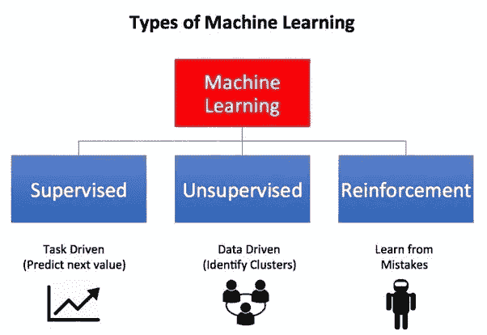

# 机器学习导论

> 原文：<https://medium.com/analytics-vidhya/introduction-to-machine-learning-bdc865068fc6?source=collection_archive---------34----------------------->

**什么是机器学习？**

机器学习是对通过经验和使用数据自动改进的计算机算法的研究。简而言之，机器学习是一种不同于启发式学习的方法，在启发式学习中，算法对训练数据执行一些功能，并在没有任何显式编程的情况下进行预测。

机器学习的一个真实例子是:睡意检测系统。这是一个非常先进的机器学习的例子，它使用计算机视觉、OpenCv 和 Python 来检测一个人的眼睛是否闭了几秒钟！多酷啊。这种全新的技术取得了巨大的进步。

想象一下在我们成长的学校里有这样的东西？我可能会被关一整天禁闭。

无人驾驶的谷歌汽车？还有机器学习！

现在，我们已经对机器学习的海洋进行了一次小小的探索，让我们了解一些非常重要的术语。

# 功能和标签


让我们看一个非常可爱的例子来了解特性和标签。

# 机器学习分类算法如何识别狗？

假设我们有一些决定性的特征已经被犬科动物学家识别出来来识别一只狗。让我们看看这些特征，试着给动物贴上标签，看它是不是狗。


前四列称为变量或特征。这些是 ***独立变量*** ，并作为机器学习模型的输入给出。

最后一列称为 label，它是由机器学习模型根据自变量预测的 ***因变量*** 。

机器学习模型获取输入变量，对其执行一些功能，并预测标签。这是典型的监督学习模型会做的事情。(我将在下一节介绍这一点)

ML 模型的 ***精度*** 取决于预测标签与实际标签的接近程度。

每一行都标识了一个不同于其他行的独特观察


现在我们有了机器学习的基本要点，让我们了解机器学习的类型。



正如我们所见，有三种主要类型的机器学习。让我们逐一解决这些问题。

# 监督机器学习


这种机器学习的方法其实是最受欢迎的。在监督学习中，我们已经知道输入变量和输出变量。

该模型将根据训练数据对自身进行训练，以正确识别共同帮助我们预测输出变量的特征

数学上 y=f(x ),其中 y 是我们试图通过对 x 执行一些函数来预测的输出变量。

监督学习主要有两种类型，回归和分类。

上面的狗的例子是一个分类问题的完美例子，但是为了更好地理解，让我们看另一个例子。

# 分类:

# 乳腺癌的诊断

乳腺癌可以根据肿瘤的类型诊断为良性或恶性。良性肿瘤很难变成癌，而恶性肿瘤是癌性肿瘤。我们的分类模型可以获取图像并将其分类为良性或恶性。


以下是在训练模型时可以考虑的一些特征


我们的模型根据以下特征进行训练，并尝试将肿瘤图像分类为良性或恶性。

**那么到底什么是分类 mdoel 呢？**

分类模型具有一些离散的特征，用于预测已经标记的输出。在分类模型中，很少有离散的标记输出。这些标签也被称为 ***类标签***

# 回归:

让我们看一个简单的线性回归模型，它有一个自变量和一个因变量。

## 根据 20 名学生的平均绩点预测他们的工资

```
#Code to calculate the salaries of 20 students from their GPA#import libraries
import numpy as np
import pandas as pd
import statsmodels.api as sm
import matplotlib.pyplot as plt#Defining the data framedata=pd.DataFrame({'Salary':[10000,20000,30000,40000,10000,12000,15000,17000,12000,10000,20000,50000,60000,70000,20000,15000,60000,20000,30000,80000], 'GPA':[2.4,3,3.4,4,2.2,2.6,3,3.5,3,2.7,3,3.4,3.5,4,2.4,2.3,3.7,2.5,2.7,4]})#Defining the independent and dependent variablesy= data['Salary']x1=data['GPA']#Relationship between x and yplt.scatter(x1,y,color='Red')plt.xlabel('GPA of Students',fontsize=15)plt.ylabel('Salary',fontsize=15)plt.show()
```


```
#Linear Regressionx=sm.add_constant(x1)result=sm.OLS(y,x).fit()result.summary()
```


总结一些术语:

*   p 值决定了我们的假设是否正确。p 值小于<0.05 determines that the null hypothesis is incorrect.This determines if our experiment is statistically significant.
*   Higher the F-Statistic,higher is the significance of the model

```
#predicted output:yhat= -5.794e+04 + 2.82e+04*x1plt.scatter(x1,y)fig=plt.plot(x1,yhat,lw=2,c='Red',label='Regression')plt.xlabel('GPA',fontsize=20)plt.ylabel('Salary',fontsize=20)plt.show()
```


Regression is used when we have continous independent variables and continuous dependent variables.

The goal of regression model is to reduce the error or the distance between the actual value and predicted value (red line) known as residuals to a minimum, hence determining the best fit line. The minimum error can also be determined by SGD.

Some very common real world uses of Regression are: Weather forecasting, Real Estate Prediction, ETA.

**监督学习的步骤**


# 无监督学习:

当我们没有标签输出或任何适当的特征时，使用无监督学习。数据是未分类的，我们只能通过训练从数据中确定相似的模式或聚类。

因为没有标记数据，所以也没有因变量。


在本例中，我们可以看到，通过聚类，我们的模型可以成功地将数据分为苹果、香蕉和芒果三组，而无需任何人工干预。

一个非常有趣的例子是:

# 主题聚类:

**什么是话题聚类？**

主题群是我们网站上的大量内容，并且链接到一个共同的支柱内容。主题聚类通过搜索量为高度集中的关键词和短语获得搜索流量。更好的主题集群排名可以帮助在谷歌建立更多的支柱内容可信度。

聚类的更多例子有:客户细分、文档识别等。

# **强化学习**

在这种类型的机器学习中，我们将一个代理放在一个环境中，允许他执行一些动作。根据这些行为，他被给予奖励或惩罚。


强化学习最受欢迎的例子之一是谷歌的国际象棋游戏“Alpha Zero ”,它使用梯度强化学习，在短短 4 小时内成为国际象棋中的“策划者”。