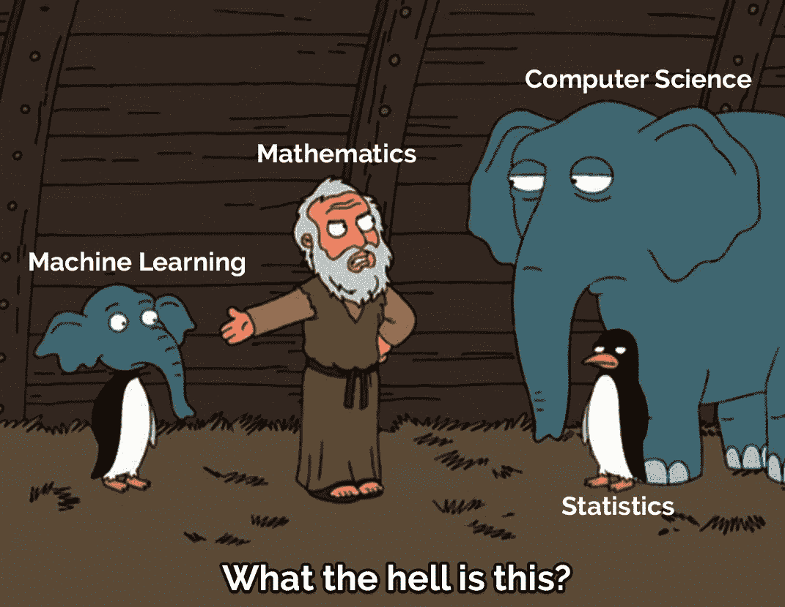
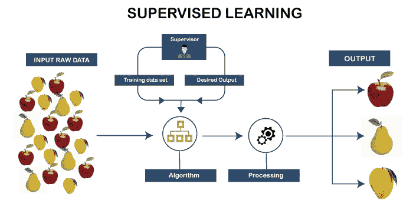
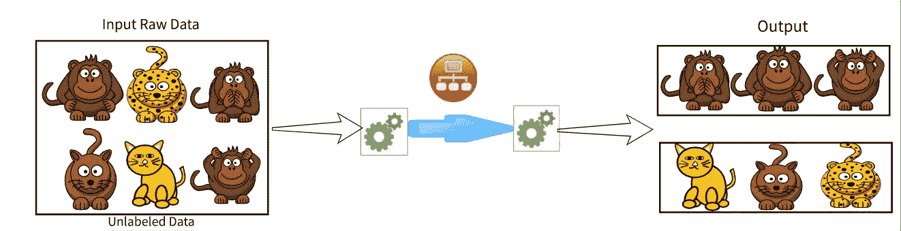
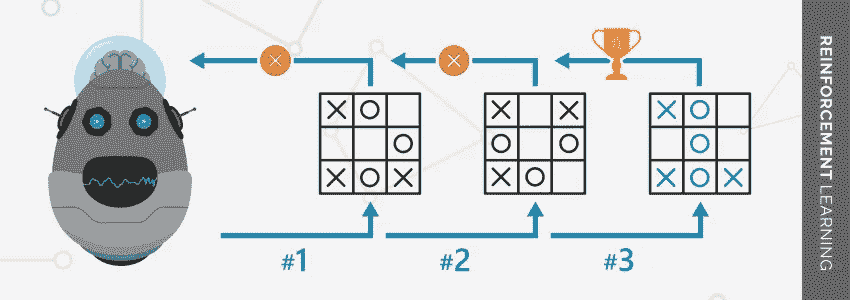
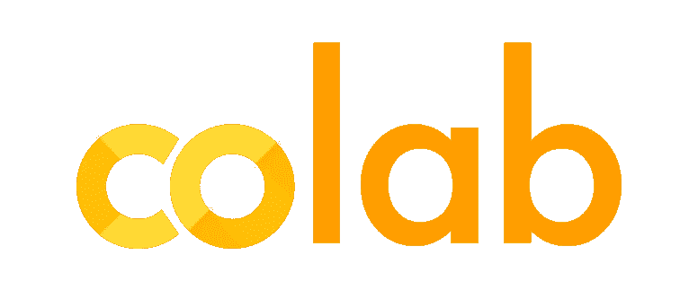

# 机器学习导论

> 原文：<https://medium.com/analytics-vidhya/introduction-to-machine-learning-e1b9c055039c?source=collection_archive---------1----------------------->

根据 Arthur Samuel(1959 年)的说法:机器学习是一个"*研究领域，它赋予计算机在没有明确编程的情况下进行学习的能力。*“换句话说，它关注的是如何构建能随着经验自动改进的计算机程序的问题。

**基于学习分类的机器学习:**

> ✨监督学习:旨在通过示例学习的机器学习，即，它基于先前的输入输出对将输入映射到输出。它是用带标签的数据训练的。

使用带标签的数据集(即，每个输入与一些输出配对)来训练模型，其中模型学习每种类型的数据。训练完成后，模型将接受测试(通过训练集的子集)，然后预测输出。

> ✨无监督学习:让模型自己发现和学习的机器学习，即它自己发现模式和信息。它是用未标记的数据训练的。

无监督学习

包含不同类型的猴子和猫的图像的输入数据集。无监督学习算法的任务是自行识别图像特征。它通过根据图像数据集之间的相似性将图像数据集聚类成组来执行任务。

> ✨强化学习:在一些应用中，系统的输出是一系列动作；机器能够评估过去方法或政策的优点，并从过去良好的行动序列中学习以生成政策的学习。

一个很好的例子是玩游戏，一个单独的动作本身并不重要；正确的动作顺序是好的。如果一步棋是一个好的游戏策略的一部分，那么它就是好的。

# GOOGLE COLAB

Colaboratory，简称“Colab”，是谷歌研究院的产品。Colab 允许每个人通过浏览器编写和执行 python 代码。它特别适用于机器学习、数据分析和教育。从技术上来说，Google Colab 是一种托管的 Jupyter 笔记本服务，无需设置即可使用，同时提供对包括 GPU 在内的计算资源的免费访问。Colab 允许您使用 Jupyter 笔记本并与其他人共享，而无需下载、安装或运行任何东西。

感谢您的阅读！！！😊

## 参考资料:

🐾*更多了解机器学习*:[https://www . CIN . ufpe . br/~ CAV mj/Machine % 20-% 20 Learning % 20-% 20 Tom % 20 Mitchell . pdf](https://www.cin.ufpe.br/~cavmj/Machine%20-%20Learning%20-%20Tom%20Mitchell.pdf)

🐾*更多了解 Google colab*:[https://colab.research.google.com/notebooks/intro.ipynb?utm_source=scs-index](https://colab.research.google.com/notebooks/intro.ipynb?utm_source=scs-index)

🐾[https://research.google.com/colaboratory/faq.html](https://research.google.com/colaboratory/faq.html)