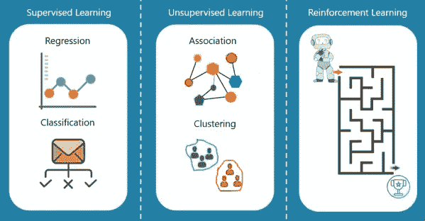
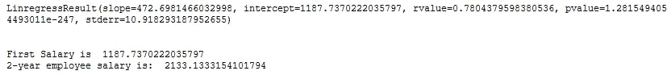
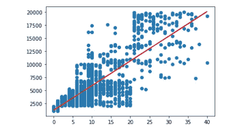
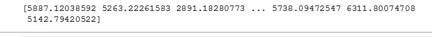
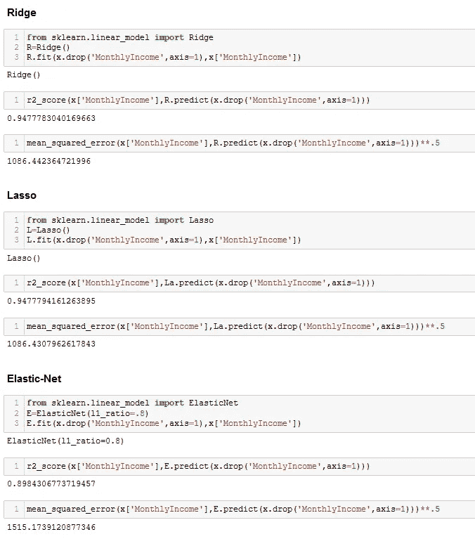
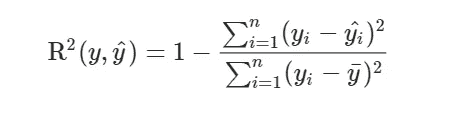
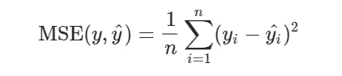
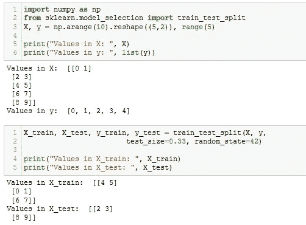
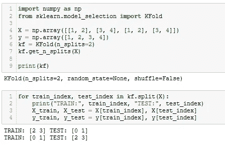

# 机器学习导论:回归

> 原文：<https://medium.com/analytics-vidhya/introduction-to-machine-learning-regression-5bbf4ed96f40?source=collection_archive---------5----------------------->

你好，首先今天的话题是机器学习和算法。但是在开始之前，我也想谈谈统计学习之间的关系。然后准备好你的咖啡，因为我今天要讲很多！

大多数学习模型天生就有统计学，这些模型的优化和预测成功在计算机科学中是先进的。多么美妙的组合。那么，用专业术语来说，它们的区别是什么呢？

在统计学习中，可以对用于建立模型的自变量的变化的响应变量的预期变化进行解释。另一方面，在机器学习方法中，假设更少，模型更容易使用并且面向结果。这就像两个亲密的朋友，我们不能分开。现在我们明白了其中的区别，我们可以专注于机器学习了。

# 机器学习

机器学习有三种类型:监督学习、非监督学习和强化学习。

*   监督学习(标记输入)
*   无监督学习(无标签输入)
*   强化学习

在监督学习中，输入被标记，输出是已知的。但是在无监督学习中，输入是无标签的。我们希望机器能发现数据中隐藏的模式和趋势。在强化学习中，它是在没有输入和输出的情况下发现具有动作的机器。它与一个对正义给予奖励，对错误给予惩罚的系统一起工作。自动驾驶汽车就是最好的例子。

有两种类型的监督学习，回归和分类。我将在本文中解释回归。你可以在我的下一篇文章中找到分类。(回归有很多类型，也有落入分类的类型。不要将这与线性回归混淆。)当我们使用回归通过建立变量之间的线性关系来预测时(例如预测汽车的价格)，我们使用分类来解决我们将得到是-否答案的问题(例如是否有垃圾邮件)。

## 回归

简单线性回归对照一个其他变量检查目标变量，而多元线性回归针对目标变量检查多个其他变量。例如，让我们首先根据一个变量检查目标变量:

我们谈到了一个线性关系，即 y 的变化依赖于 y = ax + b 中的 x。让我们在图表上显示这一点:

但是，一个因变量只用一个变量来解释的情况很少见。在这种情况下，我们使用多元回归，试图用多个自变量解释一个因变量。多元回归可以是线性的，也可以是非线性的。多元线性回归(MLR)用于确定一组随机变量之间的数学关系。换句话说，MLR 考察多个自变量如何与一个因变量相关(y= b0 + a x1 + bx2 + c a x3 + d)。现在让我们看看我们的目标变量与所有其他变量的关系，除了它本身:

我们的成功率增加了。

用于分析多元回归数据的其他算法有:

***、脊回归(L2 正则化)、套索回归(L1 正则化)、弹性网***

目的是通过对这些系数应用惩罚来找到最小化误差平方和的系数。它能抵抗过度配合。它建立了一个包含所有变量的模型，并使无关变量的系数更接近于零。与岭回归不同，它将无关变量的系数等于零。它进行变量选择和正则化，以提高其产生的模型的预测准确性和可解释性。另一方面，弹性网提供了一个结合了两者优点的模型。

让我解释一下什么是 r2 和均方误差。

r 平方根据模型中的自变量来衡量因变量的变化率，即因变量中有多少可变性可以用模型来解释。它是相关系数的平方。

均方差为您提供了预测结果与实际结果相差多少的绝对数字。它给出了一个与其他模型结果进行比较的实际数字，并帮助您选择最佳回归模型。

## 模型评估

*   我们使用的数据通常分为训练数据和测试数据。训练集包含一个已知的输出，模型学习这个数据，以便以后推广到其他数据。我们有测试数据集(或子集)来测试我们的模型对这个子集的预测。

*   交叉验证与训练/测试分割非常相似，但它适用于更多子集。也就是说，我们将数据分成 k 个子集，并在其中的 k-1 个子集上进行训练。我们要做的是保留最后一个子集进行测试。我们可以对每个子集都这样做。在 K 折叠交叉验证中，我们将数据分成 K 个不同的子集(或折叠)。我们使用 k-1 个子集来训练我们的数据，并将最后一个子集(或最后一个折叠)作为测试数据。

从现在开始，我们将在进行预测之前以这种方式分离数据。

我将在我的下一篇文章中解释分类，我的目标是一步步向你解释机器学习。如果你喜欢，跟着我，祝你有美好的一天！:)

[github 账户/esmabozkurt](https://github.com/esmabozkurt)