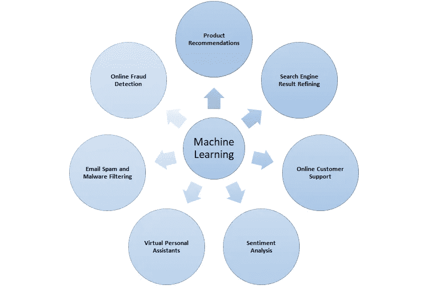

# 机器学习入门，简单的方法

> 原文：<https://medium.com/analytics-vidhya/introduction-to-machine-learning-the-easy-way-fd8bf26b2c02?source=collection_archive---------1----------------------->

[附身摄影](https://unsplash.com/@possessedphotography?utm_source=medium&utm_medium=referral)在 [Unsplash](https://unsplash.com?utm_source=medium&utm_medium=referral) 上拍照

在这篇博客中，我们将从机器学习的基础知识、与机器学习相关的术语以及一些有趣的事实开始。

**简介**

机器学习是对计算机算法的研究，允许计算机程序通过经验自动改进。它是人工智能和计算机科学的一个分支，非常依赖数据来提高其学习精度。

就像一个试图学习新主题的学生，在从信息中学习后，学生进行测试，获得分数，试图评估其表现，并确保不重复错误，同样，机器试图从经验中学习并训练自己。简而言之，这都是关于从过去的经验中学习和改进，更具体地说，机器需要概括它的学习，而不是填鸭式的数据。

# **机器学习多大了？**

虽然机器学习在 20 世纪 50 年代就为人所知，但由于超级廉价的计算和内存功能的出现，以及公共云产品的出现，以及改进的硬件(强大的笔记本电脑和台式机)的出现，它现在变得如此流行。正如我们之前所说，这些 ML 模型从数据中学习，随着大数据领域的巨大进步，处理数据也变得非常容易&将分析应用于数据。

**机器学习的一些例子:**

机器学习的例子

你今天所想的，明天就会变成现实！机器学习也是如此，对吗？从自动驾驶汽车到我们的智能手机助手谷歌、Siri、Bixby。从对我们的邮件进行分类到检测垃圾邮件，从为我们提供产品推荐，从图像识别到语言翻译，从我们金融系统的欺诈检测到医疗保健行业的创新，机器学习都发挥了重要的关键作用。

**机器学习的类型:**

机器学习

机器学习分为三类:

1.  监督学习
2.  无监督学习
3.  强化学习

# **监督学习:**

当机器试图从包含输入和期望输出的数据集学习时，这种学习被称为监督学习。一般来说，期望输出就像一个监督者，帮助机器从一组带标签的数据中学习。

**进一步分为两类:**

1.分类

2.回归

**分类:**

当机器试图将数据分类到不同的离散类别时，这就是所谓的分类。一些例子:

1.  根据天气数据集预测是否会下雨。
2.  预测一个人对食物的选择——素食，非素食，纯素食。

**回归:**

当机器试图预测一个连续的值而不是一个离散的类时，这就是所谓的回归。一些例子:

1.  根据数据集预测降雨期间的降雨量。
2.  根据数据集预测房价。

# **无监督学习:**

当机器试图在没有任何监督或标记数据集的情况下独自识别数据集中的模式时。

例如:

1.  使聚集
2.  数据间的关联

**聚类:**

分析数据集并在特征空间中查找自然组或聚类。比如客户细分。

**关联:**

机器试图找出数据点之间的关系。例如:

购物篮分析—使用关联规则，找出哪些商品是一起购买的。

# **强化学习:**

这种学习使代理能够在交互式环境中学习，通过从试错法实验的反馈中学习，它试图最大化奖励，最小化惩罚。这种方法将正值分配给期望的行为以鼓励代理，将负值分配给不期望的行为。

它的主要应用是在游戏和机器人领域。

# 使用机器学习的挑战:

到目前为止，在这篇博客中，我们已经介绍了机器学习，但现在让我们简单讨论一下，数据科学家和 ML 专家在研究这些模型时面临的挑战是什么。

1.  **没有合适质量的数据集**:正如我们所知，机器学习模型从数据中获得洞察力，用于训练的低质量数据会影响模型的准确性。
2.  **过拟合和欠拟合:**机器学习模型应该能够概括结果，而不是填鸭式地填充数据集。

**过拟合**:当机器学习模型在训练数据上有很好的准确性，但在测试数据集上表现很差时，就会发生这种情况。

**欠拟合**:当模型无法在训练和测试数据集上都获得良好的精度时，就会出现这种情况。

3.**成本和时间限制:**训练一个机器学习模型可能是相当昂贵和资源密集型的，因为我们需要高计算硬件来训练数据。

**试用:**

只是为了熟悉机器学习的能力，你可以通过微软开发的一些很酷的 API，其中之一是

**计算机视觉 API :**

 [## 计算机视觉|微软 Azure

### 从图像中提取丰富的信息，并使用计算机视觉分析内容，这是一种 Azure 认知服务。

azure.microsoft.com](https://azure.microsoft.com/en-in/services/cognitive-services/computer-vision/#overview) 

只要访问这个链接，看看机器学习模型在识别图像中的各种对象方面有多好。

只是为了好玩

我希望你喜欢这篇文章，如果这个博客对你的学习有所帮助，请鼓掌并关注我们。如有任何与内容相关的疑问，请随时联系我，我在 medha.rwt@gmail.com。非常欢迎对这篇文章的任何改进提出建议。一定要让我知道你对这个博客的评论。告诉我你们想让我为你们写的下一个主题。

在那之前保持安全，继续阅读。