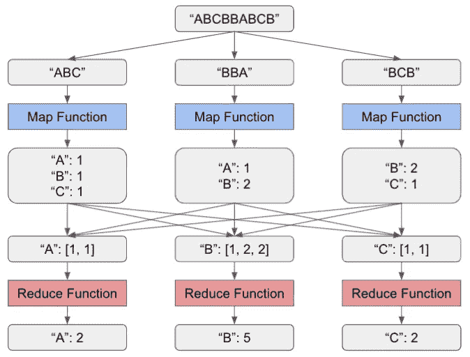

# MapReduce 简介

> 原文：<https://medium.com/analytics-vidhya/introduction-to-mapreduce-a98f3c80febc?source=collection_archive---------8----------------------->

# 什么是 MapReduce？

MapReduce 是一个用于大型作业的分布式并行处理的编程框架。它最初是由 Google 在 2004 年推出的，并由 Hadoop 推广开来。MapReduce 的主要动机是，分布在大型机器集群上的计算密集型作业需要一种简单的方法来以并行、可扩展和容错的方式管理它们。

MapReduce 的主要思想是，通过使用 map 和 Reduce 阶段将一个复杂的作业拆分为多个任务，可以将该作业进行分布式并行处理。每个阶段将使用许多工作线程，每个工作线程将执行一个用户定义的 map 函数或 reduce 函数。

# 什么是 Map 和 Reduce 函数？

一个**映射函数**获取一大块作业输入，并执行一些用户定义的逻辑来输出一个键值对列表。

一个 **reduce 函数**接受一组共享同一个键的键-值对，并执行一些用户定义的逻辑来输出该键的单个值。

# 例子

下面是一个简单的 MapReduce 示例，其中 map 函数计算输入字符串中每个字母的出现次数，Reduce 函数计算特定字母的总出现次数。

每个灰色框表示 map 和 reduce 任务的输入或输出数据。在 MapReduce 中，这种中间数据通常存储在分布式文件系统中，如 HDFS。

请注意初始输入的拆分，以及 map 函数的输出到 reduce 函数的输入的混合和排序。这些步骤由 MapReduce 框架自动完成。

# 容错

使用 MapReduce 最大的优势之一就是容错性。每个 map 和 reduce 任务都是独立执行的，如果一个任务失败，它会自动重试几次，而不会导致整个作业失败。这样，如果出现硬件故障等暂时问题，或者有意停止任务以释放资源用于更重要的任务，MapReduce 任务可以使用相同的输入数据轻松重试。

为了确保重试不会产生任何意外的后果，MapReduce 函数必须在不改变输入的情况下产生输出，并且不能有任何副作用。如果实现正确，有失败任务但重试后最终成功的 MapReduce 作业应该与成功执行且没有任何失败任务的作业产生完全相同的输出。