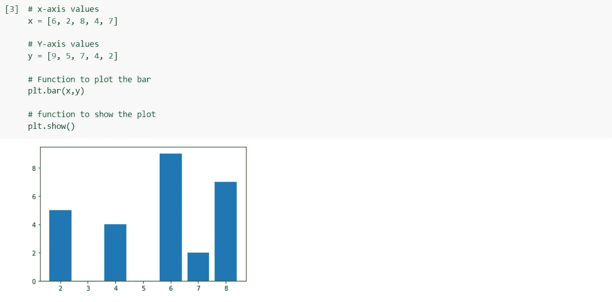
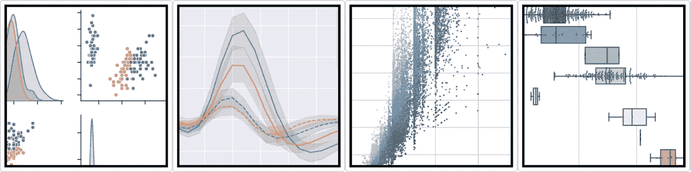

# Matplotlib 和 Seaborn 简介

> 原文：<https://medium.com/analytics-vidhya/introduction-to-matplotlib-and-seaborn-e2dd04bfc821?source=collection_archive---------2----------------------->

在这篇博客中，我将会写一些关于 matplotlib 和 seaborn 的介绍，比如什么是 matplotlib 和 seaborn，为什么使用它们，如何开始使用它们，它们的不同操作，它们之间的比较等等。


# **什么是 Matplotlib？**

Matplotlib 是一个非常棒的 Python 可视化库，用于数组的 2D 绘图。Matplotlib 是一个基于 NumPy 数组的多平台数据可视化库，旨在与更广泛的 SciPy 堆栈一起工作。它是由约翰·亨特在 2002 年提出的。

可视化的最大好处之一是，它允许我们以易于理解的视觉方式直观地访问大量数据。Matplotlib 由几个图组成，如线形图、条形图、散点图、直方图等。

***根据上面的定义，Matplotlib 用于可视化数据。*(巨大或微小)**


# 【Matplotlib 入门

**安装:**
Windows、Linux 和 macOS 发行版都有 matplotlib 及其大部分依赖项作为 wheel 包。运行以下命令安装`matplotlib` 包:

```
**python -mpip install -U matplotlib**
```

**导入 matplotlib :**

```
**from matplotlib import pyplot as plt
*or*
import matplotlib.pyplot as plt**
```

## Matplotlib 中的基本图:

Matplotlib 附带了各种各样的情节。图表有助于理解趋势、模式和建立关联。它们是对定量信息进行推理的典型工具。这里包括了一些样地。

**线条图:**


**条形图:**



**直方图:**


**散点图:**


# 什么是 Seaborn？

Seaborn 是一个了不起的可视化库，用于 Python 中的统计图形绘制。它提供了漂亮的默认样式和调色板，使统计图更有吸引力。它建立在 matplotlib 库的基础上，并且与 pandas 的数据结构紧密结合。Seaborn 的目标是让可视化成为探索和理解数据的核心部分。它提供了面向数据集的 API，因此我们可以在相同变量的不同可视化表示之间切换，以便更好地理解数据集。

根据定义，Seaborn 也致力于数据可视化，主要区别在于它致力于探索和理解数据的核心部分。


# 《海伯恩》中不同类型的情节

绘图主要用于可视化变量之间的关系。这些变量可以完全是数字，也可以是一个类别，如组、类或部门。Seaborn 将地块分为以下几类

*   **关系图:**该图用于了解两个变量之间的关系。
*   **分类图:**该图处理分类变量及其可视化方式。
*   **分布图:**该图用于检查单变量和双变量分布
*   **回归图:**seaborn 中的回归图主要是为了在探索性数据分析过程中添加一个帮助强调数据集中模式的可视化向导。
*   **矩阵图:**矩阵图是散点图的阵列。
*   **多绘图网格:**在数据集的不同子集上绘制同一绘图的多个实例是一种有用的方法。

# Seaborn 入门

## 装置

对于 python 环境:

```
**pip install seaborn**
```

对于康达环境:

```
**conda install seaborn**
```

## 属国

*   Python 3.6 以上版本
*   numpy (>= 1.13.3)
*   scipy (>= 1.0.1)
*   熊猫(> = 0.22.0)
*   matplotlib (>= 2.1.2)
*   统计模型(> = 0.8.0)

## 使用 seaborn 的一些基本图

**Dist plot:**Seaborn Dist plot 用于绘制直方图，还有其他一些变化，如 kdeplot 和 rugplot。


忽略没那么严重的警告按摩！！！

**线图:**线图是 seaborn 库中最基本的图之一。该图主要用于以某种时间序列的形式(即以连续的方式)显示数据。


**Lmplot:**Lmplot 是另一个最基本的剧情。它显示了表示线性回归模型的线以及 2D 空间上的数据点，x 和 y 可以分别设置为水平和垂直标签。


# Matplotlib vs Seaborn


# 1.功能性:

**Matplotlib:** Matplotlib 主要部署用于基本绘图。使用 Matplotlib 的可视化一般由条形图、饼图、折线图、散点图等组成。

另一方面，Seaborn 提供了多种可视化模式。它使用更少的语法，并且有很容易引起兴趣的默认主题。它专门研究统计可视化，如果需要以可视化方式汇总数据并显示数据的分布，就可以使用它。

# 2.处理多个图形:

**Matplotlib:** Matplotlib 有多个图可以打开，但是需要显式关闭。plt.close()仅关闭当前图形。plt.close('all ')将全部关闭它们。

Seaborn: Seaborn 自动创建多个图形。这有时会导致 OOM(内存不足)问题。

# 3.可视化:

Matplotlib: Matplotlib 是一个用于 Python 中数据可视化的图形包。和 NumPy，熊猫融合的很好。pyplot 模块与 MATLAB 绘图命令非常相似。因此，MATLAB 用户可以很容易地过渡到用 Python 绘图。

**Seaborn:** Seaborn 更适合处理 Pandas 数据框。它扩展了 Matplotlib 库，使用一组更简单的方法用 Python 创建漂亮的图形。

# 4.数据帧和数组

**Matplotlib:** Matplotlib 处理数据帧和数组。它有不同的有状态 API 用于绘图。图形和 ace 由对象表示，因此，没有参数的 plot()类调用就足够了，无需管理参数。

**Seaborn:** Seaborn 整体处理数据集，比 Matplotlib 直观得多。对于 Seaborn，replot()是带有“kind”参数的入口 API，用于指定绘图的类型，可以是线形、条形或许多其他类型。Seaborn 不是有状态的。因此，plot()需要传递对象。

# 5.灵活性:

Matplotlib: Matplotlib 可定制性强，功能强大。

Seaborn 通过提供常用的默认主题，避免了大量的样板文件。

# 6.使用案例:

**Matplotlib:** 熊猫使用 Matplotlib。它是 Matplotlib 的简洁包装。

**Seaborn:** Seaborn 是针对更具体的用例。还有，引擎盖下是 Matplotlib。它专门用于统计绘图。

# **来源:**

[https://analyticsindiamag . com/comparising-python-data-visualization-tools-Matplotlib-vs-seaborn/#:~:text = Matplotlib % 3A % 20 Matplotlib % 20 is % 20 mainly % 20 deployed，has % 20 easily % 20 interest % 20 default % 20 themes](https://analyticsindiamag.com/comparing-python-data-visualization-tools-matplotlib-vs-seaborn/#:~:text=Matplotlib%3A%20Matplotlib%20is%20mainly%20deployed,has%20easily%20interesting%20default%20themes)。



这是我的笔记本，你可以查一下参考资料。

[](https://github.com/Shag10/Machine-Learning/blob/master/Internity_Internship/Day-4/Matplotlib_and_Seaborn.ipynb) [## shag 10/机器学习

### 这个库包含机器学习算法的基础。基于监督学习的算法…

github.com](https://github.com/Shag10/Machine-Learning/blob/master/Internity_Internship/Day-4/Matplotlib_and_Seaborn.ipynb) 

我试图为初学者提供所有关于 Matplotlib 和 Seaborn 的重要信息。 **希望你能在这里找到有用的东西。谢谢你一直读到最后。如果你喜欢我的博客，请点击下面的按钮。让我知道我的博客是否真的有用。**