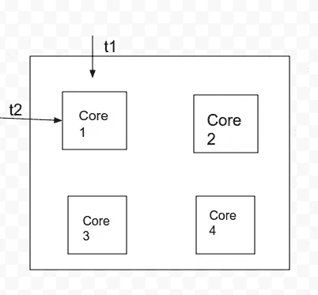

# Python 多线程简介。

> 原文：<https://medium.com/analytics-vidhya/introduction-to-multi-threading-with-python-266d7d1c5414?source=collection_archive---------13----------------------->

弗兰克·麦肯纳在 [Unsplash](https://unsplash.com?utm_source=medium&utm_medium=referral) 上拍摄的照片

> 进程是任何消耗 [CPU 时间](https://www.google.com/search?q=CPU+time&oq=CPU+time&aqs=chrome..69i57j0l7.2170j0j7&sourceid=chrome&ie=UTF-8)的程序的运行实例。而一个可以独立运行的进程的片段就是线程。

如果我们仔细观察计算机在一个实例(点)的这些统计数据。我们可以看到 4 个内核上运行着 2640 个线程和(196 个进程)。那么这是怎么发生的呢？

***为了理解*** ，我们来考虑一个 ***的例子*** 。典型的四核 CPU 在单个芯片上包含 4 个处理核心。现在，这一堆(2640)线程依赖这 4 个内核来执行。但是在任何时候，它们最多只能执行 4 个线程(每个内核 1 个线程)。这时内核开始在线程之间切换，以解决这个问题。

每个内核将开始一个接一个地运行多个线程。在一个时刻执行线程 t1(比方说),然后在下一个时刻执行线程 t2(比方说),依此类推。但这种转换以闪电般的速度发生，只需几纳秒。

> **切换线程的优势**

它提升了整体性能，加快了指令的执行速度。假设核心 1 正在执行线程 t1。和线程 t1，暂停 10 秒钟，因为睡眠方法或接受一些输入。然后，核心 1 可以切换到执行线程 t2，而不是闲置。

> 归根结底，多线程就是在一个内核上执行多个线程。

> ***Python 中多线程的实现***

***线程功能*** 作为一个新线程启动，但它暂停了 10 秒钟。于是核心转向主线程打印 ***【主】*** 。内核根本不会闲置 10 秒来执行 ***线程函数*** ，它更喜欢切换。