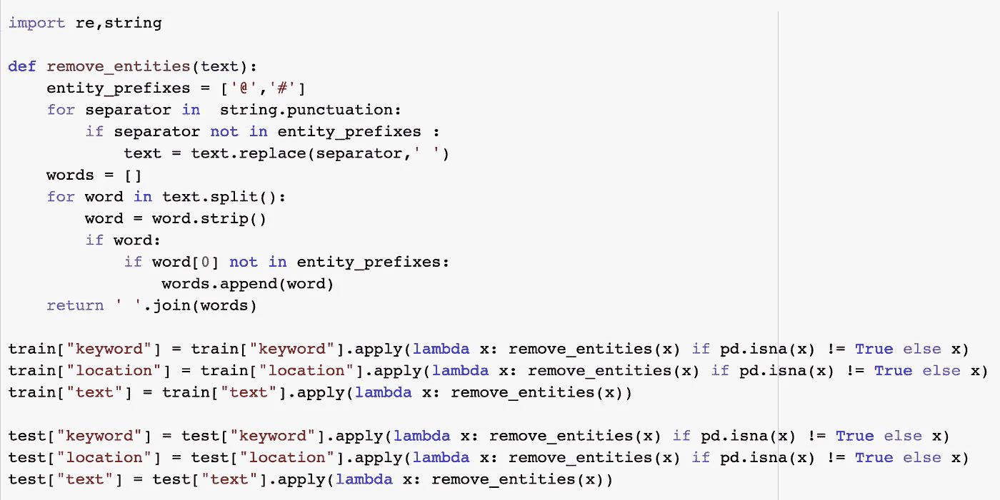

# 灾难推文 NLP 简介

> 原文：<https://medium.com/analytics-vidhya/introduction-to-nlp-with-disaster-tweets-3b672a75748c?source=collection_archive---------3----------------------->

# 介绍

自然语言处理，也称为 NLP，是计算机科学的一个子领域，特别是人工智能，专注于理解书面和口头文本。它涵盖各种任务，其中一些是语音识别、情感分析和语言生成；并且，它已经被应用在多个用例中，例如机器翻译、垃圾邮件检测、虚拟助手和聊天机器人。

本文涉及的项目是一个名为 [*的自然语言处理与灾难推文*](https://www.kaggle.com/c/nlp-getting-started) 的情感分析项目。情感分析是从文本中提取情感或态度等主观品质的过程。该项目的目标是确定一条特定的推文是否是一场真正的灾难。该项目是 NLP 初学者的理想选择。本文重点介绍了在这个项目中达到 80%准确率的步骤，并重点介绍了预处理和模型构建步骤。

# 关于数据

训练和测试数据是结构化的带标签的数据，使用 [*pd.read_csv*](https://pandas.pydata.org/pandas-docs/stable/reference/api/pandas.read_csv.html) 方法从 CSV 文件中以 pandas DataFrame 格式导入。

如下图所示，数据帧由以下 4 列组成:

*   id:每条推文的唯一标识符
*   **关键字**:来自 tweet 的特定关键字(可以为空)
*   **位置**:发送推文的位置(可以为空)
*   **文本**:推文的文本
*   **目标**:仅出现在列车数据中，表示推文是关于真实灾难(1)还是非真实灾难(0)

图 1:列车数据帧

# 文本预处理

在任何 NLP 项目中，文本预处理都是建立机器学习模型之前的第一步。这一步包括在以数字向量的形式对文本数据进行编码之前清理和准备文本数据。

本项目中遵循的文本预处理步骤是:

*   **小写**
*   **实体、网址链接和标点符号删除**
*   **拼写纠正**
*   **通过关键词提取和实体识别填补缺失数据**
*   **词汇化**
*   **停止字清除**

## 用小写字体书写

将文本转换成小写是任何 NLP 项目中必不可少的一步。虽然像*数据*、*数据*和*数据*这样的词对人类来说意思是一样的，但是如果不转换成小写，在向量空间模型中就会表现为三个不同的词。这一步可以简单地使用 [*python string lower()方法*](https://www.w3schools.com/python/ref_string_lower.asp) *来完成。*

在这个项目中，有三个特征(即列—“关键字”、“位置”和“文本”)要转换成小写。这可以在 pandas 中使用 [*apply()方法*](https://pandas.pydata.org/docs/reference/api/pandas.DataFrame.apply.html) 来完成。

重要的是要注意“关键字”和“位置”列包含缺失值(即:NA 值，如 numpy.nan 或 None)；为了避免意外错误，使用 [*pd.isna*](https://pandas.pydata.org/pandas-docs/stable/reference/api/pandas.DataFrame.isna.html) 方法跳过空条目。

## 实体、URL 链接和标点符号删除

由于数据集是基于推文的，所以它可能包括许多提及(例如:@RyleeDowns02)和标签(例如:#CAfire)。通过创建如下所示的名为 remove_entities 的函数，可以删除这些内容。

此外，你还可以找到像 http://t.co/gkNRP0e8Qs 这样的链接。regex [*sub()*](https://www.w3schools.com/python/python_regex.asp#sub) 函数，由 [*re 模块*](https://docs.python.org/3/library/re.html) 提供，用于将 URL 链接替换为空白，如下:

同理，标点也可以去掉。

## 拼写纠正

预计推文将包括几个拼写错误，因此应用拼写纠正来提高性能。 [*symspellpy*](https://pypi.org/project/symspellpy/) 模块用于纠正拼写错误。接下来是如何创建和应用 spelling_correction 函数:

## 填充缺失数据

*train.info()* 和 *test.info()* 揭示列车数据在关键字列中有 61 个条目为空，在位置列中有 2533 个条目为空；并且，测试数据在关键字列中有 26 个空条目，在位置列中有 1105 个空条目。

**关键词提取**

extract_keywords 函数，如下图所示，灵感来自以下文章 [*用 BERT*](https://towardsdatascience.com/keyword-extraction-with-bert-724efca412ea) 和 [*构建关键字提取 API 用 Spacy、Flask 和 FuzzyWuzzy*](https://towardsdatascience.com/build-a-keyword-extraction-api-with-spacy-flask-and-fuzzywuzzy-4909d7ffc105) 。它的目标是填充关键字列中缺少的数据。 [*语句-变形金刚*](https://github.com/UKPLab/sentence-transformers) 和 [*spaCy*](https://spacy.io/api/doc) 包对于该函数的工作至关重要。

**实体识别**

实体识别用于填充位置列中的空条目。 [*SpaCy*](https://spacy.io/api/doc) 库再次用于实体识别。

## 词汇化

词汇化的目标是将一个单词转换成它的词根形式。词汇化和词干化之间的主要区别在于，词汇化考虑了上下文，并将单词转换为其文本形式，而词干化仅删除单词的最后几个字符。下面是应用术语化所需的步骤。

## 停止单词删除

停用词为文本提供低级信息，并且经常大量出现；因此，删除它们是为了更加关注其他重要信息。使用 spaCy 模型，可以很容易地删除停用词。

# 模型

模型使用[*Keras*](https://keras.io/getting_started/)*库和[*tensor flow hub*](https://tfhub.dev/)*开发。**

*使用迁移学习来创建文本嵌入。迁移学习是一种机器学习技术，指的是使用一种模型，这种模型已经在一项任务上进行了训练，并重新用于另一项相关任务。迁移学习通过使用预训练的文本嵌入模型(从 TensorFlow hub 加载)应用于该项目，以将文本表示为嵌入向量。使用的预训练文本嵌入模型是[*【nnlm-en-dim 50】*](https://tfhub.dev/google/nnlm-en-dim50/2)，之前已经在英文 Google News 7B 语料库上进行了训练。*

**

*加载的*‘嵌入’*模型用于创建关键字、位置和文本特征的嵌入。*

**

*使用 [*功能 API*](https://keras.io/guides/functional_api/) 方法构建最终模型。为每个特征创建三个模型(关键词模型、位置模型和文本模型)，然后将这三个模型连接起来创建最终的模型。*

**

*由于目标要么是 1，要么是 0，损失被设置为[*‘二元 _ 交叉熵’*](https://keras.io/api/losses/probabilistic_losses/#binarycrossentropy-class)。 [*【随机梯度下降(SGD)】*](https://keras.io/api/optimizers/sgd/)用作优化器， [*【准确度】*](https://keras.io/api/metrics/) 用作判断模型性能的度量。此外，早期停止作为一种正则化方法应用，以避免过拟合。*

**

*下图显示了模型拟合在第 23 个时段停止的结果，训练精度为 0.8456，验证精度为 0.8031。*

**

*图 2:最终模型拟合的结果*

# *结论*

*本文通过一个情感分析项目介绍了自然语言处理。它侧重于文本预处理和模型创建。*

*文本预处理由六个主要步骤组成:小写、实体、URL 链接和标点符号去除、拼写校正、填充缺失数据、词条化和停用词去除。重要的是要记住，用户可以选择在文本预处理中包含更多的步骤(例如，将缩写转换为它们的原始形式)，或者排除一些她/他认为不必要的步骤。*

*在模型部分，迁移学习用于创建单词嵌入。人们可以通过尝试不同的预训练文本嵌入模型来进行实验。进一步评估模型性能的一些建议是试验增加或移除密集层、增加或减少神经元的数量、尝试不同的已知优化器以及尝试不同的学习率值。*