# 基于 RCNN 家族模型的目标检测简介

> 原文：<https://medium.com/analytics-vidhya/introduction-to-object-detection-with-rcnn-family-models-310558ce2033?source=collection_archive---------2----------------------->

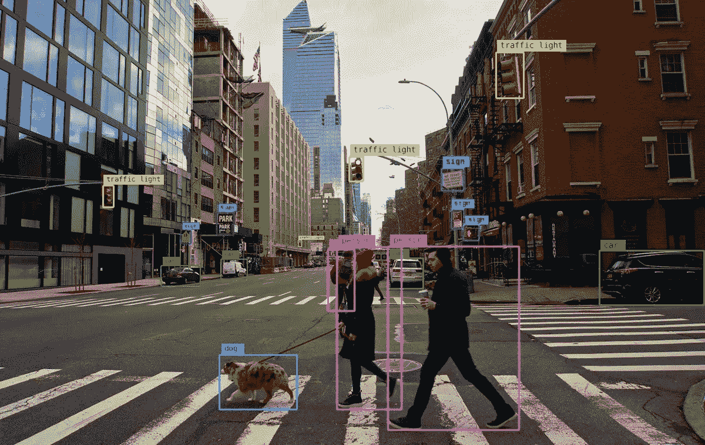

在这篇文章中，你将发现对物体检测问题的温和介绍，以及旨在解决该问题的最先进的深度学习模型。

看完这篇帖子，你会知道:

*   基于区域的卷积神经网络，或 R-CNN，是一系列用于处理对象检测任务的技术，设计用于模型性能。

让我们开始吧。

# 概观

本文分为两个部分；它们是:

1.  目标检测中的基本术语和面临的挑战
2.  R-CNN 模型族

# **那么，让我们用一些术语来理解:**

1.  **图像分类:**预测图像中物体的类型或类别

***输入:*** 单个物体的图像，如照片。

***输出:*** 一个类标签(例如映射到类标签的一个或多个整数)。

2.**物体定位:**定位图像中的物体，并用边界框输出它们的位置。

***输入:*** 带有一个或多个物体的图像，如照片。

***输出:*** 一个或多个边界框(如由点、宽度和高度定义)。

3.**目标检测:**在图像中用包围盒定位目标，并定位目标的类型或类别。

***输入:*** 带有一个或多个物体的图像，如照片。

***输出:*** 一个或多个边界框(例如，由点、宽度和高度定义)，以及每个边界框的类别标签。

边界框用这些组件(x，y，w，h，置信度)来参数化

(x，y) =给出盒子的中心，w =盒子的宽度，h =盒子的高度

# **物体检测的挑战**

1.  **多路输出:**

在图像分类的情况下，我们对每个图像有单个输出，但是这里我们需要输出检测到的对象的整个集合，其中每个图像中可能有许多不同的对象。因此，我们需要建立模型，可以输出不同大小的检测数量。

2.**多种类型的输出:**

我们有两种不同类型的输出:

a.类别标签

b.包围盒

3.**计算问题:**

对于对象检测，通常需要在高分辨率图像上工作。因为我们想要识别图像中的许多不同的对象，我们想要每个对象有足够的空间分辨率，所以图像的整体分辨率需要相当高。

> ***在深入研究 RCNN 家族之前，我们必须了解区域建议的概念***

***地区建议的想法:***

因此，我们的想法是，如果我们无法在图像中的每个可能区域上评估对象检测器，那么我们可以使用外部算法来为我们生成图像中的候选区域集，使得候选区域为每个图像提供一个小的区域集，但具有覆盖图像中对象的高概率。

区域提议的一个著名方法是称为选择性搜索的方法。因此，选择性搜索算法将在 CPU 上几秒钟的处理时间内为每幅图像提供大约 2，000 个对象建议，并且该算法输出的这 2，000 个区域建议将非常有可能覆盖图像中我们关心的所有感兴趣的对象。

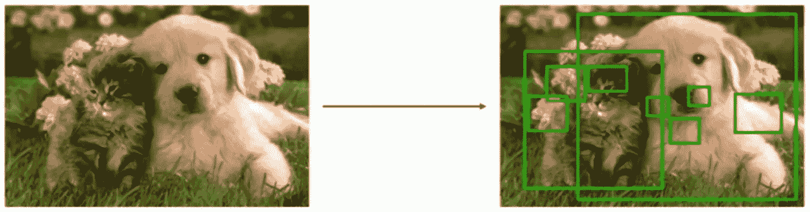

一旦我们有了区域提议的想法，它给我们提供了用深度神经网络训练对象检测器的方法。这就把我们带到了非常著名的报纸 R-CNN。

现在，让我们看看 RCNN 的模型系列。

## ***基于区域的物体检测(R-CNN):***

这就像 2014 年发表的深度学习领域最有影响力的论文一样。([丰富的特征层次进行精确的物体检测和语义分割](https://arxiv.org/abs/1311.2524))作者:[任](https://arxiv.org/search/cs?searchtype=author&query=Ren%2C+S)、[、](https://arxiv.org/search/cs?searchtype=author&query=He%2C+K)、[罗斯·吉斯克](https://arxiv.org/search/cs?searchtype=author&query=Girshick%2C+R)、[、](https://arxiv.org/search/cs?searchtype=author&query=Sun%2C+J)

**RCNN 的架构和工作:**

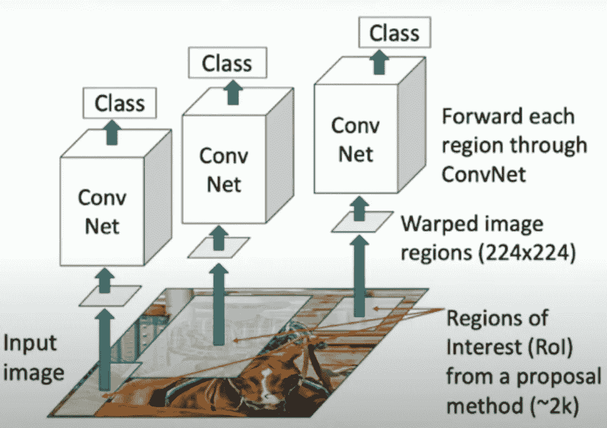

RCNN 的体系结构

***RCNN 工作:***

**步骤 1:** 我们从输入图像开始，运行类似选择性搜索的区域提议方法，通过该方法，我们在图像中获得 2000 个需要评估的候选区域提议

**步骤 2:** 对于每个候选区域，由于区域提议可以具有不同的大小和不同的纵横比，所以我们将把该区域扭曲成固定的大小，比如说(224x224)

**步骤 3:** 对于每个扭曲的图像区域，我们将通过卷积神经网络(CNN)独立地运行它们，CNN 将输出每个区域的分类分数

但是，这里有一个小问题，

如果我们从选择性搜索中得到的区域建议与我们想要在图像中检测的对象不完全匹配，会发生什么？

所以，为了克服这个问题，

现在，CNN 将输出额外的内容，这是将区域建议框转换为我们想要输出的感兴趣对象的最终框的转换

最后它看起来会像这样，

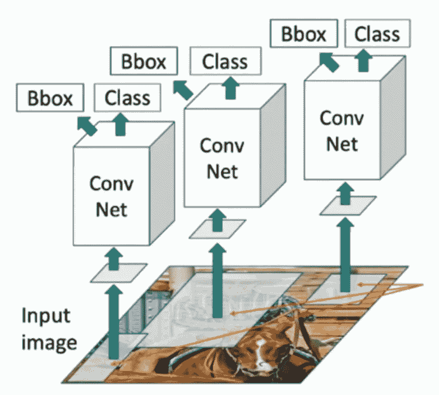

最后，RCNN 的架构将如下所示

**步骤 1:** 运行区域建议方法，计算 2000 个候选区域建议

**步骤 2:** 将每个区域调整到特定大小(224x224)并通过 CNN 独立运行，以预测类得分和边界框变换

**第三步:**使用分数选择要输出的区域提案子集

**第四步:**与地面真相框进行比较

> 现在，问题出现了**如何比较预测和地面真相框**？

我们可以将这些边界框与称为并集上的交集(IOU)的度量进行比较

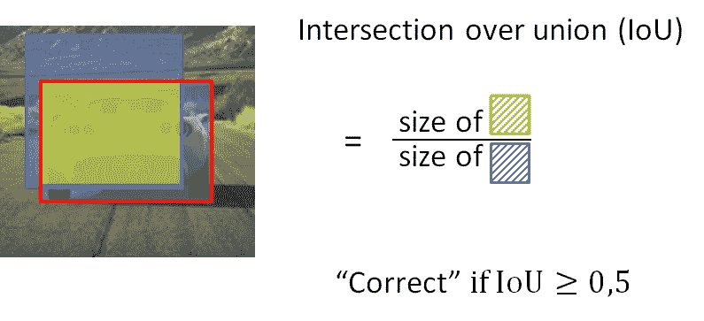

IOU =(相交面积)/(并集面积)

更一般地，IOU 是边界框之间重叠的度量

如果，IOU<0.5 → we say it ‘Bad’ IOU>0.5→‘下降’，IOU > 0.7→‘良好’，IOU > 0.9→‘几乎完美’

> 还有另一个问题是，**对象检测器经常为同一对象输出多个包围盒。那么这个怎么解决呢？**

因此，对此的解决方案是:使用**非最大值抑制(NMS)** 对原始检测进行后处理

NMS 是你确保你的算法只检测一次对象的方法。

因此，NMS 所做的是，它清除其他不需要的检测，所以我们最终只检测到一个特定的对象。

这个 NMS 是如何工作的？

1.首先，它寻找与特定对象的每个检测相关联的概率(Pc)

2.它采用最大的“Pc ”,这是对物体最有把握的检测

3.完成后，NMS 部分寻找所有剩余的边界框，并选择所有那些与最高“Pc”的边界框具有高交集(IOU)的边界框，并抑制它们。

4.然后，我们寻找剩余的边界框，并找到最高的“Pc ”, NMS 再次寻找具有高 IOU 的剩余边界框，其中边界框具有高“Pc ”,然后它们将被抑制。

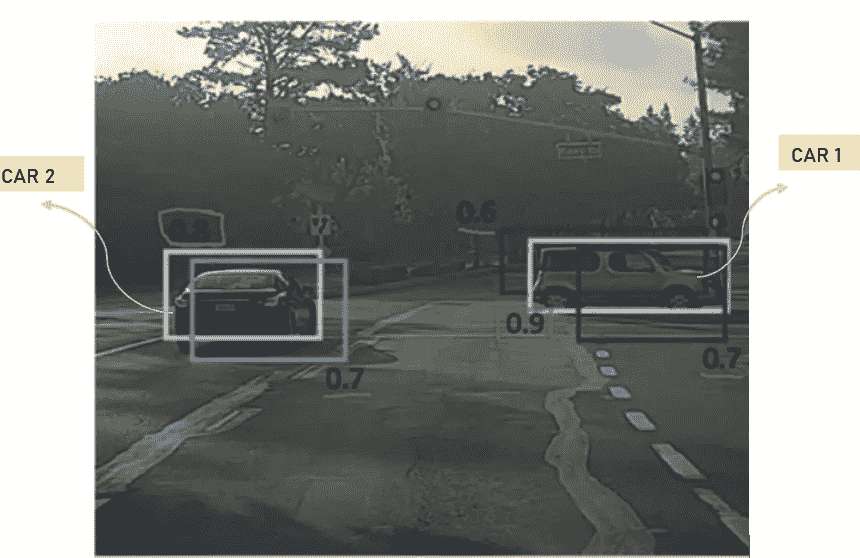

对于这个例子:

1.它需要最大的 Pc，在这种情况下是 0.9

2.它检查所有剩余边界框的 IOU(即汽车 1 的 0.6，0.7 和汽车 2 的 0.8，0.7)

3.现在，NMS 将取消汽车 1 的 0.6 和 0.7，因为它们相对于 Pc=0.9 的边界框具有较高的 IOU，所以像这样，我们只获得汽车 1 的一个边界框，它在图像中高亮显示。

4.接下来，对于剩余的边界框，car2 的 Pc 最高=0.8，我们再次检查剩余框的 IOU(即 car1 的 0.9 和 car2 的 0.7)

5.现在，NMS 将抑制 0.7，因为它相对于 Pc=0.8 的边界框具有高 IOU。汽车 2 也只有一个包围盒。

现在，在 RCNN 的情况下，它非常慢，不能实时使用。

# 快速递归神经网络

研究人员快速实现这一点的方法是交换 CNN 和 warping 步骤。基本上，我们在运行 CNN 后扭曲图像。这样，我们得到了 [***Fast-RCNN。***](https://arxiv.org/abs/1504.08083)*[罗斯·吉斯克](https://arxiv.org/search/cs?searchtype=author&query=Girshick%2C+R)。*

*让我们看看工作和建筑，*

*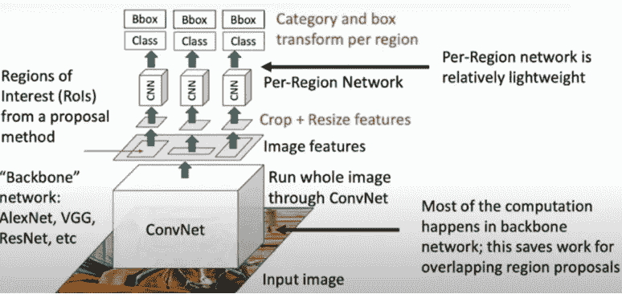*

*快速递归神经网络体系结构*

***步骤 1:** 取输入图像，用单个 CNN 处理整幅图像(无全连接层)。因此，输出将是卷积特征图，为我们提供卷积特征。而我们运行的这个 ConvNet 通常被称为骨干网(可以是 AlexNet、VGG、ResNet 等。)*

***步骤 2:** 运行区域建议方法并裁剪&调整特征尺寸*

***第三步:**按地区运行轻型 CNN(意思是浅层网络)*

*这将是快速的，因为大部分计算将发生在主干网络中，我们在每个区域运行的网络将相对较小、重量较轻且运行速度较快。*

***裁剪特征和调整特征大小是什么意思？如何裁剪特征？***

*这可以通过**兴趣池区域(RoI Pooling)** 完成*

***其目的是对非均匀大小的输入进行最大池化，以获得固定大小的特征图(如 7×7)。***

***我们就通过例子来理解这个吧，***

*让我们考虑一个小例子来看看它是如何工作的。我们将在单个 8×8 要素地图上执行感兴趣区域合并，一个感兴趣区域和 2×2 的输出大小。我们的输入要素地图如下所示:*

**

*假设我们也有一个区域建议(左上，右下坐标):(0，3)，(7，8)。在图中，它看起来像这样:*

*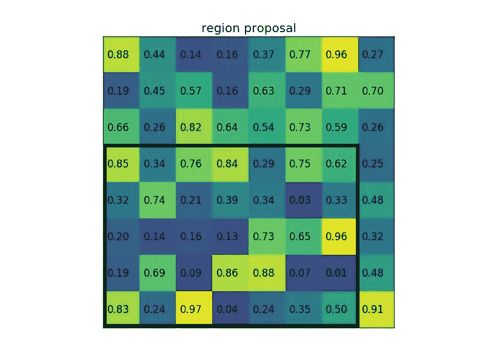*

*通常情况下，会有多个特征地图和多个建议，但是我们保持例子的简单性。
通过将其分成(2×2)个部分(因为输出大小是 2×2 ),我们得到:*

*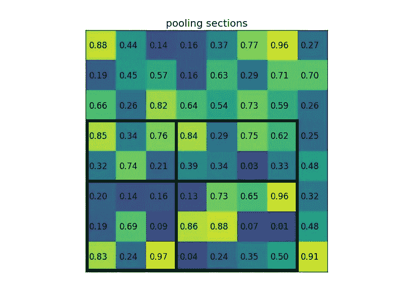*

*请注意，感兴趣区域的大小不必被汇集部分的数量整除(在这种情况下，我们的 RoI 是 7×5，我们有 2×2 个汇集部分)。
每个区段的最大值为:*

*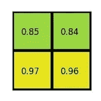*

*这是兴趣区图层的输出。下面是我们以动画形式展示的例子:*

*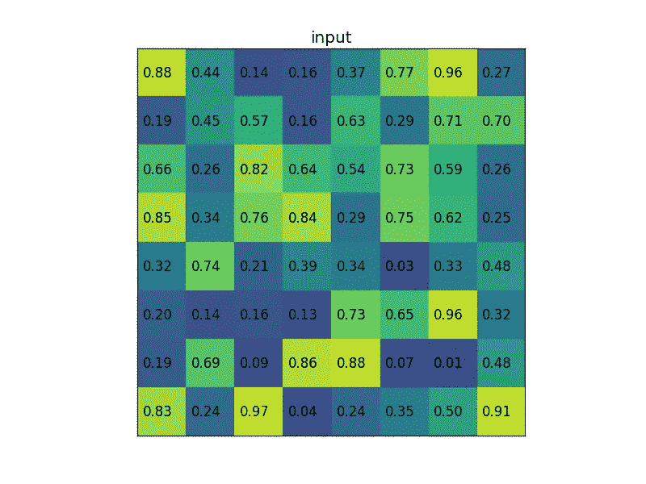*

*结果是，从具有不同大小的矩形列表中，我们可以快速获得具有固定大小的对应特征图的列表。请注意，RoI 汇集输出的维度实际上并不取决于输入特征地图的大小，也不取决于区域建议的大小。这完全取决于我们将提案分成多少部分。*

***投资回报池的好处是什么**？其中之一是处理速度。如果框架上有多个对象提议(通常会有很多)，我们仍然可以对它们使用相同的输入特征映射。由于在处理的早期计算卷积是非常昂贵的，这种方法可以节省我们很多时间。*

*现在，为了使这个快速 RCNN 更快，研究人员在主干网络后添加了**区域提议网络**。这给了我们，*

# ****更快——RCNN****

****(***[***)面向实时目标检测的区域建议网络***](https://arxiv.org/abs/1506.01497)***)****

*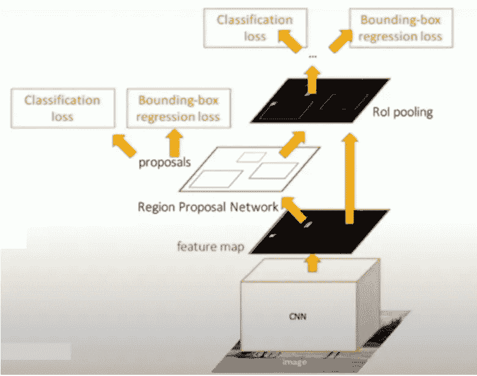*

*快速 RCNN 的体系结构*

*在这里，我们将消除称为选择性搜索的算法，而是训练卷积神经网络来预测我们的区域建议。我们将采用的方法与快速 RCNN 非常相似，只是在运行主干网络之后，我们将插入一个名为**区域建议网络(RPN)** 的微型网络，负责预测区域建议。*

*基本上，在我们得到区域建议后，Fast-RCNN 和 Fast-RCNN 的工作是相同的。*

***步骤 1:** 通过主干网络运行输入图像，获得图像级特征*

***步骤 2:** 将图像级特征传递给 **RPN** 以获得我们的区域建议*

***步骤 3:** 通过投资回报池裁剪区域提案*

***步骤 4:** 将扭曲特征传递给光 CNN，用于预测最终分类和边界框变换*

*这里的问题是我们如何使用 CNN 来输出地区建议？*

*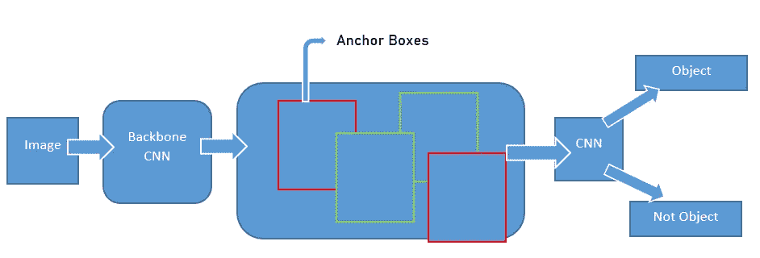*

*区域提议网络的体系结构*

*来自主干网络的 CNN 图像特征都与输入中的位置对齐。因此，我们可以做的是，在 CNN 特征图中的每个点，我们可以想象锚框，它只是在图像周围滑动，我们将锚框放置在 CNN 特征图中来自主干网络的每个位置。*

*现在，我们的任务是训练小 CNN 将这些锚盒分类为包含或不包含对象。*

> **这里我们有一个问题，所以问题是，如果锚定框可能有错误的形状或纵横比呢？**

*因此，这个问题的解决方案是，我们使用“k”个不同的锚框，它们在图像的每个点上具有不同的形状和不同的纵横比。因此，尺度、大小、锚框数量是对象检测的超参数。*

*基本上，更快的 RCNN 是两个阶段的过程:*

***第一阶段:物体探测器由**组成*

**骨干网**

**地区提案网**

***第二阶段:每个区域运行一次，我们，***

**作物特征→利益汇集区域**

**预测对象类**

**预测包围盒偏移量**

*现在，问题来了，我们真的需要第二阶段吗？*

*看起来，我们实际上可以只使用第一级，而让这个第一级做所有的事情。这将稍微简化系统，使它更快，因为我们不必在每个区域运行这些单独计算。*

*因此，有一种用于对象检测的方法，称为**单级对象检测器**，在 Fast-RCNN 的情况下，它基本上看起来像区域提议网络(RPN ),而不是将锚盒分类为对象或非对象，而是它将对对象的类别做出完全的分类决定。*

*这为我们提供了两个单级检测器，*

1.  *YOLO(你只看一眼)*
2.  *单发多盒探测器*

****我们将在下一篇文章中看到*** [***YOLO 及其实现***](/analytics-vidhya/understanding-yolo-and-implementing-yolov3-for-object-detection-5f1f748cc63a) ***。****

* [## YOLO 为对象检测，架构解释！

### 在前一篇文章“使用 RCNN 家族模型的对象检测简介”中，我们看到了 RCNN 家族模型…

medium.com](/analytics-vidhya/understanding-yolo-and-implementing-yolov3-for-object-detection-5f1f748cc63a) 

# 摘要

在这篇文章中，您发现了对对象检测问题的温和介绍，以及旨在解决该问题的最先进的深度学习模型。

具体来说，您学到了:

*   你学习了图像分类、目标定位和目标检测之间的基本区别
*   你学习了基于区域的卷积神经网络(R-CNNs ),这是一系列用于处理对象检测任务的技术，旨在提高模型性能。

## 参考资料:

R-CNN 家庭报纸

*   [用于精确对象检测和语义分割的丰富特征层次](https://arxiv.org/abs/1311.2524)，2013 年。
*   [视觉识别深度卷积网络中的空间金字塔池](https://arxiv.org/abs/1406.4729)，2014。
*   [快速 R-CNN](https://arxiv.org/abs/1504.08083) ，2015。
*   [更快的 R-CNN:利用区域提议网络实现实时对象检测](https://arxiv.org/abs/1506.01497)，2016。
*   [投资回报池](https://deepsense.ai/region-of-interest-pooling-explained/)
*   Andrew NG 的 YouTube 视频*