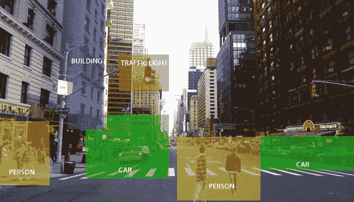
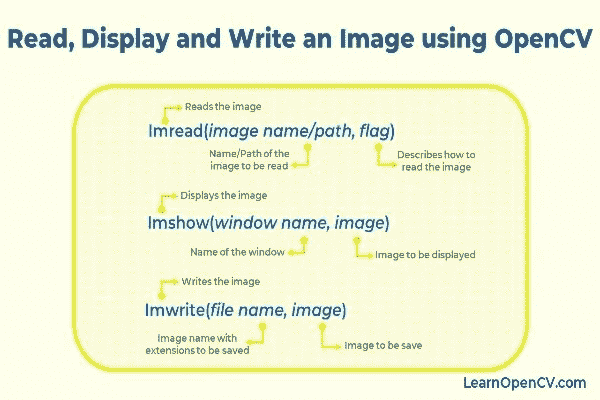
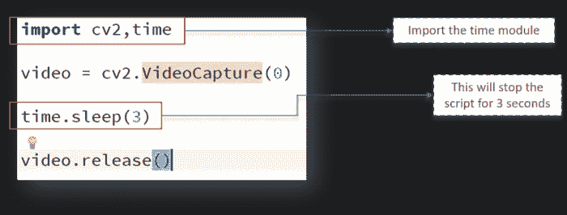
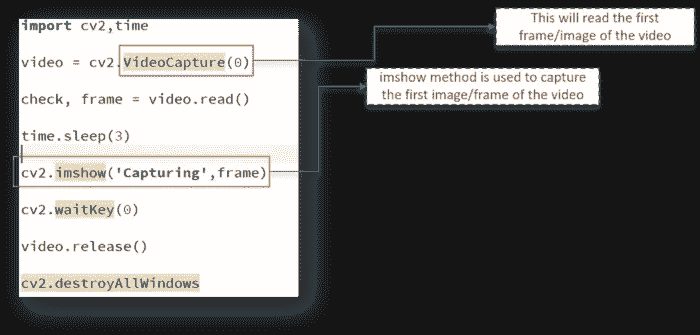

# OpenCV 简介

> 原文：<https://medium.com/analytics-vidhya/introduction-to-opencv-1497623a8a7d?source=collection_archive---------12----------------------->


布鲁斯·马斯在 [Unsplash](https://unsplash.com?utm_source=medium&utm_medium=referral) 上的照片

O[***penCV***](https://opencv.org/)**也称为“开源计算机视觉库”，是一个包括数百种计算机视觉算法的开源库。**

> **现实生活中的问题需要同时利用多个构建模块才能达到预期的结果。所以，我们只要了解需要哪些模块和功能才能得到你想要的！**

*今天，我们将深入了解一些基本功能，帮助您开始使用 OpenCV:)*

# *OpenCV 是什么？*

*OpenCV(开源计算机视觉库)是一个开源的计算机视觉和机器学习软件库。它是为各种目的而构建的，例如机器学习、计算机视觉、算法、数学运算、视频捕获、图像处理等。*

## *目的*

*计算机视觉的目的是理解图像的内容。它从图片中提取描述，可以是一个物体，一个文字描述，一个三维模型。例如，计算机视觉可以帮助汽车识别道路周围的不同物体，如交通灯、行人、交通标志等，并采取相应的行动。*

**

# *为什么要用 OpenCV？*

1.  *许多成熟的公司，如谷歌、雅虎、微软、英特尔、IBM、索尼、本田、丰田都广泛使用 OpenCV。*
2.  *该库包含超过 2500 种优化算法，在性能和速度方面具有出色的准确性。*
3.  *OpenCV 拥有大量的用户、开发人员和研究人员，人数超过 4.7 万，预计下载次数超过 700 万次。*
4.  *它拥有 C++、C、Python、Java 和 MATLAB 接口，支持 Windows、Linux、Android 和 macOS。*

**

# *装置*

```
*pip install opencv-python*
```

# *入门指南*

## *导入 OpenCV*

```
***import** **cv2** *# OpenCV-Python**
```

## *打开/显示/保存图像*

**

*LearnOpenCV.com 的照片*

```
*import cv2
# Black and White (gray scale)
Img = cv2.imread (“Penguins.jpg”,0)
cv2.imshow(“Penguins”, img)
cv2.waitKey(0)
# cv2.waitKey(2000)
cv2.destroyAllWindows()*
```

## *缩放图像*

```
*import cv2
# Black and White (gray scale)
img = cv2.imread (“Penguins.jpg”,0)
resized_image = cv2.resize(img, (650,500))
cv2.imshow(“Penguins”, resized_image)
cv2.waitKey(0)
cv2.destroyAllWindows()*
```

**

## *捕捉视频*

**

## *添加窗口*

**

*我希望这篇文章能帮助你学习使用 Python 开始学习 OpenCV 所需的基础知识。*

*欲了解更多信息，请访问:*

1.  *[https://bookauthority.org/books/new-opencv-books](https://bookauthority.org/books/new-opencv-books)*
2.  *[https://opencv.org/opencv-python-free-course/](https://opencv.org/opencv-python-free-course/)*
3.  *[https://www.tutorialspoint.com/opencv/index.htm](https://www.tutorialspoint.com/opencv/index.htm)*

*现在，您可以使用 Python 来使用 OpenCV 了。
所有最好的❤️*