# OpenCV 简介

> 原文：<https://medium.com/analytics-vidhya/introduction-to-opencv-586e38d536fd?source=collection_archive---------12----------------------->

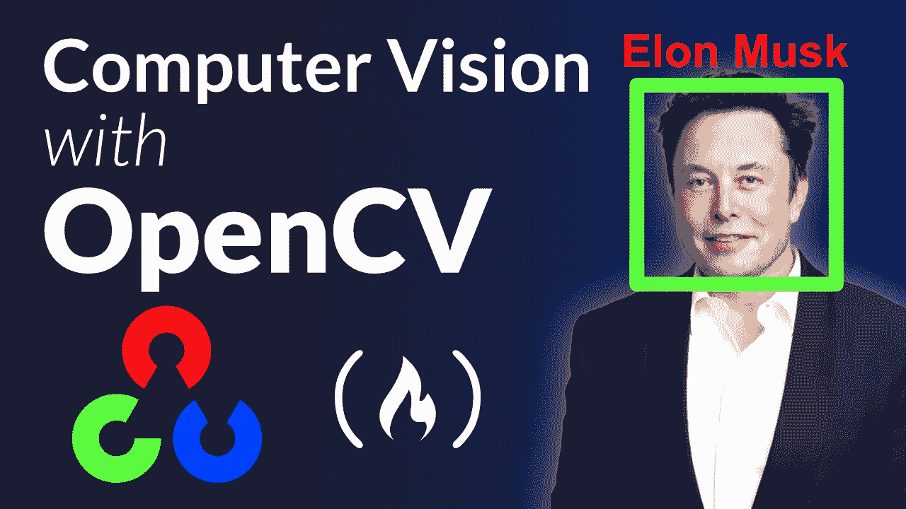

**目录**

1.  图像介绍
2.  装置
3.  进口
4.  读取图像
5.  阅读视频
6.  访问网络摄像头
7.  将图像转换为灰度、模糊、hsv
8.  边缘检测
9.  图像扩展、腐蚀
10.  裁剪和调整大小
11.  在图像上绘制形状
12.  将文本放在图像上
13.  扭曲透视
14.  连接图像

# 图像介绍

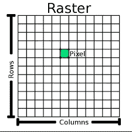

【qgis.org 的 图片

一个**像素**是图像的最小单位。它组合起来形成一个图像，视频，文本，或任何我们在电脑显示器上看得见的东西。

## 装置

```
pip install opencv-python
```

**导入**

```
import cv2
cv2.__version__
```

opencv-python 包中的 cv2.imshow()函数与 Jupyter/Colab notebook 不兼容。因此，请使用以下函数:

```
from google.colab.patches import cv2_imshow 
cv2_imshow(img)
```

## 读取图像

```
# import image in img variableimg = cv2.imread('lambo.jpeg')
```

## 显示图像

```
cv2.imshow('Output', img)
cv2.waitKey(0)
```

如果你不使用 waitKey()函数，那么图像会立即消失，你在屏幕上什么也看不到。

waitKey(x)在图像消失之前增加了 x 毫秒的延迟。当从键盘上按下一个键时，它返回该键的 ASCII 值。如果在 x 毫秒之前没有按下任何东西，则返回-1。waitKey(0)无限期等待按键。

## 阅读视频

```
cap = cv2.VideoCapture(VIDEO PATH)
while True:
  success, img = cap.read()
  cv2.imshow('Output', img)
  if cv2.waitKey(1) & 0xFF == ord('q'):
    break
```

变量' *cap* '存储视频。“img”将在每次迭代中从视频中获取下一帧

*cv2 . wait key(1)&0x ff = = ord(' q ')这一行表示*当用户从键盘上按下' q '时，我们的视频将会停止。

Colab/Jupyter 笔记本将显示视频中的图像序列。

## 访问网络摄像头

```
cap = cv2.VideoCapture(0) # id for default webcam = 0

cap.set(3, 640) # width=640, id=3 for width
cap.set(4, 480) # height=480, id=4 for height
cap.set(10, 100) # brightness=100, id=10 for brightness

while True:
    success, img = cap.read()
    cv2.imshow('Output', img)
    if cv2.waitKey(1) & 0xFF == ord('q'):
        break
```

Google Colab 是一个云平台，它不能访问你的本地系统网络摄像头，所以上面的代码不会在上面运行。如果你正在使用 Google Colab，点击这里的链接。

**将图像转换成灰度**

```
imgGray = cv2.cvtColor(img, cv2.COLOR_BGR2GRAY)
```

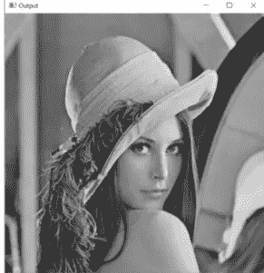

**使图像模糊**

```
imgBlur = cv2.GaussianBlur(imgGray, (7, 7), 0)
```

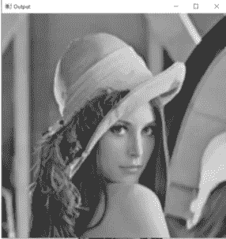

**将图像转换成 HSV 图像**

```
imgHSV = cv2.cvtColor(img, cv2.COLOR_BGR2HSV)
```

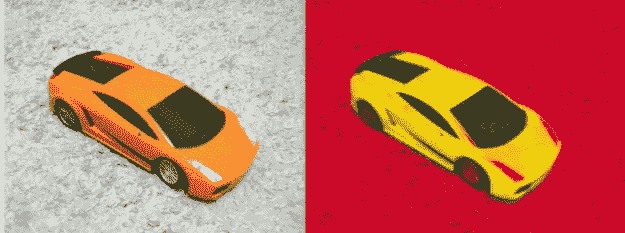

**边缘检测器:在图像中寻找边缘**

```
imgCanny = cv2.Canny(img, 100, 100)
```

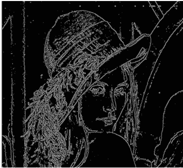

**扩张:增加边缘厚度**

```
kernel = np.ones((5,5), np.uint8)
imgDialation = cv2.dilate(imgCanny, kernel, iterations=1)
```

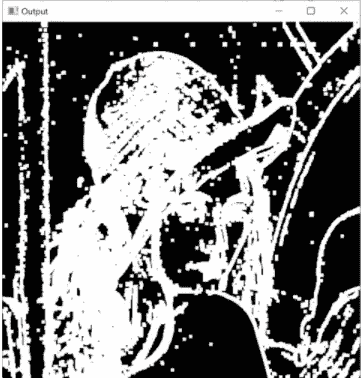

**侵蚀:减少边缘厚度**

```
kernel = np.ones((5, 5), np.uint8)
imgEroded = cv2.erode(imgDialation, kernel, iterations=1)
```

**调整大小和裁剪**

缩小尺寸:

```
imgResize = cv2.resize(img, (300, 200))
```

增加尺寸:

```
imgResize = cv2.resize(img, (800, 200))
```

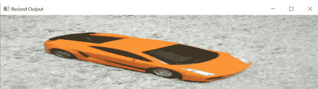

裁剪:

```
imgCropped = img[0:200, 200:500]
```

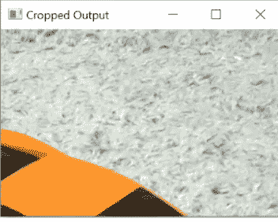

**在图像上画正方形**

```
img = np.zeros((512, 512, 3), np.uint8)
img[:] = 255, 0, 0
```

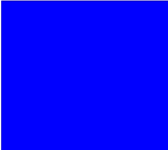

```
img[200:300, 200:300] = 0,255,0
```

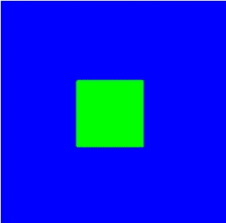

**在图像上画线**

*cv2.line(图像，起点，终点，颜色，厚度)*

```
img = np.zeros((256, 256, 3), np.uint8)cv2.line(img, (0,0), (100,200), (0,0,255), 3)
```

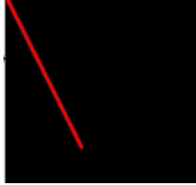

**在图像上绘制矩形**

*cv2.rectangle(图像，起点，终点，颜色，填充矩形。*

```
img = np.zeros((256, 256, 3), np.uint8) 
cv2.rectangle(img, (0,0), (200, 150), (0,255,0), cv2.FILLED)
```

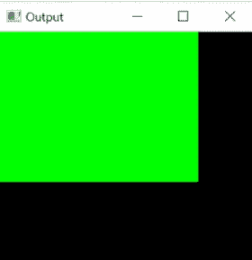

**在图像上画圆**

*cv2.circle(图像，中心，半径，颜色，粗细)*

```
img = np.zeros((256, 256, 3), np.uint8) 
cv2.circle(img, (100, 150), 30, (11, 12, 122), 2)
```

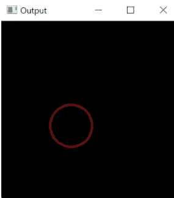

**在图像上写文字**

*cv2.putText(图像、文本、起点、字体样式、比例、颜色、粗细)*

```
img = np.zeros((256, 256, 3), np.uint8) 
cv2.putText(img, 'OPENCV', (30,100), cv2.FONT_HERSHEY_COMPLEX, 1, (255,0,0), 1)
```

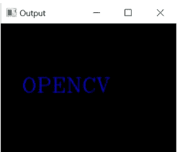

**扭曲透视:获得图像的鸟瞰图**

**透视变换**用于正确对齐图像。参见图片示例:

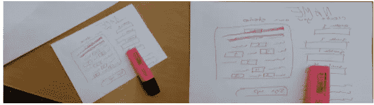

```
import numpy as np
import cv2img = cv2.imread(IMAGE PATH)width, height = 250, 350pts1 = np.float32([[111,219],[287,188],[154,482],[352,440]])

pts2 = np.float32([[0,0],[width,0],[0,height],[width, height]])
matrix = cv2.getPerspectiveTransform(pts1, pts2)imgOutput = cv2.warpPerspective(img, matrix, (width, height))cv2.imshow('img', img)
cv2.imshow('Result', imgOutput)
cv2.waitKey(0)
```

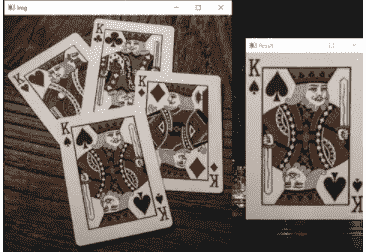

**加入图像**

```
import numpy as np
import cv2img = cv2.imread(IMAGE PATH)
imgHor = np.hstack((img, img))
imgVer = np.vstack((img, img))cv2.imshow('Horizontal', imgHor)
cv2.imshow('Vertical', imgVer)
cv2.waitKey(0)
```

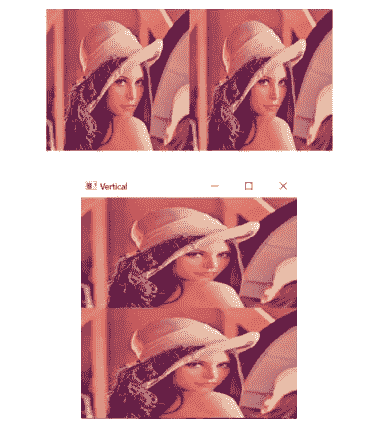

对于以上两种方法，图像应该具有相同数量的通道，并且图像不能被缩小或放大。

因此，请使用下面的函数:

```
def stackImages(scale,imgArray):
    rows = len(imgArray)
    cols = len(imgArray[0])
    rowsAvailable = isinstance(imgArray[0], list)
    width = imgArray[0][0].shape[1]
    height = imgArray[0][0].shape[0]
    if rowsAvailable:
        for x in range ( 0, rows):
            for y in range(0, cols):
                if imgArray[x][y].shape[:2] == imgArray[0][0].shape [:2]:
                    imgArray[x][y] = cv2.resize(imgArray[x][y], (0, 0), None, scale, scale)
                else:
                    imgArray[x][y] = cv2.resize(imgArray[x][y], (imgArray[0][0].shape[1], imgArray[0][0].shape[0]), None, scale, scale)
                if len(imgArray[x][y].shape) == 2: imgArray[x][y]= cv2.cvtColor( imgArray[x][y], cv2.COLOR_GRAY2BGR)
        imageBlank = np.zeros((height, width, 3), np.uint8)
        hor = [imageBlank]*rows
        hor_con = [imageBlank]*rows
        for x in range(0, rows):
            hor[x] = np.hstack(imgArray[x])
        ver = np.vstack(hor)
    else:
        for x in range(0, rows):
            if imgArray[x].shape[:2] == imgArray[0].shape[:2]:
                imgArray[x] = cv2.resize(imgArray[x], (0, 0), None, scale, scale)
            else:
                imgArray[x] = cv2.resize(imgArray[x], (imgArray[0].shape[1], imgArray[0].shape[0]), None,scale, scale)
            if len(imgArray[x].shape) == 2: imgArray[x] = cv2.cvtColor(imgArray[x], cv2.COLOR_GRAY2BGR)
        hor= np.hstack(imgArray)
        ver = hor
    return ver
```

现在，使用上面的函数连接图像:

```
import numpy as np
import cv2img = cv2.imread(IMAGE PATH)
imgGray = cv2.cvtColor(img, cv2.COLOR_BGR2GRAY)imgStack = stackImages(0.5, ([[img, img, img], [img, imgGray, img]]))
# Here, 0.5 is the scale. You can add the scale of your choicecv2.imshow('Horizontal', imgStack)
cv2.waitKey(0)
```

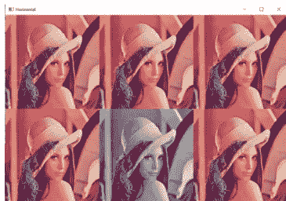

这些是 opencv 的一些基本功能。要了解更多，请参考 opencv 官方文档[这里](https://docs.opencv.org/master/d6/d00/tutorial_py_root.html)。

如果你喜欢我的博客，那么看看我以前的一些博客:

1.  [海风](https://khushijain2810.medium.com/seaborn-data-visualization-library-142ac64d5560)
2.  [熊猫](https://khushijain2810.medium.com/pandas-python-data-analysis-library-1d061c982fc8)
3.  [Numpy](https://khushijain2810.medium.com/numpy-day-3-at-internity-foundation-efcef826e549)

快乐学习！！