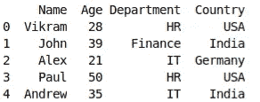
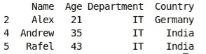
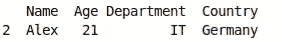
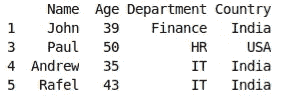
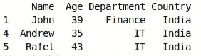

# 熊猫 DataFrame.query()函数介绍

> 原文：<https://medium.com/analytics-vidhya/introduction-to-pandas-dataframe-query-function-60b5408ae58b?source=collection_archive---------3----------------------->

# 概观

*   有时，在 EDA(探索性数据分析)过程中，选择或过滤数据框可能是一项乏味的任务
*   Pandas DataFrame query()使用户能够像 SQL 中的 where 子句一样分析和过滤数据

# 介绍

Python 是数据科学家主要使用的编程语言之一。这种语言激增的原因是它易于使用，并享有强大的社区支持，具有用于数据分析和预测建模的专用库。Pandas 就是这样一个库，它被数据科学界广泛接受，用于执行数据清理和分析。


有时，在 EDA(探索性数据分析)过程中，选择或过滤数据框可能是一项单调乏味的任务。因此，pandas 提供了一些功能，即使对于初学者来说，这也是一件轻而易举的事情。查询是一个非常有用的功能。它使用户能够像 SQL 中的 where 子句一样分析和过滤数据。此外，它有助于以内存高效的方式同时编译几个条件，因为它不使用临时变量。

在本文中，我们将看到一个非常有趣的 pandas 数据框函数[查询。](https://pandas.pydata.org/pandas-docs/stable/reference/api/pandas.DataFrame.query.html)

# 目录

1.  句法
2.  过滤 IT 部门的员工
3.  不居住在印度的 IT 部门员工
4.  OR 条件的实现
5.  使用环境变量
6.  为什么使用查询？

# 句法

在开始查询之前，让我们先看一下语法。

```
**pandas.DataFrame.query(expr,inplace=false,**kwargs) 
expr:The condition to filter the data. 
inplace: weather the query modify the original data or return a modified copy. 
**kwargs: Any other keyword argument you want to pass**
```

现在我们来看一些例子，看看这个神奇的函数如何简化您的分析。

让我们首先为演示创建一个数据帧

```
import pandas as pd 
import numpy as np 
df= pd.DataFrame({'Name':['Vikram','John', 'Alex','Paul','Andrew','Rafel' ], 
'Age':[28,39,21,50,35,43], 
'Department':['HR', 'Finance','IT','HR','IT','IT'], 
'Country':['USA','India','Germany','USA','India','India'] }) print(df.head())
```



现在，让我们使用 pandas 为其 DataFrame 对象提供的查询函数来过滤数据集。

在本例中，我们只想选择为 IT 部门工作的员工。

```
import pandas as pd
import numpy as np 
df= pd.DataFrame({'Name':['Vikram','John', 'Alex','Paul','Andrew','Rafel' ], 
'Age':[28,39,21,50,35,43],
'Department':['HR', 'Finance','IT','HR','IT','IT'], 
'Country':['USA','India','Germany','USA','India','India'] }) print(df.query('Department == "IT"'))
```

这是需要的结果。数据集中有所有 IT 部门的员工。



让我们再举一个用‘and’同时满足两个条件的例子。

```
import pandas as pd 
import numpy as np 
df= pd.DataFrame({'Name':['Vikram','John', 'Alex','Paul','Andrew','Rafel' ], 
'Age':[28,39,21,50,35,43], 'Department':['HR', 'Finance','IT','HR','IT','IT'], 
'Country':['USA','India','Germany','USA','India','India'] }) print(df.query('Department == "IT" and Country != "India" '))
```

在数据集中，只有一个雇员同时满足这两个要求。



这里我们给出另一个例子来说明如何实现“OR”子句。这意味着选择满足第一个条件或另一个条件的记录。

```
import pandas as pd 
import numpy as np 
df= pd.DataFrame({'Name':['Vikram','John', 'Alex','Paul','Andrew','Rafel' ], 
'Age':[28,39,21,50,35,43], 'Department':['HR', 'Finance','IT','HR','IT','IT'], 
'Country':['USA','India','Germany','USA','India','India'] }) print(df.query('Age>= 40 or Country =="India"'))
```

## 输出



# 使用环境变量

有时我们想在表达式中使用环境变量，我们可以在变量名前使用@。就像 SQL 一样，您可以使用子查询引用来选择满足条件的行。 *'@'* 方法保存要比较的值。如下例所示。

在示例中，Location 是一个局部变量。要在查询表达式中使用它，你只需要在它前面加上@就可以了。

```
import pandas as pd 
import numpy as np 
df= pd.DataFrame({'Name':['Vikram','John', 'Alex','Paul','Andrew','Rafel' ], 
'Age':[28,39,21,50,35,43], 
'Department':['HR', 'Finance','IT','HR','IT','IT'], 
'Country':['USA','India','Germany','USA','India','India'] } Location= " India" print(df.query( Country == @Location'))
```

## 输出



**注意**:始终记住你的列名中是否有空格，但是在表达式中使用时在一对反斜杠(")之间，或者用" _ "替换空格

# 为什么使用查询？

对于时间和空间的数据科学家或软件程序员来说，在考虑执行任务的方式时，复杂性是重要的方面。该查询方法对于较大的数据集非常有效。因为它节省了内存，也为用户提供了更清晰的语法。

# 结束注释

总之，这里我们看到了 pandas.query，这是一个非常有用的函数，可以对数据帧进行切片和切块。如果你是 python 的绝对初学者，我会推荐你参加我们的 [Python 课程(免费)](https://courses.analyticsvidhya.com/courses/introduction-to-data-science)，以增强你的 Python 基础。

最后，我有个任务给你。只需选择一个数据集，尝试不同的数据过滤方法，并比较它们的时间和内存效率。如果你想在评论中分享你的发现，那就太好了。

另外，如果你有任何疑问，请在下面评论。