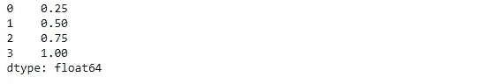
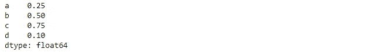

# 熊猫图书馆简介

> 原文：<https://medium.com/analytics-vidhya/introduction-to-pandas-library-d507a48980c9?source=collection_archive---------16----------------------->

Pandas 是建立在 Numpy 之上的一个较新的包，它提供了数据帧的高效实现。数据帧本质上是具有附加行和列标签的多维数组，并且通常具有异构类型和/或缺失数据。

**在 windows 系统上安装熊猫:**

```
pip install pandas
```

我们将通过首先导入库来开始编码会话:

```
import numpy as np
import pandas as pd
```

**熊猫系列对象:**

熊猫系列是索引数据的一维数组。它可以从数组列表中创建，如下所示:

```
data = pd.Series([0.25, 0.5, 0.75, 1.0])
data
```



该系列包装了一个值序列和一个索引序列，我们可以使用值和索引属性来访问它们。像 Numpy 数组一样，数据可以通过方括号由关联的索引访问。

```
data[1]
```

Numpy 和 Pandas 之间的主要区别在于，Numpy 数组有一个隐式定义的整数索引用于访问值，Pandas 系列有一个显式定义的与值相关联的索引。

以上陈述可以用下面的例子来详细解释:

```
data = pd.Series([0.25, 0.5, 0.75, 0.1], index=['a','b','c','d'])
data
```



这里，显式声明的索引不同于所使用的正常数值。

**系列专业词典:**

字典是将任意键映射到一组任意值的结构，序列是将类型键映射到一组类型值的结构。

```
population_dict = {'California': 38332521,'Texas': 26448193, 'New York': 19651127, 'Florida': 19552860, 'Illinois': 12882135}
population_dict = pd.Series(population_dict)
population_dict
```


默认情况下，将创建一个序列，其中索引是从已排序的键中提取的。

**熊猫数据帧对象:**

DataFrame 类似于二维数组，具有灵活的行索引和列索引。

```
states = pd.DataFrame({'population':population_dict})
states
```

**系列数据选择:**

1.  作为字典的系列

```
data = pd.Series([0.25, 0.5, 0.75, 1.0],
                index=['a','b','c','d'])
data
```

2.一维数组形式的序列:

```
data['a':'c']
```

有两种索引类型。1.含蓄 2。明确的

让我们用一个例子来理解

```
data = pd.Series(['a','b','c'], index=[1,3,5])
data#explicit index when indexing
data[1]
#output : 'a'#implicit index when indexing
data[1:3]
#output: 
#3  b
#5  c
```

由于在整数索引的情况下这种潜在的混淆，pandas 提供了一些特殊的索引器属性，它们显式地公开了某些索引模式。

首先，loc 属性允许始终引用显式索引的索引和切片:

```
#loc
data.loc[1]
# output: 'a'data.loc[3:5]
#ouput:
#3  b
#5  c
```

iloc 属性允许始终引用隐式 Python 风格索引的索引和切片

```
#iloc
data.iloc[1]
#ouput: 'b'data.iloc[1:3]
#output:
#3  b
#5  c
```

在本教程中，我们学习了熊猫的基本知识。

为了访问本教程的 jupyter 笔记本，请点击下面的链接:

[](https://github.com/Pallavi885/Pandas/blob/main/Introduction%20to%20Pandas.ipynb) [## pallavi 885/熊猫

### 在 GitHub 上创建一个帐户，为 Pallavi885/Pandas 的发展做出贡献。

github.com](https://github.com/Pallavi885/Pandas/blob/main/Introduction%20to%20Pandas.ipynb)