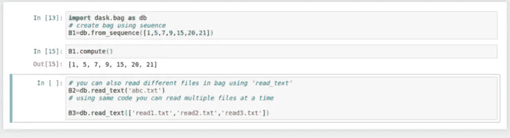

# 使用 Dask 介绍机器学习中的并行处理

> 原文：<https://medium.com/analytics-vidhya/introduction-to-parallel-processing-in-machine-learning-using-dask-93438a899cf9?source=collection_archive---------1----------------------->

如果我让你说出 5 个机器学习库。你会怎么回答？让我猜猜，

1.  熊猫
2.  Numpy
3.  scikit 学习
4.  matplotplib
5.  scikit 图像

我的答案和你的一致吗，我想差不多。是的，因为我们都从这些库开始了我们的数据科学之旅，我们开始做玩具项目，而没有意识到我们远离了真实世界的场景。

如果我说没那么简单呢。假设您必须处理 6 GB 的大型数据集，并且您有 4GB RAM 和四核处理器，Pandas 和 NumPy 虽然是非常高效的库，但将无法处理该任务，并且您的机器将开始崩溃。

在上面的例子中，它是一个小数据集，但在现实生活中的科学研究机器学习项目中，数据大小从 GBs 到 PBs 不等，你甚至不能想到在你的机器上运行它。

图片来源:[https://hackersandslackers.com/pandas-dask/](https://hackersandslackers.com/pandas-dask/)

这是您在数据科学之旅中从初学者转向专业人员时面临的挑战。有许多工具被设计来解决这样的问题，Dask 就是其中之一。在本文中，我们将探索 Dask 及其工作原理。

**什么是 Dask :**

如果你必须学习一个新的工具并重写整个代码，这会使整个过程变得很麻烦。在这种情况下，最好的解决方案是不需要或只需要很少的改变。

> **Dask 是一个灵活的开源并行处理 python 库。**

Dask 是一个 python 高级 API，用于使用多线程/进程/机器并行处理大型数据集。它为 pandas 和 NumPy 提供了另一个抽象层，使它们在处理大型数据集和复杂模型时更加高效。

**为什么是 Dask:**

上图显示，python 是大多数程序员和分析师最喜欢的语言，因为它是开源的，并且有丰富的包来解决你提到的问题。

这些 python 包适合在单台机器上运行，但是我们需要一些东西，通过使它们可伸缩来使这些高效的 python 包更加高效。

Dask 与 python 及其生态系统合作，使其可以从单台机器扩展到大型集群。

追随事物让 Dask 独一无二

1.  用 Dask 写代码和熊猫、NumPy、sci kit-learn 很像。它通过使用大部分 API 和内部数据结构使上述包具有可扩展性。使用这些软件包的数据科学家可以轻松地切换到 Dask。
2.  Dask 的速度**更快**，因为它通过内存计算、数据局部性和惰性评估避免了数据传输、不必要的计算和通信。
3.  它可以很容易地**扩大到**大型集群，而**缩小到**单台机器。代码改动最小。
4.  Dask 引擎兼容许多分布式调度程序，包括 YARN 和 Mesos
5.  Dask 是响应性的，这意味着它提供了一个交互式环境，向用户快速反馈。此外，它支持仪表板

【Dask 如何工作:

如前所述，Dask 是一个并行处理库。如果你不熟悉“别担心”这个术语，我会解释的。任何计算都可以用两种方式进行

*   串行处理
*   并行处理

假设您有一组任务{A，B，C，D，E}，现在您可以用两种方式执行这些任务

串行处理，即一个接一个的任务被顺序执行，如下所示

第二种方法是同时执行独立的任务，并追求结果

你认为哪种方法更快，显然是第二种。所以 Dask 使用这种并行处理来减少更大的机器学习问题的计算时间。

现在的问题是 Dask 是如何做到的。Dask 有两种方法可以让项目变得可伸缩和并行

1.用户界面

2.任务调度

让我们一个个看看。

**Dask 的用户界面:**

**高层接口:**

关注 Dask 的主要目的是获得 pandas、NumPy 和 sci-kit learn 的可扩展版本。因此，我们有 Dask 数组、Dask 数据帧和 Dask 包，这有助于大型数据集的核心计算。

1.  **Dask 数组:**

Dask 阵列由许多以网格形式排列的 NumPy 阵列组成。这些 NumPy 阵列可以驻留在磁盘、不同的内核、集群中的多台机器上，以支持并行处理大于 RAM 的数据集。

Dask 实现了大多数 NumPy 数组接口，这意味着您可以在 Dask 数组上执行大多数操作，就像使用类似 NumPy 数组一样

1.算术运算

2.转置、矩阵乘法、点积

3.限幅

4.线性代数运算

由于 Dask 延迟求值，在上面的代码中触发了我们需要调用的动作。 **compute()** 。

**Dask 数据帧:**

Dask 数据帧是驻留在磁盘或集群中多台机器上的多个 pandas 数据帧的大型并行集合。在 Dask 数据帧上执行动作导致在该数据帧的多个熊猫约束上并行执行该操作。

在 pandas 数据帧上执行的大多数操作都可以在 Dask 数据帧上执行，例如

*   元素式操作
*   行方式选择
*   限幅
*   聚合(最小值、最大值、平均值、分组依据)等。

## Dask 包:

Dask bag 是 pandas list 的并行实现，pandas list 是元素的异构集合。Dask Bag 在对 JSON blobs 或日志文件等半结构化或非结构化对象执行操作时非常有用。

Dask bag 实现了对数据集合的过滤、分组、映射、折叠等操作。此外，它是一种计算密集型数据类型，因此，在对数据进行初始清理和操作后，将 dask 包转换为 Dataframe 或 Array 非常重要。

**低级接口:**

通过 dask 的这些现成可用的数据类型，您可以轻松地并行化您的代码，但有时这还不够，程序员希望他们的代码以定制的方式工作。为了解决这个问题，Dask 提供了名为**延迟**和**未来的低级接口。**

**延迟:**

如果你使用 python，你一定非常清楚一个叫做**‘装饰者’的概念。装饰器是 python 中强大的工具，它允许程序员修改函数的行为。Dask 使用这个 python 实用程序来实现代码的定制并行化。**

在上面的代码中，Dask delayed 修饰了用户定义的函数，这样它们就可以懒惰地操作**。现在问题来了，什么是懒惰执行？这是 Spark RDDs 使用的一种优化技术。**

首先，在惰性执行中，有向非循环图(DAG)被准备好，以在调用一个动作时找到执行一系列任务的最佳方式。**计算**在这种情况下，执行开始。

因此，您可以将延迟添加到任何可并行化的代码中，并以自己的方式加速这个过程。

**未来**

在延迟之后，我们在 Dask 中有了另一个提供定制并行化的低级接口，它被称为 **Future。**与 delayed 不同，future 支持数据的立即执行而不是懒惰执行。在计算需求可能随时间变化的情况下，它提供了更大的灵活性。这使得 dask 支持实时框架。

**Dask 图**

上面解释的低级和高级用户界面生成 Dask 图。dask 图可以定义为将关键字映射到任务的 python 字典。其中键是任何 python 可散列的，值是任何 python 对象而不是任务，任务是具有可调用的第一个元素的元组。

简单地说，在 dask 图中，每个节点都是一个简单的 python 函数，节点之间的边是由一个任务创建的 python 对象，将由另一个任务使用。可以使用**进行可视化。**视觉化()。当您在上面的代码中运行 z.visualize()时，您将得到一个任务图作为输出。

**Dask 调度**

一旦任务图准备就绪，现在就需要在并行硬件上执行，这个任务将调度程序带入画面。任务调度程序使用任务图并计算结果。

dask 中主要有两种类型的调度程序:

**单机调度器**

这个调度程序在 dask 中是默认的，它使用本地资源，即**进程**和**线程池**进行并行处理。它易于安装和使用，而且价格低廉。因为一切都在本地进行，所以不涉及数据传输的开销。它有不可伸缩性的限制，只能在单台机器上使用

**分布式调度器**

这种类型的调度更加复杂和精密。对于分布式调度，我们有 **Dask.distributed** 库。它是一个集中管理的动态任务调度器，其中 dask 调度器管理和协调分布在集群中的多个 dask 工作器的功能。调度器对变化的任务图进行检查，并相应地做出响应，这使得它更加灵活。这个调度器可以在本地运行，也可以跨集群运行，在集群中，多个工作器将通过 TCP 进行通信。

**限制**

1.  Dask 将代码并行化，使其运行更快，但也增加了复杂性。因此，在到达 dask 以使过程更快之前，最好寻找其他选择。在某些情况下，Dask 不是最佳解决方案。
2.  在处理 1 GB 到 100 GB 之间的数据时，Dask 是一个很好的选择。如果您的数据低于 1 GB，您应该避免 dask 产生的开销，在这种情况下，请使用 Pandas。如果您的数据大小超过 100 GB，在这种情况下，Dask 不是一个有效的解决方案，您可以考虑 Pyspark。
3.  Dask 不会在单个任务中并行化。因此，个人任务应该有一个最佳的规模，这样他们就不会压倒任何特定的工人。

终于，穿越达斯克的旅程结束了。在本文中，我的目标是向您介绍一种工具，使用它我们可以克服现实生活中机器学习项目的挑战。Dask 通过其高级和低级接口和调度程序帮助我们以非常有效的方式做到这一点。但是我的学习还没有结束，我相信你也没有结束。

参考

*   [https://docs.dask.org/en/latest](https://docs.dask.org/en/latest)
*   [https://www . analyticsvidhya . com/blog/2018/08/dask-big-datasets-machine _ learning-python/](https://www.analyticsvidhya.com/blog/2018/08/dask-big-datasets-machine_learning-python/)
*   [https://conference . scipy . org/proceedings/scipy 2015/pdf/Matthew _ rocklin . pdf](https://conference.scipy.org/proceedings/scipy2015/pdfs/matthew_rocklin.pdf)
*   [https://arxiv.org/pdf/1907.13030.pdf](https://arxiv.org/pdf/1907.13030.pdf)