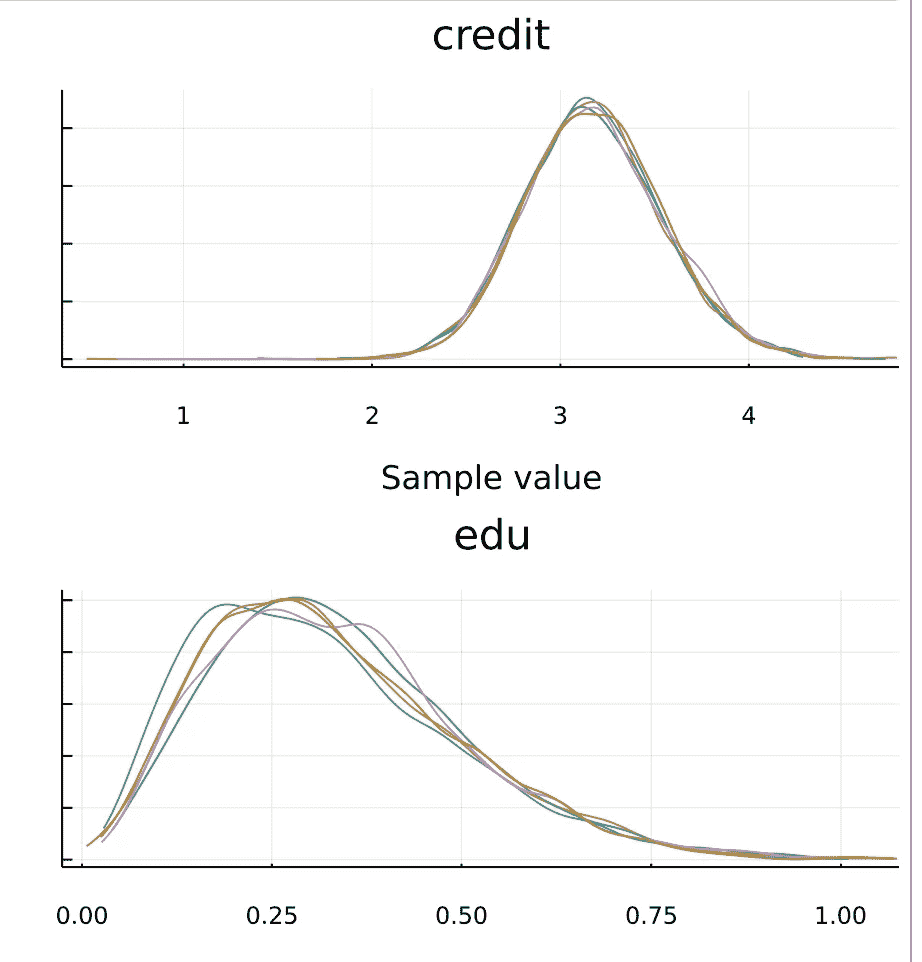
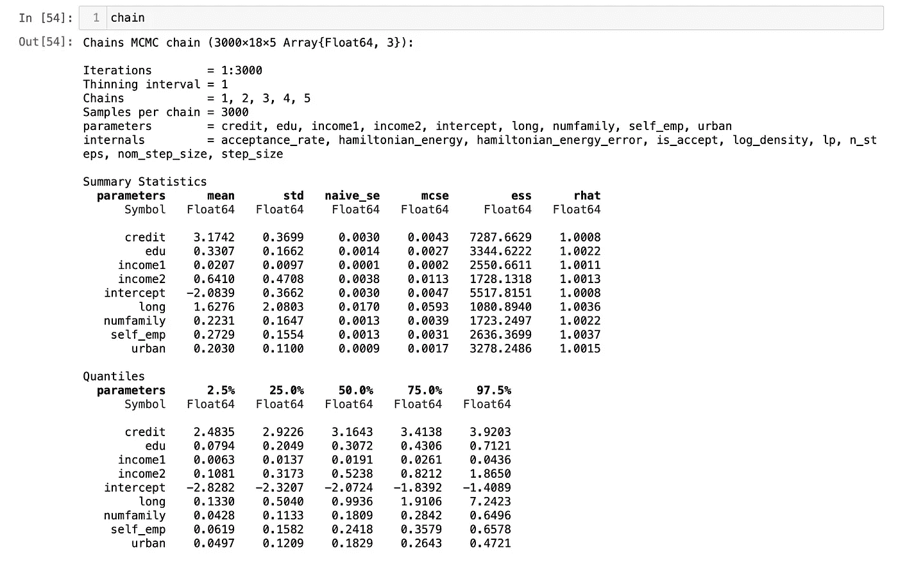

# Julia 中的概率规划介绍

> 原文：<https://medium.com/analytics-vidhya/introduction-to-probabilistic-programming-in-julia-33960c7929f0?source=collection_archive---------13----------------------->

在这篇文章中，我将使用[贷款批准预测](https://datahack.analyticsvidhya.com/contest/practice-problem-loan-prediction-iii/?utm_source=auto-email#MySubmissions)数据来说明如何使用 Julia 包[图灵](https://turing.ml/stable/)用概率编程进行贝叶斯推断。我将来自[图灵教程](https://turing.ml/dev/tutorials/2-logisticregression/)的代码应用于贷款分类问题。

# 贝叶斯理论

P(Y|X)P(X) = P(XY) = P(X|Y)P(Y)

如果 X 是我们的数据，也叫证据，Y 是我们的模型假设，P(Y)是我们看到任何证据之前的概率，叫先验概率。在实践中，我们通常假设均匀分布或正态分布。

P(X|Y)是似然函数，这意味着如果我们知道模型假设/参数的值，那么我们可以通过使用似然函数来获得证据发生的概率。

P(Y|X)是给定我们看到数据/证据 X 的情况下，我们的模型假设的概率，也称为后验概率。

贝叶斯推断是根据我们能观察到的数据样本 X 来估计后验概率 P(Y|X)的过程。通常，我们会重复以下步骤:

1.  假设先验概率为均匀或正态分布。
2.  使用概率来生成模型参数 Y’。
3.  使用 Y '的样本来生成数据 X '。
4.  将生成的 X '与我们观察到的实际数据进行比较。
5.  根据 X 和 X '的差值更新后验概率。例如，如果差值小于我们预设的阈值，我们将保持 Y’的值。经过多次迭代后，我们通过使用我们保留的所有采样 Y '来估计后验概率分布。

**概率编程**是我们使用计算机语言建立贝叶斯模型的方式。它们提供了一种简单的方法来定义概率模型并自动求解。

在 Julia 中，我们用来定义概率模型的包是 ***Turing.jl*** 。

# 贝叶斯逻辑回归

我们可以使用贝叶斯推断来估计逻辑回归的参数。这里，我将以[贷款审批预测](https://datahack.analyticsvidhya.com/contest/practice-problem-loan-prediction-iii/?utm_source=auto-email#MySubmissions)数据为例。

> 家庭可支配收入=主要申请人收入+w1 *共同申请人收入-人均支出*家庭成员人数。
> 
> 每期还贷额=贷款总额/贷款总期限
> 
> 贷款批准状态与每期可支配收入与贷款支付的比率有关。

贷款审批状况还会受到信用记录、教育水平、居住区域的位置以及贷款是长期还是短期的影响。

Julia 使用宏`@model`来定义概率模型。其中输入参数 x 是数据向量:

1.  应用程序输入 x[，1]，
2.  共同申请人 x[，2]，
3.  估计家庭成员数 x[，3](我用婚姻状况和赡养人数来估计)，
4.  每个贷款期限的贷款金额 x[，4](即贷款总额/贷款期限)

上述 4 个数据值将被馈入上述可有可无的收入公式。然后，它将由几个 0-1 变量乘以相应的权重进行调整。

1.  状态是否有信用记录 x[，5]，
2.  状态是否有研究生学历 x[，6]，
3.  是否为自雇人士 x[，7]，
4.  是否居住在 x[，8]城区
5.  贷款状态是否为长期 x[，9](贷款期限≥ 360 个月)

最后，将公式的全部输出提供给逻辑函数，以计算伯努利概率。最终分类(Y/N)可视为伯努利分布的 0–1 结果。

```
# Bayesian logistic regression (LR)
[@model](http://twitter.com/model) logistic_regression(x, y, n, σ) = begin
    intercept ~ Normal(0, σ)
    income1 ~ LogNormal(0, σ)
    income2 ~ LogNormal(0, σ)
    numfamily  ~ LogNormal(0, σ)
    credit  ~ LogNormal(0, σ)
    edu  ~ LogNormal(0, σ)
    self_emp  ~ LogNormal(0, σ)
    urban  ~ LogNormal(0, σ)
    long  ~ LogNormal(0, σ)for i = 1:n
        v = 
        logistic(intercept + income1*(x[i, 1] + income2*x[i,2] - numfamily*x[i,3]) / x[i,4] 
        + credit*x[i,5] + edu*x[i,6] + self_emp*x[i,7] + urban*x[i,8] + long*x[i,9]
        )
        y[i] ~ Bernoulli(v)
    end
end;
```

[哈密顿蒙特卡罗](https://en.wikipedia.org/wiki/Hamiltonian_Monte_Carlo)采样器(HMC)用于抽取样本来估计后验分布。下面的代码将迭代并提取存储在“链”中的 3000*5 个样本，链的类型为:Vector{ChainDataFrame}。

```
# Retrieve the number of observations.
n, _ = size(train)# Sample using HMC.
chain = mapreduce(c -> sample(logistic_regression(train, train_label, n, 1), HMC(0.05, 10), 3000),
    chainscat,
    1:5
)
```

通过绘制“链”数据，我们可以得到模型参数的后验分布。下面是参数的示例图:“信用记录”和“教育背景”。一个看起来像正态分布，而另一个看起来像对数正态分布。



这里是所有参数的平均值，以及其他统计数据。



我们可以看到“信用历史”的参数是所有其他状态变量中最高的。这意味着申请人是否有信用记录比教育背景、就业和居住地区更重要。

此外，共同申请人收入的权重(w1)为 0.64。参照公式部分:申请人-收入+w1 *共同申请人-收入。这意味着，与主申请人的全部收入相比，只有 60%的共同申请人收入被考虑在内。

# 预言；预测；预告

利用后验分布中每个参数的平均值，我们可以对测试集进行预测。

```
function prediction(x::Matrix, chain, threshold)
    # Pull the means from each parameter's sampled values in the chain.
    intercept = mean(chain[:intercept][:,])
    income1 = mean(chain[:income1][:,])
    income2 = mean(chain[:income2][:,])
    numfamily = mean(chain[:numfamily][:,])
    credit = mean(chain[:credit][:,])
    edu = mean(chain[:edu][:,])
    self_emp = mean(chain[:self_emp][:,])
    urban = mean(chain[:urban][:,])
    long = mean(chain[:long][:,])# Retrieve the number of rows.
    n, _ = size(x)# Generate a vector to store our predictions.
    v = Vector{Float64}(undef, n)# Calculate the logistic function for each element in the test set.
    for i in 1:n
        num = 
        logistic(intercept + income1*(x[i, 1] + income2*x[i,2] - numfamily*x[i,3]) / x[i,4] 
        + credit*x[i,5] + edu*x[i,6] + self_emp*x[i,7] + urban*x[i,8] + long*x[i,9]
        )
        if num >= threshold
            v[i] = 1
        else
            v[i] = 0
        end
    end
    return v
end;
```

将阈值设置为 0.5，我们可以得到预测的输出。

```
threshold = 0.5
predictions = prediction(test, chain, threshold)
```

我们在测试集上达到的准确率约为 79%。挺好的！