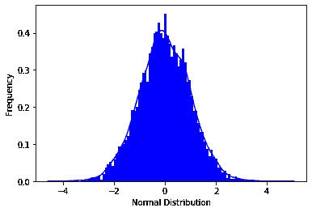

# ML 中的概率统计导论

> 原文：<https://medium.com/analytics-vidhya/introduction-to-probability-and-statistics-in-ml-6b3b918dbc83?source=collection_archive---------31----------------------->

# 统计数字

**统计学**简单来说就是数字数据，是一个数学领域，通常处理数据的收集、制表和数字数据的解释。它实际上是一种数学分析的形式，使用不同的定量模型来产生一组实验数据或对现实生活的研究。这是一个应用数学领域，涉及数据收集、分析、解释和展示。统计学研究数据如何被用来解决复杂的问题。有些人认为统计学是一门独特的数学科学，而不是数学的一个分支。


# 安装统计数据

要安装统计数据，我们使用以下命令

> pip 安装统计

# 导入统计数据

> 将统计数据作为 st 导入

# 入门指南

> 进口统计为 st
> 进口海运为 sn

**Mean() :**
它是一个样本集中所有值的平均值的度量。

```
import statistics as st
import seaborn as snn=[2,23,4,55,5,54,5,54,6,15]
print(“Mean of the number is :”,st.mean(n))out : Mean of the number is : 22.3
```

**Mode ():**
是样本集中出现频率最高的值。中央集合中重复次数最多的值实际上是 mode。

```
n=[34,5,5,5,54,343,5,45,4]
print("Mode of the number is :",st.mode(n))out: Mode of the number is : 5
```

**Median() :**
它是一个样本集的中心值的度量。其中，数据集从最低值到最高值排序，然后找到中间值。

```
n=[34,5,5,5,54,343,456,56,6,56,4,5,45,4]
print("Median of the number is :",st.median(n))

out: Median of the number is : 20.0
```

**方差:**

```
**S2=** ∑ni=1 [(xi - ͞x)2 ÷ n]n=[34,5,5,5,54,343,5,45,4]
print(st.variance(n))out:
12010.527777777777
```

# 正态分布

```
from scipy.stats import norm
data=norm.rvs(size=10000,loc=0,scale=1)
a=sn.distplot(data,bins=100,kde=True,color='blue',hist_kws={"linewidth":15,"alpha":1})
a.set(xlabel='Normal Distribution', ylabel='Frequency')out:[Text(0, 0.5, 'Frequency'), Text(0.5, 0, 'Normal Distribution')
```



# 泊松分布

```
from scipy.stats import poisson
d=poisson.rvs(size=1000,mu=3)
a=sn.distplot(d,bins=100,kde=False,color='blue',hist_kws={"linewidth":15,"alpha":1})
a.set(xlabel='Poisson Distribution',ylabel='Frequency')out:[Text(0, 0.5, 'Frequency'), Text(0.5, 0, 'Poisson Distribution')]
```


# γ分布

```
from scipy.stats import gamma
data=gamma.rvs(a=5,size=10000)
a=sn.distplot(data,kde=True,bins=100,color='blue',hist_kws={"linewidth":15,"alpha":1})
a.set(xlabel='Gamma Distribution',ylabel='Frequency')out:[Text(0, 0.5, 'Frequency'), Text(0.5, 0, 'Gamma Distribution')]
```


# 均匀分布

```
from scipy.stats import uniform
d=uniform.rvs(size=1000,loc=5,scale=20)
a=sn.distplot(d,bins=100,kde=True,color='blue',hist_kws={"linewidth":15,"alpha":1})
a.set(xlabel='Uniform Distribution',ylabel='Frequency')out:[Text(0, 0.5, 'Frequency'), Text(0.5, 0, 'Uniform Distribution')]
```

