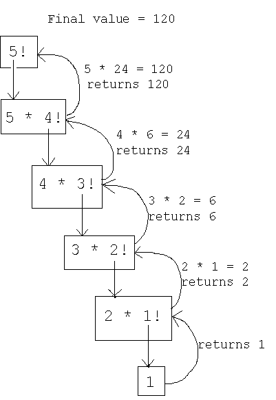

# 递归介绍

> 原文：<https://medium.com/analytics-vidhya/introduction-to-recursion-c1f593c7440?source=collection_archive---------18----------------------->

# 什么是递归？

递归是根据事物本身来定义事物的过程。

物理世界的一个例子是放置两个彼此面对的平行镜子。它们之间的任何对象都将被递归反射。

递归主要有两种情况。第一种情况是递归被用作一种技术，在这种技术中，函数对自己进行一次或多次调用。第二种情况是，当数据结构表示自身时，它使用完全相同类型的数据结构的较小实例。

# 为什么要用递归？

递归提供了一种在循环不理想的情况下重复执行任务的方法。大多数现代编程语言都支持递归。递归是构建特殊数据结构的一个很好的工具。

现在，让我们从创建分数函数的示例练习开始。

# 阶乘示例

阶乘函数用感叹号表示，定义为从 1 到 *n* 的整数的乘积。形式上，我们可以这样表述:

*n* ！=*n*⋅(*n*−1)⋅(*n*−2)…3⋅2⋅1

注意，**如果 n = 0，那么 n！= 1** 。考虑这一点很重要，因为它将作为我们的*基础案例*。

举个例子:

4!=4⋅3⋅2⋅1=24.

那么我们如何以递归的方式来表述呢？这就是**基础案例**概念的由来。

基本案例是理解递归的一个关键部分，尤其是在解决处理递归的面试问题时。让我们重写上面 4 的等式！所以看起来是这样的:

4!=4⋅(3⋅2⋅1)=24

请注意，这与以下内容相同:

4!=4⋅3!=24

这意味着我们可以用递归来重写正式的递归定义，如下所示:

*n* ！=*n*⋅(*n*1)！

注意，**若 n = 0，则 n！= 1** 。这意味着一旦 n=0，**基本情况**出现，则*递归情况*在上面的等式中定义。每当你试图开发一个递归解决方案时，考虑基本情况是非常重要的，因为一旦所有的递归情况都完成了，你的解决方案将需要返回基本情况。让我们看看如何在 Python 中创建阶乘函数:

```
def fact(n):
    '''
    Returns factorial of n (n!).
    Note use of recursion
    '''
    # BASE CASE!
    if n == 0:
        return 1

    # Recursion!
    else:
        return n * fact(n-1)
```

让我们看看它的实际效果吧！

```
fact(5)120
```

请注意，我们如何使用 if 语句来检查基本情况是否发生。没有它，这个函数就不会成功完成运行。我们可以用下图来直观显示递归:

```
from IPython.display import Image
from IPython.core.display import HTML 
Image(url= 'http://faculty.cs.niu.edu/~freedman/241/241notes/recur.gif')
```



我们可以按照这个流程图从上到下，到达基础案例，然后再向上。

递归是一个强大的工具，但它可能是一个难以实现的概念。

如果你有任何反馈或批评，请随时与我分享。如果本演练对您有所帮助，请喜欢👏文章。干杯！