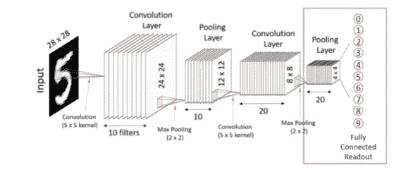
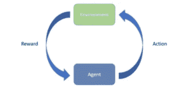
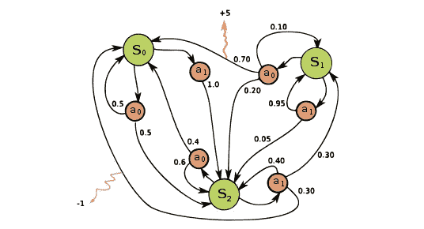
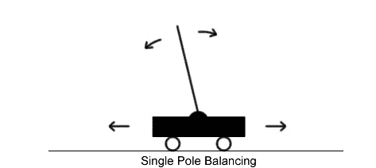

# PyTorch 中的强化学习(RL)介绍

> 原文：<https://medium.com/analytics-vidhya/introduction-to-reinforcement-learning-rl-in-pytorch-c0862989cc0e?source=collection_archive---------1----------------------->


艾莉娜·格鲁布尼亚克在 [Unsplash](https://unsplash.com/) 上的照片

# 监督学习概述

到目前为止，我们主要关心的是监督学习问题(主要是分类)。在监督学习中，我们被给予某种由输入/输出对组成的训练数据，目标是在学习模型后，能够在给定一些新输入的情况下预测输出。例如，我们之前研究了 MNIST 的卷积神经网络(CNN)分类模型；给定 60000 个数字图像和相应的数字标签(例如“5”)的训练集，我们学习了能够预测新 MNIST 图像的数字标签的模型。换句话说，类似于(但不完全是)这样:



作者图片

如果我们想学习如何执行更复杂的行为，数据收集可能会很昂贵，怎么办？你如何教机器人走路？自动驾驶汽车？在围棋比赛中如何打败人类冠军？

# 强化学习

进入强化学习。在强化学习中，我们的模型(在上下文中通常称为*代理*)通过采取*动作* 𝑎a 与*环境*进行交互，并以*奖励* 𝑟.的形式接收来自环境的某种反馈从这个意义上说，强化学习算法是通过经验来学习的。我们把一个任务从开始到结束的轨迹称为*集*，通常我们的代理人会通过经历许多集来学习。



作者图片

许多强化学习算法被建模为马尔可夫决策过程。在这些设置中，我们有一个*状态* 𝑠的概念，它封装了代理的情况(例如位置、速度)。从每个状态𝑠𝑡，代理采取动作𝑎𝑡，这导致从一个状态𝑠𝑡到另一个状态𝑠𝑡+1.的转换在许多情况下，这种转变是随机的，也就是说在𝑠𝑡+1 的分布取决于𝑠𝑡和𝑎𝑡.通常，这些状态中的几个被认为是剧集结束，之后代理人不能再进行任何转换或收集任何更多的奖励。这些对应于诸如到达最终目标、游戏结束或跌落悬崖的状态。最终，我们的目标是学习一个*政策* 𝜋或者从状态到行动的映射。

在一个 MDP 中，我们假设我们总能知道我们的代理在𝑠𝑡的哪个州。然而，情况并非总是如此。有时，我们所能得到的只是𝑜𝑡的观察，它提供了𝑠𝑡st 的信息，但足以精确地指出确切的一个。我们称这样的设置为部分可观测马尔可夫决策过程(POMDPs)。想象一下，例如一个 Roomba 被训练用 RL 在客厅导航。从它的红外线和机械“颠簸”传感器，它接收到部分信息(𝑜𝑡ot)关于它可能在哪里，但不是一个确定的位置(𝑠𝑡).作为 POMDP 操作给 RL 算法增加了一整层的复杂性。不过，在今天剩下的时间里，我们将关注 MDP，因为它们更简单，更容易用来教授基本概念。

## 一个简单的 MDP 例子



作者图片

在上面的例子中，我们可以看到代理的 3 个可能状态为𝑠0、𝑠1 和𝑠2，每个状态有 2 个动作𝑎0 和𝑎1。我们可以看到，每个动作并不会导致决定性的下一个阶段的过渡，正如每个动作的多条路径所示。请注意，每个行动的结果都标有一个介于 0 和 1 之间的黑色小数字。这表示给定动作的结果的概率(我们结束的状态);由于这些是概率，给定前一状态𝑠𝑡st 和选定动作𝑎𝑡，到达每个下一状态𝑠𝑡+1 的概率之和是 1。

## 目标

代理的目标是最大化𝑅R 在一系列步骤中获得的总报酬。重要的是要确保奖励确实抓住了我们希望代理实现的真正目标。代理人会尽职地尝试最大化它被给予的目标，而不考虑任何人类可能期望的隐含目标。有很多关于 RL 代理通过利用奖励函数的某些方面来学习不良行为的(有趣的)轶事。因此，定义这种奖励需要特别小心。

RL 研究人员通常采用的一种对策是*折扣*奖励的概念。这是用一个乘法项𝛾:完成的一个奖励𝑇一步在未来被贴现为𝛾𝑇𝑟𝑇.使用折扣鼓励代理人尽早完成任务，这是一个常见的隐含标准。有了折扣，RL 代理的目标是最大化:


作者图片

这远远不是让我们的奖励准确捕捉我们想要的目标的完整解决方案，但是尽早获得更高的奖励是一个几乎普遍的偏好，所以我们几乎总是添加它。设计一个好的奖励函数可能是高度依赖于任务的艺术。

## 强化学习作为监督学习？

起初，这似乎与我们之前看到的监督方法没有太大的不同，可能会出现一些自然的问题:

*   为什么我们不能把 RL 当成一个被监督的任务？为什么我们不能用回报(或者说，回报的负数)作为我们的监督损失？

与监督学习不同，在强化学习中，我们通常没有预先分配的数据集可供学习。在一些问题设置中，我们可能有其他代理(通常是人类)执行期望任务的例子，但这些不一定是如何最大化回报的最佳例子，这是我们想要学习的。在大多数 RL 环境中，除了我们的代理人通过试错法所经历的，我们没有任何国家行为轨迹的例子，这甚至更次优。

# 开放 AI 健身房

在我们深入实施强化学习模型之前，首先我们需要一个环境。请记住，我们的目标是学习一个能够以我们想要的方式与环境交互的智能体，所以我们需要一些我们的智能体能够与之交互并从中获得回报的东西。在机器人学中，这通常是真实世界(或者真实世界中的一些设置)。然而，首先在模拟环境中测试我们的算法通常更便宜、更快。有许多任务是强化学习社区的流行基准，如[推车杆](https://en.wikipedia.org/wiki/Inverted_pendulum)、[山地车](https://en.wikipedia.org/wiki/Mountain_car_problem)或[雅达利 2600 游戏](https://gym.openai.com/envs/#atari)。本着在研究社区中加速进步和促进开放的精神，Open AI 非常好地编写了 [Open AI Gym](https://gym.openai.com/) ，其中有许多这些环境的实现供公众使用。我们将使用这些环境，因为它允许我们专注于算法本身，而不是担心我们自己实现每个问题集。

要使用它，我们首先需要下载并安装它。首先确保您处于 PyTorch 环境中！

```
*# If you environment isn't currently active, activate it:*
*# conda activate pytorch*pip install gym
```

安装完成后，我们可以像导入任何其他 Python 模块一样导入它:

```
import gym
```

# FrozenLake(网格世界)

先说一个简单的环境:FrozenLake。以下是来自 OpenAI 健身房的官方描述:

> 冬天来了。当你和你的朋友在公园里扔飞盘时，你把飞盘扔到了湖中央。水大部分都结冰了，但是有几个冰融化的洞。如果你踏入其中一个洞，你会掉进冰冷的水里。在这个时候，有一个国际飞盘短缺，所以它是绝对必要的，你航行穿过湖和检索光盘。然而，冰很滑，所以你不会总是朝着你想要的方向移动。

FrozenLake 作为网格世界的可视化:


作者图片

在一集的开始，我们从左上角开始。我们的目标是将自己移动到右下角(G)，避免掉进洞里(H)。冰水是冷的。

用强化学习的术语来说，网格上 16 个位置中的每一个都是一个状态，动作试图向四个方向移动(左、下、右、上)。当代理改变位置时，每次移动将导致代理的状态从𝑠𝑡变为𝑠𝑡+1，除非它试图向墙的方向移动，这导致代理的状态不变(代理不移动)。我们因达到目标(G)而获得正奖励“+1”，根据花费的时间打折。虽然掉进一个洞(H)没有负奖励，但代理人仍然要支付罚款，因为掉进洞里是一集的结尾，因此阻止它获得任何奖励。我们想学习一个𝜋政策，它能以尽可能少的步骤把我们从出发点带到目标。

为了真正确立我们在这里试图实现的目标，有必要揭穿一些常见的初始误解:

*   **关于状态和转移概率的知识:**从上往下看，你的第一个想法可能是从起点到终点画出一条路径，就像你在迷宫里一样。然而，这个视图是提供给我们算法设计者的，因此我们可以直观地看到手头的问题。学习任务的代理人*而不是*获得了这个先验知识；我们要告诉它的是，会有 16 个状态，每个状态会有 4 个可能的动作。一个更恰当的类比是，如果我蒙上你的眼睛，把你扔进一个冰冻的湖中，每当你决定向四个方向中的一个方向迈出一步时，告诉你你的州(位置)，然后在你踩上飞盘时燃放烟花。
*   **目标知识(奖励):**在 OpenAI 对环境的官方描述中，你(代理人)知道你希望完成什么:你想取回飞盘，同时避免掉进冰里。代理人不知道这件事。相反，它通过体验奖励(或惩罚)来学习目标，算法更新其政策，以便它更有可能(或更不可能)再次做那些动作。请注意，这意味着如果代理从未体验过某些奖励，它就不会知道它们的存在。
*   **寻路、物理等先验知识。:**作为一个人类，即使你以前没有解决过这个任务，你仍然为这个问题带来了大量的先验知识。例如，你知道到目的地的最短路径是一条线。你知道北、南、东、西是方向，先向北再向南会把你带回到原来的地方。你知道冰很滑。你知道冰水是冷的。你知道在冰冷的水中是不好的。重要的是要记住，我们的代理将开始不知道这些事情；它最初的政策基本上是完全随机地选择行动。在训练结束时，它仍然不知道像“北/南”、“冷”或“滑”这样的抽象概念是什么意思，但它将(希望)学会一个好的政策，使它能够完成目标。

## 与 FrozenLake 互动

这个例子非常简单，我们可以很容易地自己编写环境及其接口，但是 OpenAI 已经完成了，我们希望尽可能地关注解决它的算法。我们可以用一行代码创建 FrozenLake 的实例化:

在[ ]:

```
env **=** gym.make('FrozenLake-v0')
```

开放的人工智能健身房环境提供了一种观察环境状态的机制，由于 FrozenLake 是一个 MDP(与 POMDP 相反)，所以观察就是状态本身。对于 FrozenLake，地图上有 16 个网格位置，这意味着我们有 16 个州。我们可以通过查看我们刚刚创建的环境的`observation_space`属性的大小来确认这一点。

在[ ]:

```
env.observation_space
```

我们的代理将与这个环境交互，导致其状态改变。对于 FrozenLake，我们有 4 个选项，每个选项对应于尝试向特定方向前进:`[Left, Down, Right, Up]`。我们可以通过观察我们环境中`action_space`的大小来证实这一点。

在[ ]:

```
env.action_space
```

在与环境交互之前，我们必须首先重置它以初始化它。复位还会返回复位后第一个状态的观察结果。在 FrozenLake 中，我们总是从左上角开始，这对应于状态 0。因此，我们看到`reset()`命令返回`0`。

在[ ]:

```
env.reset()
```

我们可以通过调用`render()`来可视化 FrozenLake 环境。在更复杂的任务中，这实际上会向视频添加帧来显示我们代理的进度，但对于 FrozenLake，它只是打印出一个文本表示，突出显示的字符显示我们代理的当前位置。我们可以看到，正如承诺的那样，我们从左上角的“S”开始。

在[ ]:

```
env.render()
```

现在，让我们试着移动。需要记住的一点是，最初的 FrozenLake 环境是“湿滑的”。因为有冰，如果你试着朝一个方向走，你会有 1/3 的机会朝你想去的方向走，两个相邻的方向各有一个。例如，如果我们试着向右走，我们有相等的概率滑倒和上下。这使事情变得有点复杂，所以现在，让我们首先关闭随机性，使这成为一个确定性的转换。我们通过注册一个新类型的环境，然后实例化所述环境的一个副本，确保首先重置它。

在[ ]:

```
# Non-slippery versionfrom gym.envs.registration import register
register(
    id='FrozenLakeNotSlippery-v0',
    entry_point='gym.envs.toy_text:FrozenLakeEnv',
    kwargs={'map_name' : '4x4', 'is_slippery': False},
)
env = gym.make('FrozenLakeNotSlippery-v0')
env.reset()
```

我们在 OpenAI 环境中使用`step()`方法来推进时间，该方法将一个`action`作为参数。让我们试着向右移动，这对应于`2`的动作。请注意，输出是一个由四个元素组成的元组:下一次观察(`object`)、奖励(`float`)、该集是否完成(`boolean`)以及可能对调试有用的信息字典(`dict`)(这个字典不应该用于最终的算法本身)。

在[ ]:

```
env.step(2)
```

接下来，让我们`render()`来可视化发生了什么。注意，这个特定的环境打印出我们在括号中采取的行动，在这个例子中是“(右)”，然后显示该行动的结果。请注意，虽然大多数时候，我们成功地朝着我们想要的方向前进，但偶尔我们会在冰上滑倒，朝着我们不想去的方向前进。

在[ ]:

```
env.render()
```

我们可以想做多少次就做多少次。因为我们在 Jupyter 中，我们可以继续运行同一个单元(做一些小的编辑来改变我们的动作)。

请注意，一旦我们掉进了一个洞里，这一集就结束了，我们再也不能做任何事情。达到目的后也是如此。

在[ ]:

```
env.step(0)
env.render()
```

在我们进入任何 RL 之前，让我们看看随机动作在这种环境中是如何执行的:

在[ ]:

```
env.reset()
done = Falsewhile not done:
    env.render()
    action = env.action_space.sample()
    _, _, done, _ = env.step(action)
```

嗯。不太好。好吧，显然选择随机的步骤不太可能让我们达到目标。从地图上可以明显看出，我们可以学习更好的政策。我们将如何做到这一点？

## q 学习

我们可以使用许多算法，但让我们选择 Q-learning，这是我们今天早些时候讨论过的。记住，在 Q-learning 中(事实证明，还有 SARSA)，我们试图学习系统中各状态的 Q 值。

𝜋保单的 q 值是𝑠s 和𝑎a 行动的函数，定义如下:


作者图片

直觉上，q 值是代理人将获得的总回报(包括贴现),如果它从𝑠采取行动𝑎a，然后在剩余的剧集中遵循𝜋政策。正如人们所预料的那样，如果 q 是确切已知的，代理人将从𝑠s 那里获得最高的报酬，如果𝜋选择 q 值最高的𝑎a。

好的，如果我们知道系统的 Q 值，那么我们可以很容易地找到最优策略。那么系统的 Q 值是多少呢？嗯，开始的时候，我们不知道，但是我们可以试着通过经验来学习。这就是 Q-learning 的用武之地。Q-learning 以下列方式迭代更新 Q 值:


作者图片

请注意，Q-learning 是一种*非政策*方法，在某种意义上，你实际上并没有从你实际走的轨迹中学习(否则就是 SARSA)。相反，我们从*贪婪*转变中学习，即我们知道如何采取的最佳行动。

就是这样！我们让我们的代理人经历了许多集，经历了许多𝑠𝑡→𝑎𝑡→𝑠𝑡+1 转换和回报，就这样，我们最终学会了一个好的 q 函数(因此也是一个好的政策)。现在，当然，有一堆小细节和调整，使这项工作在实践中，但我们会得到这些以后。

## FrozenLake 的 q 学习

FrozenLake 是一个非常简单的场景，我们称之为玩具问题。只有 16 个状态和 4 个动作，只有 64 个可能的状态-动作对(16x4=64)，如果我们考虑到目标和情节结尾的漏洞，就更少了(但为了简单起见，我们不会这样做)。有了这几个状态-行为对，我们实际上可以简单地解决这个问题。让我们建立一个 Q 表，并将所有状态-动作对的 Q 值初始化为零。注意，虽然我们可以，但在这个例子中我们实际上不需要 PyTorchPyTorch 的亲笔签名和神经网络库在这里是不必要的，因为我们只是要修改一个数字表。相反，我们将使用 Numpy 数组来存储 Q 表。

在[ ]:

```
import numpy as np#Initialize table with all zeros to be uniform
Q = np.zeros([env.observation_space.n, env.action_space.n])
```

我们要设置几个超参数:

*   `alpha`:Q 功能的学习率
*   `gamma`:未来奖励的折扣率
*   `num_episodes`:我们的代理将从中学习的片段数(从起点到目标/球洞的轨迹)

我们还将把我们的奖励存储在一个名为`rs`的数组中。

在[ ]:

```
# Learning parameters
alpha = 0.1
gamma = 0.95
num_episodes = 2000# array of reward for each episode
rs = np.zeros([num_episodes])
```

现在是算法本身的大部分。请注意，我们将循环执行流程`num_episodes`次，每次都重置环境。在每一步，我们采取当前状态下 Q 值最高的行动，并加入一些随机性(尤其是在开始时)以鼓励探索。每次行动后，我们都会根据经历的奖励和下一个最佳行动，贪婪地更新我们的 Q 表。我们还确保更新我们的状态，冲洗，并重复。我们继续在一集里采取行动，直到它结束，存储该集的最终总奖励。

在[ ]:

```
for i in range(num_episodes):
    # Set total reward and time to zero, done to False
    r_sum_i = 0
    t = 0
    done = False

    #Reset environment and get first new observation
    s = env.reset()

    while not done:
        # Choose an action by greedily (with noise) from Q table
        a = np.argmax(Q[s,:] + np.random.randn(1, env.action_space.n)*(1./(i/10+1)))

        # Get new state and reward from environment
        s1, r, done, _ = env.step(a)

        # Update Q-Table with new knowledge
        Q[s,a] = (1 - alpha)*Q[s,a] + alpha*(r + gamma*np.max(Q[s1,:]))

        # Add reward to episode total
        r_sum_i += r*gamma**t

        # Update state and time
        s = s1
        t += 1
    rs[i] = r_sum_i
```

我们表现如何？让我们来看看我们节省下来的奖励。我们可以绘制出奖励与集数的关系，希望我们能看到随着时间的推移，奖励会有所增加。RL 性能的噪声可能非常大，因此让我们绘制一个移动平均值。

在[ ]:

```
## Plot reward vs episodes
import matplotlib.pyplot as plt# Sliding window average
r_cumsum = np.cumsum(np.insert(rs, 0, 0)) 
r_cumsum = (r_cumsum[50:] - r_cumsum[:-50]) / 50# Plot
plt.plot(r_cumsum)
plt.show()
```

非常好。我们还可能对我们的代理实际达到目标的频率感兴趣。这不能说明代理到达那里的速度有多快(这也可能是我们感兴趣的)，但是现在让我们忽略这一点。为了防止我们被数据点淹没，让我们将这些值分成 10 个阶段，打印出每个阶段有多少集导致找到目标。

在[ ]:

```
# Print number of times the goal was reached
N = len(rs)//10
num_Gs = np.zeros(10)for i in range(10):
    num_Gs[i] = np.sum(rs[i*N:(i+1)*N] > 0)

print("Rewards: {0}".format(num_Gs))
```

当移动确定时，我们的 RL 代理在导航 FrozenLake 方面做得非常好，但毕竟，这应该是*冰冻*湖，所以没有滑溜的乐趣在哪里？让我们回到最初的环境，看看代理的表现。

在[ ]:

```
env = gym.make('FrozenLake-v0')#Initialize table with all zeros to be uniform
Q = np.zeros([env.observation_space.n, env.action_space.n])# Learning parameters
alpha = 0.1
gamma = 0.95
num_episodes = 2000# array of reward for each episode
rs = np.zeros([num_episodes])for i in range(num_episodes):
    # Set total reward and time to zero, done to False
    r_sum_i = 0
    t = 0
    done = False

    #Reset environment and get first new observation
    s = env.reset()

    while not done:
        # Choose an action by greedily (with noise) from Q table
        a = np.argmax(Q[s,:] + np.random.randn(1, env.action_space.n)*(1./(i/10+1)))

        # Get new state and reward from environment
        s1, r, done, _ = env.step(a)

        # Update Q-Table with new knowledge
        Q[s,a] = (1 - alpha)*Q[s,a] + alpha*(r + gamma*np.max(Q[s1,:]))

        # Add reward to episode total
        r_sum_i += r*gamma**t

        # Update state and time
        s = s1
        t += 1
    rs[i] = r_sum_i## Plot reward vs episodes
# Sliding window average
r_cumsum = np.cumsum(np.insert(rs, 0, 0)) 
r_cumsum = (r_cumsum[50:] - r_cumsum[:-50]) / 50# Plot
plt.plot(r_cumsum)
plt.show()# Print number of times the goal was reached
N = len(rs)//10
num_Gs = np.zeros(10)for i in range(10):
    num_Gs[i] = np.sum(rs[i*N:(i+1)*N] > 0)

print("Rewards: {0}".format(num_Gs))
```

难多了。然而，我们可以看到模型最终确实学到了一些东西。

# RL 中的 PyTorch

嘿，还不错。然而，尽管前面的例子有趣而简单，但它明显缺乏 PyTorch 的任何暗示。

我们可以使用 PyTorch `Tensor`来存储 Q 表，但是这并不比使用 NumPy 数组好多少。PyTorch 的真正效用来自于构建神经网络和自动计算/应用梯度，而学习 Q 表并不需要这些。

## 连续域

在我们之前的例子中，我们提到只有 16 个离散状态和 4 个动作/状态，Q 表只需要保存 64 个值，这是非常容易管理的。但是，如果状态或动作空间是连续的呢？你可以把它离散化，但是你必须选择一个分辨率，你的状态-行为空间可能会呈指数级爆炸。将这些分箱的状态或动作视为完全不同的状态也忽略了两个连续的分箱在所需的策略中可能非常相似。你可以学习这些关系，但是这样做是非常低效的。

与其学习 Q 表，也许 Q 函数会更合适。这个函数接受一个状态和动作作为输入，并返回一个 Q 值作为输出。Q 函数可能非常复杂，但正如我们在过去几天中所了解的那样，神经网络非常灵活，适合逼近任意函数。[深度 Q 网络](https://deepmind.com/research/dqn/)采取这样的方法。

# 手推车杆

接下来我们来看看大车杆子问题。在这个场景中，我们将一根杆子连接到推车上的铰链上，目的是尽可能长时间地保持杆子垂直，而不会沿着栏杆移动太远。由于重力的原因，杆子会倒下，除非手推车正好在杆子重心的下方。为了防止柱子掉落，代理可以对手推车施加+1 或-1 的力，使其沿着轨道左右移动。对于极点保持垂直的每个时间戳，代理接收+1 的奖励；当杆与垂直方向的夹角超过 15 度，或者推车离开中心超过 2.4 个单位时，游戏结束。我们将有点武断地称获得+200 奖励为“成功”;或者，代理需要在 200 个分笔成交点内避免上述故障情况。



作者图片

首先，让我们创建一个 cart pole 环境的实例:

在[ ]:

```
env **=** gym.make('CartPole-v0')
```

同样，我们可以查看该环境的`observation_space`。同样与 FrozenLake 相似的是，由于这个版本的 cart pole 是一个 MDP(与 POMDP 相反)，所以观察是状态本身。我们可以看到，cart pole 的状态有 4 个维度，对应于`[cart position, cart velocity, pole angle, pole angular velocity]`。重要的是，注意这些状态是连续的值。

在[ ]:

```
env.observation_space
```

我们也可以再看一遍《T2》。在 cart pole 中，有两个动作可供代理使用:`[apply force left, apply force right]`。我们可以通过检查`action_space`属性看到这一点:

在[ ]:

```
env.action_space
```

重置环境返回我们的第一个观察结果，我们可以看到有 4 个值对应于前面提到的 4 个状态变量。

在[ ]:

```
env.reset()
```

在我们开始任何强化学习之前，让我们看看我们如何在环境中执行动作。

在[ ]:

```
done = Falsewhile not done:
    env.render()
    action = env.action_space.sample()
    _, _, done, _ = env.step(action)
```

很明显，在每一个时间点选择一个随机的动作，并不能真正实现我们保持柱子垂直的目标。我们需要更聪明的东西。

让我们关闭渲染窗口。我们用`close()`来做这个。注意`gym`渲染可能有点挑剔，尤其是在 Windows 上；关闭渲染窗口可能需要重启 Jupyter 内核。

在[ ]:

```
env.close()
```

Cart pole 实际上是一个相当简单的问题(它的维度非常低)，因此有更简单的方法来实现这一点，但既然我们已经从深度学习中获得了如此多的乐趣，让我们使用神经网络。具体来说，让我们构建一个 DQN，它使用 Q-learning 来学习如何平衡极点。我们打算给我们的 DQN 代理商 1000 集，以达到 200 集的目标。

让这些模型正常工作需要很多小细节，所以不要一段一段地看，完整的代码:

在[ ]:

```
# Based on: [https://gym.openai.com/evaluations/eval_EIcM1ZBnQW2LBaFN6FY65g/](https://gym.openai.com/evaluations/eval_EIcM1ZBnQW2LBaFN6FY65g/)from collections import deque
import random
import mathimport gym
import numpy as np
import torch
import torch.nn as nn
import torch.nn.functional as Fclass DQN(nn.Module):
    def __init__(self):
        super().__init__()
        self.fc1 = nn.Linear(4, 24)
        self.fc2 = nn.Linear(24, 48)
        self.fc3 = nn.Linear(48, 2)def forward(self, x):        
        x = self.fc1(x)
        x = F.relu(x)
        x = self.fc2(x)
        x = F.relu(x)
        x = self.fc3(x)
        return xclass DQNCartPoleSolver:
    def __init__(self, n_episodes=1000, n_win_ticks=195, max_env_steps=None, gamma=1.0, epsilon=1.0, epsilon_min=0.01, epsilon_log_decay=0.995, alpha=0.01, alpha_decay=0.01, batch_size=64, monitor=False, quiet=False):
        self.memory = deque(maxlen=100000)
        self.env = gym.make('CartPole-v0')
        if monitor: self.env = gym.wrappers.Monitor(self.env, '../data/cartpole-1', force=True)
        self.gamma = gamma
        self.epsilon = epsilon
        self.epsilon_min = epsilon_min
        self.epsilon_decay = epsilon_log_decay
        self.alpha = alpha
        self.alpha_decay = alpha_decay
        self.n_episodes = n_episodes
        self.n_win_ticks = n_win_ticks
        self.batch_size = batch_size
        self.quiet = quiet
        if max_env_steps is not None: self.env._max_episode_steps = max_env_steps# Init model
        self.dqn = DQN()
        self.criterion = torch.nn.MSELoss()
        self.opt = torch.optim.Adam(self.dqn.parameters(), lr=0.01)def get_epsilon(self, t):
        return max(self.epsilon_min, min(self.epsilon, 1.0 - math.log10((t + 1) * self.epsilon_decay)))def preprocess_state(self, state):
        return torch.tensor(np.reshape(state, [1, 4]), dtype=torch.float32) 

    def choose_action(self, state, epsilon):
        if (np.random.random() <= epsilon):
            return self.env.action_space.sample() 
        else:
            with torch.no_grad():
                return torch.argmax(self.dqn(state)).numpy()def remember(self, state, action, reward, next_state, done):
        reward = torch.tensor(reward)
        self.memory.append((state, action, reward, next_state, done))

    def replay(self, batch_size):
        y_batch, y_target_batch = [], []
        minibatch = random.sample(self.memory, min(len(self.memory), batch_size))
        for state, action, reward, next_state, done in minibatch:
            y = self.dqn(state)
            y_target = y.clone().detach()
            with torch.no_grad():
                y_target[0][action] = reward if done else reward + self.gamma * torch.max(self.dqn(next_state)[0])
            y_batch.append(y[0])
            y_target_batch.append(y_target[0])

        y_batch = torch.cat(y_batch)
        y_target_batch = torch.cat(y_target_batch)

        self.opt.zero_grad()
        loss = self.criterion(y_batch, y_target_batch)
        loss.backward()
        self.opt.step()        

        if self.epsilon > self.epsilon_min:
            self.epsilon *= self.epsilon_decaydef run(self):
        scores = deque(maxlen=100)for e in range(self.n_episodes):
            state = self.preprocess_state(self.env.reset())
            done = False
            i = 0
            while not done:
                if e % 100 == 0 and not self.quiet:
                    self.env.render()
                action = self.choose_action(state, self.get_epsilon(e))
                next_state, reward, done, _ = self.env.step(action)
                next_state = self.preprocess_state(next_state)
                self.remember(state, action, reward, next_state, done)
                state = next_state
                i += 1scores.append(i)
            mean_score = np.mean(scores)
            if mean_score >= self.n_win_ticks and e >= 100:
                if not self.quiet: print('Ran {} episodes. Solved after {} trials ✔'.format(e, e - 100))
                return e - 100
            if e % 100 == 0 and not self.quiet:
                print('[Episode {}] - Mean survival time over last 100 episodes was {} ticks.'.format(e, mean_score))self.replay(self.batch_size)

        if not self.quiet: print('Did not solve after {} episodes      😞'.format(e))
        return eif __name__ == '__main__':
    agent = DQNCartPoleSolver()
    agent.run()
    agent.env.close()
```

强化学习可能有点吵。在某种意义上，这取决于你的代理“幸运地”进入正确的行为，以便它可以从中学习，偶尔会陷入坏的常规。即使您的代理未能“解决”问题(即达到 200 个滴答)，您仍然应该看到随着代理经历更多的发作，平均存活时间大多在攀升。您可能需要重新运行几次学习，以使代理达到 200 个节拍。

一旦你理解了这句话，你就已经完成了 PyTorch 中强化学习入门的所有步骤

以下是您今天的成就总结:

**1。监督学习**

**2。强化学习**

**3。开 AI 健身房**

**4。FrozenLake(一个网格世界)**

**5。RL 中的 py torch**

**6。推车杆**