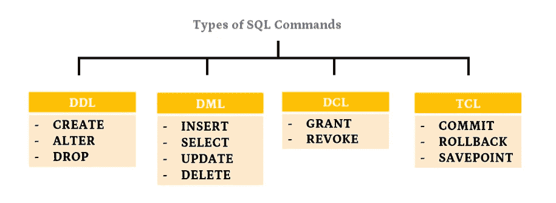
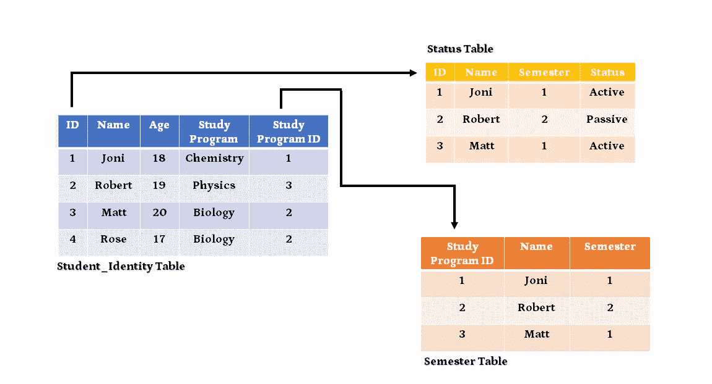
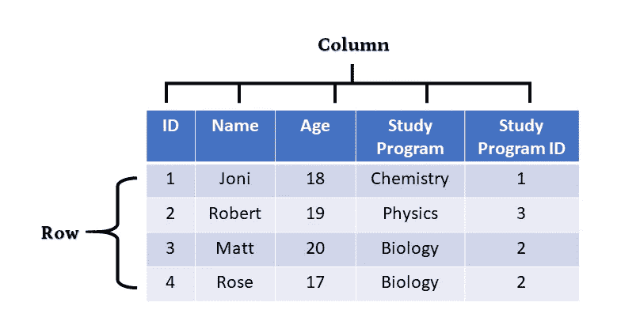
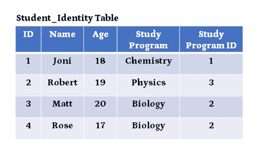
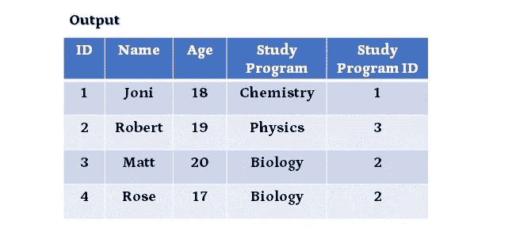
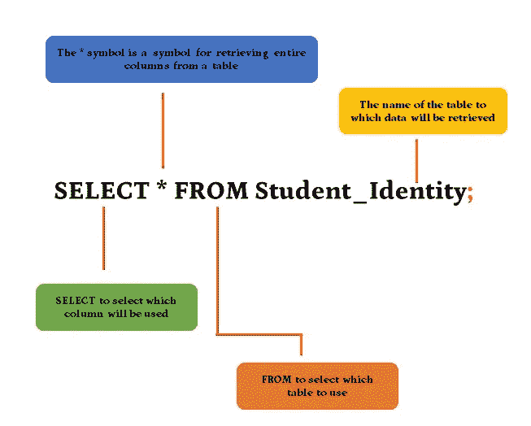
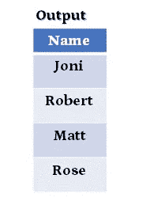
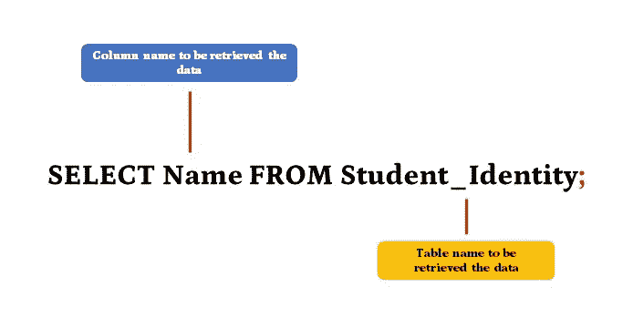
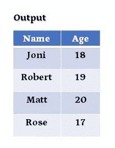
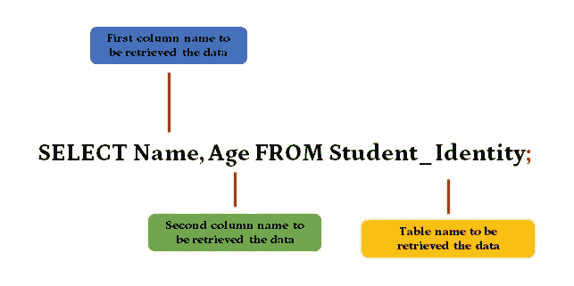

# Data Analyst 的 SQL 简介

> 原文：<https://medium.com/analytics-vidhya/introduction-to-sql-for-data-analyst-878937df9f31?source=collection_archive---------7----------------------->

## 数据分析师应该知道的 SQL 初级课程


[张秀坤·万尼](https://unsplash.com/@dominik_photography?utm_source=unsplash&utm_medium=referral&utm_content=creditCopyText)在 [Unsplash](https://unsplash.com/?utm_source=unsplash&utm_medium=referral&utm_content=creditCopyText) 上的照片

目前，如果我们观察，在实施了 IT 系统的公司中，大多数数据分析师的职位空缺都需要 SQL 作为分析工具的专业知识，因此 SQL 技能是希望成为数据分析师的人必须掌握的技能。

在本文中，我打算为正在寻找数据分析师职业的人介绍一个初步的 SQL 课程。

# 目录

1.  **关于 SQL**
2.  **SQL 命令的类型**
3.  **关系数据库管理系统**
4.  **查询示例**

# 关于 SQL

## 什么是 SQL？

SQL 代表结构化查询语言，是用于数据库系统的标准计算机语言——或者更确切地说，是关系数据库管理系统。

## 为什么数据分析师需要学习 SQL？

作为一名数据分析师，我们的工作不仅是分析已经可用的数据，还要能够自己从数据源(即数据库)中检索、修改和访问数据。数据分析师将使用 SQL 查询数据，并从中获得洞察力。

此外，掌握 SQL 将在以下方面帮助公司:

-帮助创建信息报告，例如，逐月销售趋势、客户增长等。

-构建应用系统的程序员。

-提高公司绩效。

-等等。

## SQL 用在哪里？

SQL 通常用于已经实施 IT 系统的公司，例如:

电子商务
-零售
-物流
-等等。

# SQL 命令的类型

我发现很多 SQL 命令的类型分为 4 种，即数据定义语言(DDL)、数据操作语言(DML)、数据控制语言(DCL)和事务控制语言(TCL)，但一个数据分析师，实际上足以掌握 DDL 和 DML，因为事实上他们经常与 DDL 和 DML 类型的命令交互，如果你想成为数据库管理员，那么可能会经常与 DCL 和 TCL 命令类型交互。下面是来自 SQL 命令的类型分布图:



作者创建的图像

## 数据定义语言

DDL(数据定义语言)是一个操作数据库结构的命令，比如创建、修改和删除。以下是 DDL 中包含的命令及其功能:

*   **创建:**创建一个数据库或表格。
*   **ALTER:** 改变表的结构，比如改变表名，增加列，改变列，删除列，给列分配属性。
*   **删除:**删除数据库或表。

## 数据操作语言

DML(数据操作语言)是 SQL 编程语言中的一个命令，用于操作数据库中的数据。以下是 DML 中包含的命令及其功能:

*   **插入:**向表格中插入新数据。
*   **选择:**选择并显示表格中的列，甚至是表格中的多列。
*   **更新:**更改/编辑表格中的数据。
*   **删除:**从表格中删除数据。

## 数据控制语言

数据控制语言(DCL)用于控制和操作数据库权限本身。简单地说，数据控制语言(DCL)的功能是控制访问权限(特权)和操作用户数据库。以下是 DCL 中包含的命令及其功能:

*   GRANT:该命令用于向用户授予管理权限。
*   REVOKE:与授予访问权限的 GRANT 不同，REVOKE 有权撤销用户的访问权限。

## 事务控制语言

TCL 命令处理数据库中的事务。以下是 TCL 中包含的命令及其功能:

*   **提交:**用于在数据库中永久存储事务。
*   **roll back:**roll back 命令用于将数据库返回到上次提交时的状态。
*   **保存点:**保存点是事务内部的一个特殊符号，它允许所有在设置后执行的命令回滚，将事务状态恢复到保存点时的状态。

# 关系数据库管理系统

## 什么是 RDBMS？

关系数据库管理系统，通常缩写为 RDMBS，是一个允许我们创建、更新和管理关系数据库的程序。关系数据库本身是一种数据库，其中数据通常以表格(行和列)的形式以结构化的形式存储，并且数据库中包含的每个表格/数据彼此具有关系(关系)。

## 关系表的简单说明

下面是一个简单的表格示例，该表格通过其列相互关联:



作者创建的图像

## 流行的 RDBMS 产品

*   **PostgreSQL(开源)**
*   **MySQL，MariaDB(开源)**
*   **SQLite(开源)**
*   **Hadoop(开源)**
*   **微软 SQL Server(非开源)**
*   **甲骨文数据库(非开源)**

## 数据库存储结构

作为数据存储，关系数据库系统具有如下存储对象的分层结构:

*   数据库ˌ资料库
*   桌子
*   圆柱

## 表格和列

下图是数据库中一个表的示例。例如，数据库名称是一个**学生**数据库



作者创建的图像

# 查询示例

在这里，我将展示一个 SQL 查询的小例子，希望有了它，你就知道如何用 SQL 查询了。

例如，在一个名为 student 的数据库中，我们有一个名为 **Student_Identity** 的表，下面是这个表:



然后我们想试着用简单的操作来操作这个表。

## 检索表中的整列

要检索所有的 **Student_Identity** 表列，我们可以键入以下命令:

```
SELECT*FROM Student_Identity;
```

运行后，它将产生以下输出:



语法解释:



作者创建的图像

*   第一个单词 SELECT 用于通知系统我们想要检索数据。
*   *(星号)表示需要从被引用的表中检索所有列。这个符号通常被称为通配符。
*   从[TABLE_NAME]开始，它表示将在其中获取数据的表的名称。
*   签字；(分号)是表示 SELECT 命令结束的符号

## 取表格中的一列

要检索 **Student_Identity** 表中的 **Name** 列，我们可以键入以下命令:

```
SELECT Name FROM Student_Identity;
```

运行后，它将产生以下输出:



语法解释:



## 在表格中取多个列

要检索多列，我们可以键入以下命令:

```
SELECT Name, Age FROM Student_Identity;
```

运行后，它将产生以下输出:



语法解释:



作者创建的图像

# 结论

作为一个想从事数据分析师职业的人，掌握 SQL 作为一种分析工具是非常重要的，要掌握 SQL，首先需要了解 SQL 课程的基础知识，以便建立思维流程，希望上面的解释可以帮助你！

# 参考

[1] DQLab 课程

[2][http://www . joo info . com/2018/07/penger Tian-DML-DDL-DCL-TCL-dalam-SQL . html](http://www.jooinfoo.com/2018/07/pengertian-dml-ddl-dcl-tcl-dalam-sql.html)