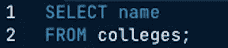
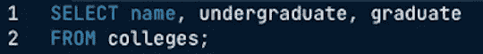
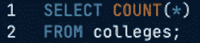
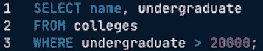
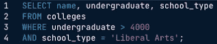

# SQL 简介:选择列和过滤行

> 原文：<https://medium.com/analytics-vidhya/introduction-to-sql-selecting-columns-and-filtering-rows-60413c018260?source=collection_archive---------12----------------------->

## **简介:**

SQL(结构化查询语言)是一种特定于领域的语言，在编程中用于管理存储在关系数据库管理系统中的数据。它最初是由 IBM 的 Donald D. Chamberlin 和 Raymond F. Boyce 在 20 世纪 70 年代早期开发的。该系统是为了管理和检索存储在 IBM 原始关系数据库管理系统 System R 中的数据而设计的。SQL 帮助引入了用一个命令访问许多记录的概念，并消除了指定如何访问记录的需要。除了查询数据库之外，SQL 还可以用来创建和修改数据库。

## **选择栏目:**

在 SQL 中，可以使用 SELECT 语句显示表中的数据。例如，假设您有一个名为“colleges”的表，其中包含美国所有的学院和大学。如果要从该表中选择所有学院或大学的名称(列“name”)，可以输入以下查询:

通常情况下，当输入查询时，您会希望提取多个列。如果希望提取表中的所有列，可以在 SELECT 语句后使用星号(*)。如果只想提取某些列，只需在查询中用逗号分隔列名。假设除了学院名称之外，您还想选择本科生人数(列“本科生”)和研究生人数(列“研究生”)。您将输入以下查询:

除了查询某些行和列之外，还可以计算表中的记录数。为此，您可以输入以下查询:

## **按条件过滤行:**

在 SQL 中，WHERE 子句允许您根据特定条件(数字和文本方式)过滤查询的行。可以与 WHERE 子句一起使用的不同比较运算符如下:

*   >→大于
*   ≥ →大于或等于
*   < → Less than
*   ≤ → Less than or Equal to
*   = → Equal to
*   <> →不等于

回到我们的学院和大学的例子，假设您想要过滤 Colleges 表，以便只输出拥有超过 20，000 名本科生的学校的名称和本科生人数。在这种情况下，您将输入以下查询:

现在让我们说，有一个名为“学校类型”的列，说明该学院或大学是“文科”学校、“国立大学”还是“社区学院”。如果您想要查找拥有超过 4000 名学生的文科学校的名称、本科生人数和学校类型，您必须在 Where 子句后输入 and 子句。该查询类似于:

查询表时另一个有用的子句是 OR 子句。OR 子句和 and 子句的区别在于，使用 OR 子句时，一行只需满足指定的条件之一，就可以在结果中输出。在上面的查询中，如果将 AND 子句替换为 OR 子句，则将输出所有拥有超过 4000 名本科生的学校以及所有文科类型的学校。

**参考文献:**

*   唐纳德·张伯伦(2012)。《SQL 的早期历史》。 *IEEE 计算历史年鉴*。**34**(4):78–82。[doi](https://en.wikipedia.org/wiki/Doi_(identifier)):[10.1109/mahc . 2012.61](https://doi.org/10.1109%2FMAHC.2012.61)。[S2CID](https://en.wikipedia.org/wiki/S2CID_(identifier))1322572
*   “欢迎参加本课程！:SQL。*Campus.datacamp.com*，campus.datacamp.com/courses/introduction-to-sql/.