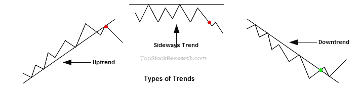

# 股票市场技术分析导论

> 原文：<https://medium.com/analytics-vidhya/introduction-to-technical-analysis-of-stock-markets-453e9049771d?source=collection_archive---------16----------------------->

股票市场技术分析导论

股票市场的技术分析是指对市场生成的历史数据的研究，如股票价格、交易量等。预测未来的市场行为。

# **基本面分析与技术面分析**

基本面分析是通过衡量股票的内在价值来评估股票。技术分析是观察股票价格和交易量的统计趋势。

换句话说，基本面分析帮助我们决定买哪只股票，而技术分析帮助我们决定何时买某只股票。

基本面分析与技术面分析

# **技术分析基础**

*了解自己*:在涉足任何一只股票之前，你都应该决定投资的类型，不应该在两者之间改变自己的位置。投资类型可以是日内投资(1 天)、短期投资(2 天至 3 个月)、中期投资(3 个月至 1 年)或长期投资(1 年以上)。

*股票价格分析*:这涉及到股票价格的四个主要组成部分的分析

1.  开盘价:股票在证券交易所开市后的第一个交易日的交易价格。
2.  收盘价:股票在一个交易日最后交易的价格。
3.  高价:一段时间内股票交易的最高价格。
4.  低价:一段时间内股票交易的最低价格。

*股票成交量分析*:成交量是某一天换手的股票数量。当在特定的一天伴随着巨大的交易量时，价格变动就更加显著了。

# **股市走势图**

有 3 个主要图表用于分析股票的价格变动:

***折线图*** :是用一条连续的线连接一系列数据点的图形表示。这些数据点描述了资产的收盘价。这是一个基本图表，因为它只分析一个参数，即收盘价。

折线图

***条形图*** :条形图显示指定时间内的开盘价、最高价、最低价和收盘价。价格条上的竖线代表该时期的最高价和最低价。每个价格条的左右横线代表开盘价和收盘价。

条形图可以用颜色编码。

*看涨棒*:如果收盘价高于开盘价，它可能会变白或变绿。

*看跌棒线*:如果收盘价低于开盘价，该棒线可能会变成黑色或红色。

条形图

***烛台图表*** :烛台通过不同的颜色直观地表现价格变动的大小来表达情感。就像条形图一样，日线图显示了当天市场的开盘价、最高价、最低价和收盘价。烛台有一个很宽的部分，叫做真身。

烛台图表是彩色编码的。

*看涨蜡烛*:如果收盘价高于开盘价，它可能会变成白色或绿色。

看跌蜡烛线:如果收盘价低于开盘价，这根棒线可能会变成黑色或红色。

烛台图案

# **股市走势**

趋势表明股票价格的运动方向。在技术分析中，趋势是通过趋势线来识别的。任何资产都有 3 种趋势，即上升趋势、下降趋势和横向趋势。

股票市场趋势

1.  *上升趋势*:股票价格遵循上升轨迹。每一个连续的波峰(高)和波谷(低)都高于趋势早期形成的波峰和波谷。上升趋势的特征是数据点上升，如更高的高点和更高的低点。
2.  *下跌趋势*:股票价格跟随下跌轨迹。每一个连续的波峰(高)和波谷(低)都低于趋势早期形成的波峰和波谷。下降趋势的特征是数据点的下降，如较低的高点和较低的低点。
3.  *横向趋势*:股票价格遵循一条水平路径。当需求和供给的力量几乎相等时，就会发生这种情况。每个连续的波峰(高)和波谷(低)与先前形成的波峰和波谷在同一范围内。横盘趋势的特点是高点和低点在同一范围内。

股票市场趋势

**趋势逆转**

趋势反转是指股票价格的方向发生变化，并向相反的方向运动，从上涨到下跌，或者相反。

上升趋势是一系列更高的高点和更高的低点，通过改变到一系列更低的高点和更低的低点，上升趋势反转为下降趋势。

下降趋势是一系列较低的高点和较低的低点，通过改变到一系列较高的高点和较高的低点，反转为上升趋势。

趋势逆转

**基于趋势的投资策略**

1.  *上升趋势*:建议在上升趋势中不要卖出任何股票，应该一直等待趋势反转。
2.  *下降趋势(Downtrend)* :建议在下跌趋势中不要买入任何股票，应该一直等待趋势反转。
3.  *横盘趋势*:建议等待横盘趋势的突破。

# 支撑和阻力位

*支撑位*:支撑位是指资产在一段时间内不会跌破的价格水平。当股票跌到一个较低的价格时，买方(多头)接管并买入股票，形成了一个支撑位。

*阻力位*:阻力位是指资产在一段时间内不会上涨的价格水平。当股价上涨到一个更高的价格时，卖方(空头)接管并卖出股票，这就形成了一个阻力位。

支撑和阻力位

根据价格行为，这些线可以是平的，也可以是斜的。

据分析，该支撑位一旦被突破，将成为未来的阻力位。同样，当阻力位被打破时，它将成为未来的支撑位。

**基于支撑位和阻力位的投资策略**

1.  *支撑位*:建议在上升趋势中的支撑位附近买入股票。
2.  *阻力位*:在下跌趋势中，建议在阻力位附近卖出股票。

# 交易突破

交易突破是指股票价格超出了规定的支撑位或阻力位。换句话说，股价通过在阻力位上方移动来打破先前观察到的阻力位，或者通过在支撑位下方移动来打破先前观察到的支撑位。

交易突破

交易突破表明股票价格开始向突破方向发展的潜力。

成交量较高的交易突破是对趋势变化的确认。

**基于交易突破的投资策略**

1.  建议交易者在股价突破阻力位后做多(买入股票)。
2.  建议交易者在股价跌破支撑位后做空该股票(卖出该股票)。

就这样结束了。我们已经成功地理解了股票市场技术分析的基本策略。我们将在下一篇文章中进一步了解看跌烛台模式和看涨烛台模式。

欢迎留下任何问题或评论！