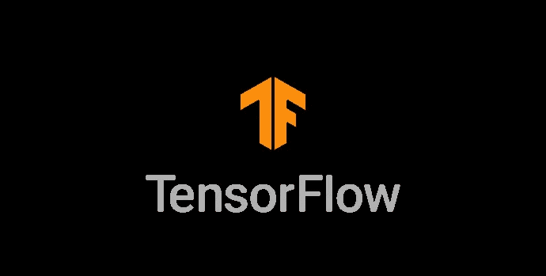

# Python 中的 TensorFlow 是什么？

> 原文：<https://medium.com/analytics-vidhya/introduction-to-tensorflow-8f2dbaba8844?source=collection_archive---------8----------------------->

在这篇文章中，我将介绍张量流的基础知识，在深入研究张量流之前，你需要了解这些知识。主题包括什么是张量，常数和变量。



# 什么是张量流？

TensorFlow 是 Google 开发的用于机器学习的开源库。TensorFlow 由高级 API 和低级 API 组成。

# 高级 API 与低级 API

与低级 API 相比，高级 API 在一个命令中提供更多的功能，但是低级 API 允许用户具有更详细的控制来操纵功能。

# TensorFlow 2.0 有什么新功能？

默认情况下，启用急切执行，因此它允许用户编写更简单、更直观的代码。此外，TensorFlow 模型构建现在以 Keras 和 Estimators 高级 API 为中心

# 什么是张量？

根据 TensorFlow 文档，张量是“向量和矩阵向潜在的更高维度的推广。”。如果你不理解，你可以简单地把它想象成排列成特定形状的数字集合。

# 在 TensorFlow 中定义张量

我们将通过定义 1 维、2 维和 3 维张量来学习如何定义张量。在我们定义张量之前，我们需要导入必要的包。

```
import tensorflow as tf 
```

## 一维张量

```
tf.ones(2,)
```

## 二维张量

```
tf.ones((2,2))
```

## 三维张量

```
tf.ones((2,3,4))
```

创建一个需要的参数是形状，在这种情况下，我们将使用三维张量的例子。我们可以把括号中的 2 想象成**行**，然后 3 想象成**列**，4 想象成**厚度**像一个立方体。回到一维张量，它只是一个只有行的张量。

> 请注意，你也可以创建更多的三维张量。

# 张量流中的常数

常数是张量中最简单的张量范畴。常数是不能用更简单的术语来表达的东西，常数是定义后不能改变的东西。然而，它可以具有任何尺寸。

## 如何定义一个常数？

```
#this is a 2x3 tensor made of 2s 
constant(2,shape[2,3])
```

# 定义常数的便捷函数

在某些情况下，它们是定义特定类型的特殊张量的更方便的选项，以前我们使用 tf.ones 来生成填充有 1 的任意维。此外，我们还可以生成一个填充有零的张量，如下所示。

```
tf.zeros(2,2)
```

另一个有用的函数是类零或类一，我们可以在张量上使用这个函数，用 0 或 1 填充它，复制输入张量的维数。下面提供了一个例子

```
#first we define a constant 
c = tf.constant([[1, 2, 3], [4, 5, 6]])
tf.zeros_like(c)
```

最后是填充函数，它可以用来用相同的值填充所需维数的张量。第一个必需的参数是 shape，后跟填充尺寸的 number 值。

```
tf.fill([1,2,3],5)
```

# 变量

与变量不同，变量的值是可以改变的。但是，变量数据类型和形状是固定的。我们可以创建一个变量，如下所示。

```
tf.Variable([1,2,3,4,5],dtype=tf.float32)
```

这就是 TensorFlow 介绍的第一部分，你可以关注我的灵媒或在我的 Linkedin 中与我联系，以保持对灵媒的关注。

 [## Swee Liang Chua - NYP 信息技术学院(SIT) -新加坡，新加坡| LinkedIn

### 查看 Swee Liang Chua 在全球最大的职业社区 LinkedIn 上的个人资料。瑞良的教育是…

www.linkedin.com](https://www.linkedin.com/in/sweeliang/) 

# 接下来阅读:

[](/analytics-vidhya/basic-operations-of-tensorflow-e6311e2eb8a0) [## 张量流的基本运算

### 张量流简介第 2 部分

medium.com](/analytics-vidhya/basic-operations-of-tensorflow-e6311e2eb8a0) 

# 另请阅读:

[](/analytics-vidhya/advanced-operation-in-tensorflow-9b7d3157b08) [## 张量流中的高级运算

### 什么是渐变和重塑？

medium.com](/analytics-vidhya/advanced-operation-in-tensorflow-9b7d3157b08)