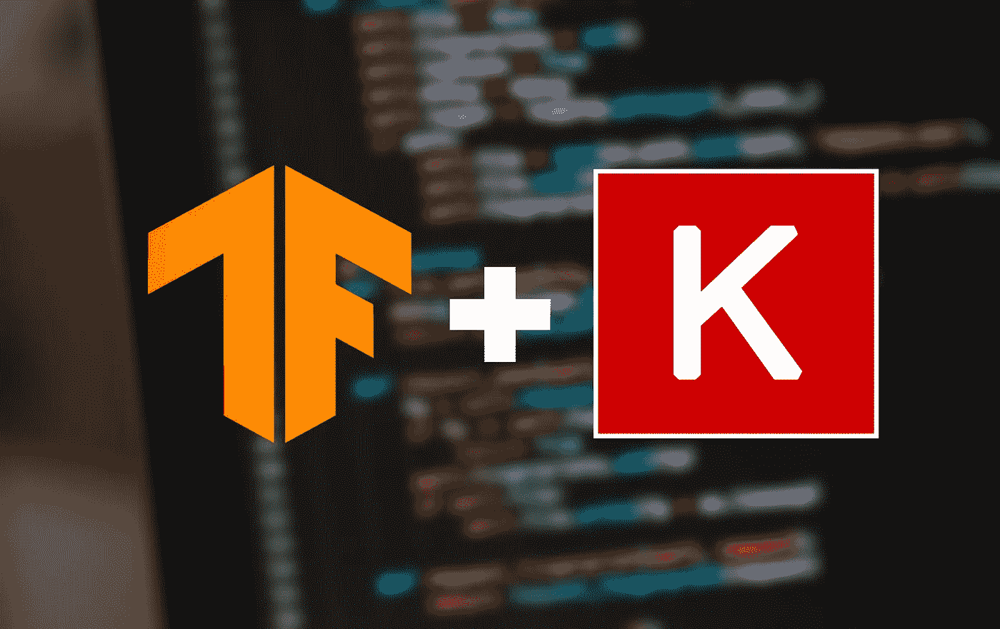

# Keras API tensor flow 简介

> 原文：<https://medium.com/analytics-vidhya/introduction-to-tensorflow-with-keras-api-36cbeeb562d5?source=collection_archive---------4----------------------->

## 在 TensorFlow 中创建各种神经网络的简单介绍。

# Keras 是什么？

Keras 是一种高级深度学习 API(应用程序编程接口)，允许我们轻松地构建、训练、评估和执行各种神经网络。它所做的是抽象出各种深度学习库的实现，如 TensorFlow、微软认知工具包(CNTK)和 Theano。

# 什么是张量流？

这是一个深度学习库，同时它还提供了大量用于数值计算和大规模机器学习的工具。它还提供了用于模型可视化 TensorBoard、用于生产 TensorFlow 项目的 TensorFlow Extended (TFX)等等。

# 我们开始吧

为了使用 Keras 在 TensorFlow 中构建神经网络，TensorFlow 提供了自己的 Keras 实现。要使用它，让我们导入它。

Keras 提供了 3 种不同的 API 来创建基于模型复杂程度的神经网络。这些是:

*   **顺序 API**
*   **功能 API**
*   **子类化 API**

我们会一个一个地检查。

# 使用 Keras Sequential API 构建简单模型

对于非常简单的用例，或者有时甚至对于基线模型，这个 API 通常是首选的。它是一层层的线性堆叠。

在这里，我们为具有两个隐藏图层的 MNIST 数据集创建了一个分类 MLP。

这里有一点见解:

*   首先是一个`Flatten`层，其目的是将每个输入转换成一个 1D 数组。直观上，它执行`X.reshape(-1,1)`，其中`X`是输入。我们还提供了 28×28 的`input_shape`，因为 MNIST 数据集由 28×28 像素的数字图像组成。
*   然后我们堆叠了两个`Dense`层，都有`"relu"`激活。
*   最后，我们添加了一个激活了`"softmax"`的`Dense`输出层，因为这个模型是用于分类任务的。

但是有一种更简单的方式来写这个:

现在我们可以调用模型的`summary()`方法来显示模型的所有层和参数。

*   如前所述，展平层展平我们的 28x28 输入，以在第一层中给出 784 个神经元的输入形状。
*   根据我们的代码，下一层有 300 个神经元。每个神经元与前一层(即`Dense`层)中的每个神经元都有联系，导致 300x784 = 235200 个权重加上 300 个偏差(该层中的每个神经元)= 235500 个可训练参数。
*   并且对于该 NN 中的所有不同层，情况相同。

# 编译模型

模型的`compile()`方法指定了损失函数和要使用的优化器。我们还可以指定我们希望在培训和评估期间计算的额外指标。

我们使用了`"sparse_categorical_crossentropy"`,因为对于每个实例，只有一个目标类索引(0-9 ),并且这些类是互斥的。

如果我们每个实例有一个目标概率，(就像第三类的`[0., 0., 0., 1., 0., 0., 0., 0., 0., 0.]`)我们会使用`"categorical_crossentropy"`。

对于二元分类任务，我们将使用`"binary_crossentropy"`。

# 训练模型

对于训练，我们调用`fit()`方法，传递输入特征、标签和历元数。我们还可以传递验证数据，以便在模型接受训练时测量验证的准确性。

这个方法返回一个`history`对象，然后我们可以使用 Tensorboard 或一个简单的脚本来可视化它。

绘制训练模型的学习曲线

# 使用函数式 API 构建复杂模型

此 API 主要用于构建非顺序神经网络，即，我们将拥有多个输入、多个输出，甚至将激活或输入直接传递给网络中的其他层。

一个这样的例子是*宽&深*的神经网络。该网络将全部或部分输入直接连接到输出层。

广度和深度神经网络

这有助于学习深度模式(使用深度路径)和简单规则(通过短路径)。

在 Keras 中，我们可以像这样使用函数式 API 来构建加州住房预测问题:

*   注意我们是如何创建一个指定输入形状的`Input`对象的，然后这个对象在创建后就被传递给`Dense`层作为输入。
*   这创建了一个隐藏的层对象`hidden1`，它被进一步传递到`hidden2`。
*   然后我们需要连接密集层的输入和输出。因此我们使用了`Concatenate`层并传递了`input_`和`hidden2`对象。
*   最后，我们告诉 Keras 什么是输入和输出。从而创建了我们的模型对象。

但是，如果您想要多个输入或多个输出呢？使用函数式 API，你也可以做到这一点。检查这个:

具有两个输入的宽深度神经网络

这让我们通过宽路径发送特征的子集，通过深路径发送不同的特征子集。

**需要注意的一点是，**现在我们需要调用`fit()`方法**来提供一组输入，而不是单个输入**。如果我们的网络中有多个输出和验证数据，这同样适用于标签。

当我们有很多输入时，为了避免输入的错误排序，提供一个输入字典，并以 key 作为输入的名称可能会有所帮助。

同样的方法，我们可以实现这个模型的多个输出:

具有两个输入和两个输出的宽深度神经网络

每个输出都需要自己的损失函数。这就是为什么当我们编译模型时，会传递一个损失列表。提供一个`loss_weights`列表给一个输出一个更大的权重也是有帮助的。

如前所述，对于训练，我们需要为每个输出提供标签。这完全取决于模型的构建任务。

在模型评估期间，Keras 返回总损失以及所有其他产出损失。

模型的`predict()`方法也返回不同输出层的输出。

# 使用子类化 API 构建动态模型

在某些情况下，模型可能涉及循环、变化的形状、条件分支和其他动态结构。Keras 子类化 API 正是为了这个目的，为此我们需要:

*   子类`keras.Model`类。
*   在构造函数中创建层。
*   用`call()`方法计算这些层。

让我们使用子类化 API 构建同样的*宽和深*模型

虽然这有 Keras 不能检查它的缺点。所以我们不能保存或克隆模型，`summary()`方法也只返回一个层列表。此外，Keras 不能提前检查类型和形状。

而且很容易出错，所以除非你真的需要这种灵活性，否则尽量避免。

***不断学习。***

# 我是谁？

我是阿努拉格·达泽。对机器学习充满热情的终身学习者。

来自 anuragdhadse.com 的广播