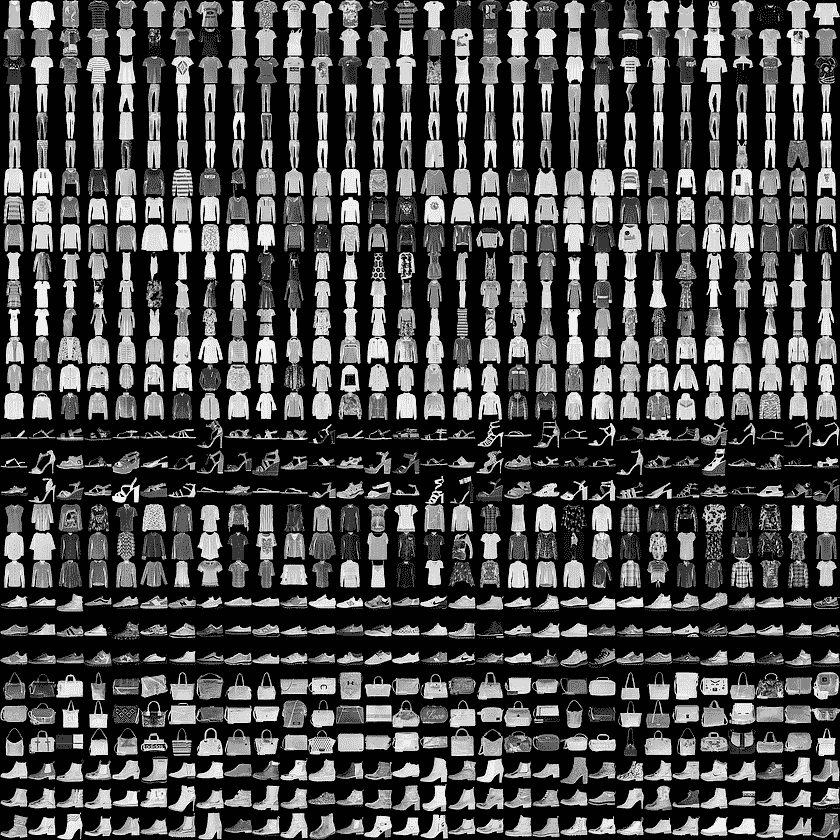

# TF-Lite 简介

> 原文：<https://medium.com/analytics-vidhya/introduction-to-tf-lite-3a02d753939?source=collection_archive---------11----------------------->


在边缘设备中操纵 TF Lite

# **什么是 TF Lite？**

TF Lite 模型是轻量级模型，是用于部署 ML 模型的生产就绪和跨平台框架，ML 模型用于在手机和微控制器等边缘设备上进行推理。

# **理想观众**

正在寻找方法来优化模型以用于部署目的的 ML 工程师。

让我们以一个您已经创建并训练的模型为例，现在您想要在智能手机、raspberry pi 和 jetson nano 等边缘设备上对您的模型进行推断。

为了得到一个好的预测，你的模型应该通过以下标准，比如

*   模型应该是轻量级的，以便加载模型，并且边缘设备也具有有限的存储容量。
*   内存的可用性在边缘设备中表现不佳。使用电池供电的边缘设备的功耗也会增加，因此功耗是一个重要因素。
*   输出应该具有低延迟，即预测应该更少。如果你的模型架构像 VGG16 或 YOLO v4 一样庞大，你需要一个好的高端设备来预测。
*   如果您的模型部署在服务器上，那么进行推断将花费大量时间，并且整体功耗也会增加。

所以部署 ML 模型是一个很大的挑战。

# TF Lite 的优势

*   更低的延迟—预测时间非常快。
*   Tensorflow Hub 提供了大量预训练模型，我们可以在小型项目中使用这些模型。
*   它是隐私保护的，因为预测是在设备上进行的，并且在您的设备和服务器之间没有数据传输。
*   它有离线工作的能力。

# 使用 TF Lite 的应用程序示例

Youtube 上的谷歌翻译
增强现实功能

# 让我们建立一个自己的神经网络

安装必要的模块

```
import os
import time
import numpy as np
import pandas as pd
import matplotlib.pyplot as plt
from sklearn.metrics import accuracy_score
from sys import getsizeofimport tensorflow as tf
from tensorflow import keras
from tensorflow.keras.layers import Dense, Flatten
from tensorflow.keras.losses import SparseCategoricalCrossentropyprint(tf.__version__)
2.4.1
```

在本次演示中，我们将使用 tensorflow 版本 2.4.1
如果您使用的是 TF 1.x，那么这段代码可能不相关，因此最好升级到 TF 2.x。

```
def get_file_size(file_path):
    size = os.path.getsize(file_path)
    return sizedef convert_bytes(size, unit=None):
    if unit == "KB":
        return print('File Size: ' + str(round(size/1024, 3)) + 'Kilobytes')
    elif unit == 'MB':
        return print('File Size: ' + str(round(size/(1024*1024), 3)) + 'Megabytes')
    else:
        return print('File Size: ' + str(size) + 'bytes')
```

这是两个帮助器函数，以千字节(KB)和兆字节(MB)为单位确定文件大小。

# 资料组

在这次演示中，我将使用著名的时尚 MNIST 数据集。
该数据集包含 10 个类别的 70，000 幅灰度图像。这些图像以低分辨率(28 x 28 像素)显示了单件衣服，如下所示:



数据集的样本

```
fashion_mnist = keras.datasets.fashion_mnist
(train_images, train_labels), (test_images, test_lables) = fashion_mnist.load_data()
```

这些是我们图像分类的不同类别。

```
class_name = ['T-shirt/top', 'Trouser', 'Pullover', 'Dress', 'Coat', 'Sandal', 'Shirt', 'Sneaker', 'Bag', 'Ankle Boot']
```

# 让我们用我们的训练和测试数据做一个探索性的数据分析。

```
train_images.shape
(60000, 28, 28)test_images.shape
(10000, 28, 28)np.unique(train_labels)
array([0, 1, 2, 3, 4, 5, 6, 7, 8, 9], dtype=uint8)plt.figure()
plt.imshow(train_images[19], cmap="gray")
plt.colorbar()
plt.grid(False)
plt.show()
```


预览图像

现在让我们正常化图像。图像强度值的范围从 0 到 255。现在，如果我们必须建立一个快速收敛的神经网络，我们必须将强度值从 0 降低到 1。

最高强度值是 255，因此如果我们将所有值除以 255，范围现在将变成从 0 到 1。

```
train_images = train_images/255.0
test_images = test_images/255.0
```

# **现在，让我们为训练配置我们的模型。**

> 优化器—使用的 Adam
> 损失函数—稀疏分类交叉熵
> 指标—精确度

欲了解更多信息，请访问:

[](https://keras.io/api/models/model_training_apis/) [## Keras 文档:模型训练 API

### 为训练配置模型。参数优化器:字符串(优化器的名称)或优化器实例…

keras.io](https://keras.io/api/models/model_training_apis/) 

```
model.compile(optimizer='adam', loss=SparseCategoricalCrossentropy(from_logits=True),
              metrics=['accuracy'])
```

# 获取模型摘要

```
model.summary()
```


模型摘要

**是时候用 10 个历元的训练图像和训练标签来训练我们的模型了。**

```
h = model.fit(train_images, train_labels, epochs=10)
```

拟合模型后，让我们将模型保存为 Keras 文件，即 h5 文件。

```
KERAS_MODEL_NAME='tf_MODEL_FASHION_MNIST.h5'
model.save(KERAS_MODEL_NAME)
```

**让我们用测试图像**来检查准确度和损耗

```
test_loss, test_acc = model.evaluate(test_images, test_lables, verbose=2)
print('Test Accuracy:', test_acc)
print('Test Loss:', test_loss)
```

> 测试精度:0.8855000138282776
> 测试损耗:0.200000001

**现在让我们将 Keras 文件转换成 TF-Lite 模型**

```
TF_LITE_MODEL_FILE_NAME = 'tf_lite_model.tflite'tf_lite_converter = tf.lite.TFLiteConverter.from_keras_model(model)
tflite_model = tf_lite_converter.convert()tflite_model_name = TF_LITE_MODEL_FILE_NAME
open(tflite_model_name, "wb").write(tflite_model)
```

**检查输入张量形状**

```
interpreter = tf.lite.Interpreter(model_path = TF_LITE_MODEL_FILE_NAME)
input_details = interpreter.get_input_details()
output_details = interpreter.get_output_details()print("Input Shape:", input_details[0]['shape'])
print("Input Type:", input_details[0]['dtype'])
print("Output Shape:", output_details[0]['shape'])
print("Output Type:", output_details[0]['dtype'])
```

这是我们得到的模型配置。

```
Input Shape: [ 1 28 28]
Input Type: <class 'numpy.float32'>
Output Shape: [ 1 10]
Output Type: <class 'numpy.float32'>
```

**根据我们的需要调整张量形状的大小。我们正在测试 10000 张图片。**

```
interpreter.resize_tensor_input(input_details[0]['index'], (10000, 28, 28))
interpreter.resize_tensor_input(output_details[0]['index'], (10000, 10))
interpreter.allocate_tensors()input_details = interpreter.get_input_details()
output_details = interpreter.get_output_details()print("Input Shape:", input_details[0]['shape'])
print("Input Type:", input_details[0]['dtype'])
print("Output Shape:", output_details[0]['shape'])
print("Output Type:", output_details[0]['dtype'])
```

这是调整大小后我们得到的模型配置。

```
Input Shape: [10000 28 28]
Input Type: <class 'numpy.float32'>
Output Shape: [10000 10]
Output Type: <class 'numpy.float32'>
```

**让我们检查测试图像的类型。**

```
test_images.dtype
dtype('float64')
```

它是浮动 64 型的。

有许多方法可以改变类型，但是我们将使用 numpy 数组来改变它。

```
test_imgs_numpy = np.array(test_images, dtype=np.float32)
```

**让我们从测试图像中得到预测。**

```
interpreter.set_tensor(input_details[0]['index'], test_imgs_numpy)
interpreter.invoke()tflite_model_predictions = interpreter.get_tensor(output_details[0]['index'])print("Prediction results shape:", tflite_model_predictions.shape)
prediction_classes = np.argmax(tflite_model_predictions, axis=1)acc = accuracy_score(prediction_classes, test_lables)
print('Test accuracy TFLITE model :', acc)
```

> 测试精度 TFLITE 模型:0.8855

# 获取 Keras 和 Tensorflow 文件的文件大小

```
convert_bytes(get_file_size(KERAS_MODEL_NAME), "MB")
convert_bytes(get_file_size(TF_LITE_MODEL_FILE_NAME), "KB")
```

> 文件大小:1.19 兆字节
> 文件大小:398.969 千字节

# 结论

Keras 文件大约为 **1.2MB** ，如果我们在模型中添加更多的层，它会增加。在创建了 TF-Lite 之后，它大约有 400KB 。

Keras 模型在测试图像上的准确率为
**88.55000138282776%**，TF-Lite 文件大小为 **88.55%** 。

您可以清楚地看到，我们仍然转换了我们的模型，精度几乎保持不变。

如果您想了解更多关于 Tensorflow Lite 的信息，请访问:

[](https://www.tensorflow.org/lite) [## 面向移动和边缘设备的 TensorFlow Lite | ML

### 一个用于设备上推理的深度学习框架。在移动和物联网设备上训练和部署机器学习模型…

www.tensorflow.org](https://www.tensorflow.org/lite) 

在下一篇博客中，我将讨论通过使用量化来优化 tflite 模型。敬请期待:)

在 Github 上关注我

[](https://github.com/sayannath) [## sayannath -概述

### 大家好。我是萨彦纳特。我是 KIIT 大学本科二年级的学生。我是顶尖的…

github.com](https://github.com/sayannath) 

# 社交把手

*insta gram:*[*https://www.instagram.com/sayannath235/*](https://www.instagram.com/sayannath235/)

*领英:*[*https://www.linkedin.com/in/sayannath235/*](https://www.linkedin.com/in/sayannath235/)

*邮件:sayannath235@gmail.com*