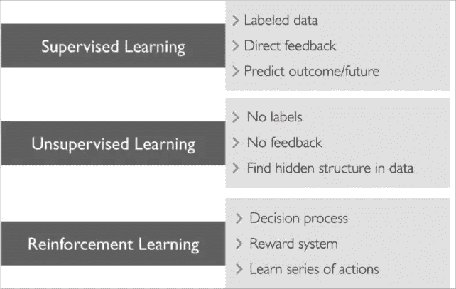

# 机器学习世界简介..

> 原文：<https://medium.com/analytics-vidhya/introduction-to-the-world-of-machine-learning-94c2b265a878?source=collection_archive---------25----------------------->

他的文章概述了机器学习这门科学。它解释了各种类型的机器学习算法，强调了学习机制的原则，并解释了广泛分类的算法类型。

**概述*机器学习* :**

为了理解机器学习，退一步看看我们每天使用的程序并试图理解它们是如何设计的是有意义的。计算机执行由程序员编写的程序或软件来解决程序员或其他人的问题。这就产生了解决不同问题的不同算法。但是在这个过程中，出现了算法无法解决的问题。一个经典的例子是垃圾邮件过滤。垃圾邮件是一种几乎每个人都会收到的广告或产品促销邮件，充斥着我们的收件箱。

今天，大多数电子邮件提供商在默认过滤这些垃圾邮件方面做了值得称赞的工作，然而这是一个困难的问题。在垃圾邮件过滤中，很难定义一个规则来决定电子邮件文本是否是垃圾邮件。但这些问题中的一线希望是，我们有垃圾邮件和非垃圾邮件的例子。因此，非常需要能够使用原始数据收集对目标的理解并将其应用于从未见过的数据的算法。这为今天存在的机器学习领域铺平了道路。如果我们将机器学习的能力范围限制在一个数据库问题上，我们可能低估了什么是机器学习。机器学习可以应用于处理数据的各种情况，

1.  表列数据
2.  时序数据
3.  文本数据
4.  图像数据
5.  语音数据

有了这些作为*数据*，机器学习算法可以:

*   分类
*   推导出要预测的值
*   根据历史预测和推荐
*   预测用户是否会点击广告

**定义**:

机器学习有很多正式的定义。

但是，正如 Tom Mitchell 所言，它抓住了机器学习的本质:“如果一个计算机程序在 T 类任务中的性能，如 P 所测量的，随着经验 E 的增加而提高，那么就可以说它从关于某类任务 T 和性能测量 P 的经验 E 中学习。”

这个定义把机器学习说成是一个计算机程序，它通过监控自己在一系列任务中的表现来学习改进。这个定义构成了机器学习的关键。程序执行它的任务 T，并且在它执行的同时，它还在执行任务 T 的过程中使用度量 P 来度量它的性能。在这个练习中，程序应该理解性能差距的原因并且纠正它自己。经过多次迭代，任务 t 的性能将会很好。表现出这种学习特性的程序被称为机器学习算法。

**机器学习的大致分类:**

机器学习算法大致分为三种类型:

*   监督学习
*   无监督学习
*   强化学习

> **监督学习**

这些学习算法期望数据被人类标记。算法正是从这些数据中学习如何实现它们的目标。这些算法学习如何在人类的监督下实现它们的目标，因此被称为监督学习。

对于在野外处理未知数据的计算机来说，如果它们能提前看到问题集的例子，总是更好的。在同一个方向上，监督学习在行业中找到了最多的应用。在相邻的图中，代理(机器学习/AI 程序)用大量的猫和狗的图片示例进行训练。过去，这个程序被输入了大量的图像，每次代理人看到一张图像，代理人都会被告知这是一只猫还是一只狗。所以，代理学会了如何区分猫和狗。

如果代理在训练中被问及从未见过的新图片，代理会像上图中一样说这是一只狗。相比之下，想象一下，如果我们使用基于规则的程序来区分猫和狗，就不可能对看不见的图像进行分类。形象，具体来说是一个很难处理的问题。计算机看到图像的方式是 1 和 0 的流，并且不能获得像素的上下文或其空间连接。这个问题叫做语义鸿沟。

但除此之外，还有一些经过验证的算法，可以稳健地对图像进行分类。监督算法分为两种类型:

1.  分类
2.  回归

**分类:**

分类，顾名思义，就是那些期望算法给出离散输出的问题。输出也可以称为“分类的”,不包含在其值范围内连续变化的数字。

例如，我们可能有一个电子邮件数据的文本文件数据集，问题是要分类电子邮件是否是垃圾邮件。您可能有“训练数据”，即 100 个样本中被标记为垃圾邮件/非垃圾邮件的数据。在算法从这个训练数据集学习之后，它必须对它在实际使用情况中可能面临的新电子邮件进行分类，并将其分类为垃圾邮件/非垃圾邮件。在本例中，只有两种状态—垃圾邮件/非垃圾邮件。我们不应该从算法中听到任何介于两者之间的东西。这是一个分类问题。

***回归:***

回归是一个问题，涉及连续变量的预测。输出也称为“数字”。这些变量可以包含在不同状态之间不断变化的值。这些变量的一些例子是温度、时间、位置等。例如，如果问题陈述是用房子的许多参数来预测房子的价格，例如，sq。制成房子的面积，到附近公共交通的距离，水质，那个地区的犯罪率等等。在这种情况下，要预测的房价将随任何数字而变化，不会包含离散的步骤。为了说明，我们将只取一个变量(sq。制成).

> **无监督学习**

这些是机器学习问题的类型，其中没有标记数据来表示机器学习问题的预期结果。在这些问题中，数据通常是巨大的，目标是从积累的数据中理解模式。这些算法使用任何定义的度量标准来估计每个样本之间的相似性，然后尝试将它们组合在一起以呈现给分析师。例如，让我们从一个给定的城市中随机选择 1000 名专业人士的混合工资数据。如果我们执行无监督学习，我们将最终在数据中形成某些群体，这些群体可能揭示行业的某些细分市场，如信息技术、医疗专业、教学等。这种用法被称为“聚类”。

> **强化学习**

这种类型的机器学习既不处理带标签的数据，也不试图理解数据中的模式，而是用什么是对什么不是的规则来定义。它们一般由“奖励”、“惩罚”和“目标”来指导。他们努力实现目标，以最大的回报和最少的惩罚。例如，在下图中，该算法的任务是在找到最短路径时找到带有奖励的出口，并在发现自己走进死胡同时受到惩罚。那么这就是一个强化学习的问题。

## **机器学习——一种直觉:**

了解了所有这些概念后，让我们将它们付诸行动，并在此过程中学习一些术语。让我们假设没有算法适用于我们的问题，让我们尝试设计一个非常基本的算法。问题区分两组图像:茉莉花和玫瑰。这里我们有八张图片可以借鉴。

不用说哪个是玫瑰，哪个是茉莉，如果向孩子解释玫瑰和茉莉之间的区别，这可能是一个简单的因素，通过它我们将成功地向孩子解释。显著区分这些套装的因素是颜色。因此，有可能解释说，如果图像主要是红色的，那么称它为玫瑰，如果图像主要是绿色的(根据给定的数据)，那么称它为茉莉花。

我们需要用数学表达式来表示这些模糊的定义，以便能够在计算机中执行它们。让我们把这种大部分是红色的理解作为所有像素的平均颜色。所有像素的平均颜色将给出一个单一的输出，我们可以用它来学习。为了考虑所有的训练图像，我们可以再次对图像的数量进行平均。现在，让我们用一些示例数据来测试我们的模型。

假设相邻的图像是一个示例测试数据，对于这个数据，我们的算法工作得完美无缺，如果你能看到我们已经完成的是非凡的。现在，我们的程序可以从任意两组图像中学习，并且可以毫无问题地执行分类操作。但这不是真实世界对待我们的方式。虽然我们实现了我们想要的，但我们算法的工作范围非常有限。如果必须对该相邻图像进行分类，将会失败。

最大颜色会是红色，会被归类为玫瑰色！为了表现得更好，我们需要考虑更多的因素，比如形状。我们在这个案例研究中考虑的这些因素被称为机器学习中的“特征”。我们为从文件中学习模式而定义的数学(平均颜色)是“模型”。

> **使用案例和挑战:**

机器学习的使用案例每天都在增加，下面提到的只是冰山一角:

*   自动垃圾邮件分类
*   图像分类
*   物体检测
*   医疗诊断
*   语音转文本
*   机器翻译
*   广告货币化分析
*   电影推荐
*   市场篮子分析
*   手写识别
*   自动驾驶

机器学习已经找到了广阔的应用领域。它带有一个非常重要的警告，即他们(比如人类)并不总是对的。这些算法确实会出错，比如我们的例子。因此，将其应用于医疗诊断或自动驾驶等许多领域仍然非常危险，在这些领域，生命危在旦夕，算法的任何错误结果都将是一个非常昂贵的错误。

> **概要:**

*   机器学习是一个从已经收集的数据中获取智能的领域。
*   如果数据被标记，那么它是有监督的学习，否则它是无监督的。
*   在无监督学习中，没有标记数据，这通常用于识别数据中的模式。
*   分类问题涉及对数据的分类类型的预测。
*   回归问题处理的是数值型数据的预测。
*   学习概念的数学表示是模型。
*   我们为模型考虑的变量或因素称为特征。