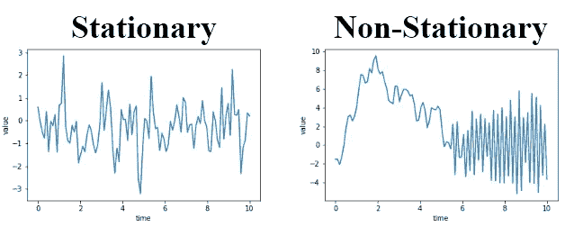

# 时间序列分析和关键概念介绍

> 原文：<https://medium.com/analytics-vidhya/introduction-to-time-series-analysis-and-key-concepts-dbf6c394984f?source=collection_archive---------7----------------------->

平稳性，随机游走，白噪声，时间序列模型和模型评估。

> 在这篇文章中，我们将探讨什么是时间序列分析？，它将来的范围？和时间序列分析的关键概念。

潘瓦尔·阿布哈什·阿尼尔拍摄的照片

# **目录:**

1.  简介:什么是时间序列分析及其重要性？
2.  什么是时间序列中的平稳性及其类型？
3.  白噪声和随机游走
4.  自相关函数和部分自相关函数(PACF)
5.  模型:自回归(AR)、移动平均(MA)、自回归移动平均(ARMA)、自回归移动平均(ARMAX)和自回归综合移动平均(ARIMA)
6.  确定模型的顺序
7.  模型诊断
8.  博克斯-詹金斯方法

# 1]简介:

T 时间序列分析是一种处理**时间序列数据**或趋势分析的统计技术。在时间序列中，数据存在于一系列特定的时间段或间隔中。

[**时间序列分析**](https://en.wikipedia.org/wiki/Time_series) 用于股票市场分析、模式识别、地震预测、经济预测、人口普查分析等各种应用。

时间序列由以下部分组成:

显示趋势、季节性和周期性的图像(由 [Panwar Abhash Anil](https://www.linkedin.com/in/abhash-panwar-85126976/) 拍摄)

*   [**趋势**](https://en.wikipedia.org/wiki/Trend) **:** 趋势表示数据在一个较长的时间段内增加或减少的总体趋势。趋势是一个平滑的、一般的、长期的、平均的趋势。在给定的时间内，增加或减少并不总是必须在同一方向。
*   [**季节性**](https://en.wikipedia.org/wiki/Seasonality) **:** 定期频繁重复的模式。比如:每个周末的高销量。
*   [**周期性**](https://en.wikipedia.org/wiki/Cyclical_history) **:** 周期性是有重复模式但没有固定周期的地方。

时间序列分析的范围:

*   股票市场分析
*   经济预测
*   库存研究
*   请求预报
*   销售预测等

# 2]平稳性:

[平稳](https://en.wikipedia.org/wiki/Stationary_process)表示数据的分布不随时间变化。

静止的 v/s 非静止的(由[潘瓦尔·阿布哈什·阿尼尔](https://www.linkedin.com/in/abhash-panwar-85126976/)拍摄)

*   没有趋势:没有增长也没有萎缩。
*   均值和方差常数:数据点离零线的平均距离不变。
*   自相关常数:时间序列中的每个值与其相邻值之间的关系保持不变。

## 静止的类型:

*   强平稳性:数据的整个分布是时不变的。
*   弱平稳:均值、方差和自相关是时间不变的(即，对于自相关，corr[(X(t)，X(t-τ)]只是τ的函数)

## 平稳性测试:[增强迪基富勒测试](https://en.wikipedia.org/wiki/Dickey%E2%80%93Fuller_test)

*   零假设是时间序列是非平稳的。
*   另一个假设是时间序列是非平稳的。
*   迪基-富勒检验仅用于检验趋势。

## 使时间序列平稳:

识别一个时间序列是否平稳是非常重要的。如果它是平稳的，那么我们可以使用假设时间序列需要是平稳的模型来使用历史数据预测时间序列的下一个值。如果它是不稳定的，那么应用下面的变换使它稳定，然后使用一个模型。

*   差分时间序列的平稳性
*   获取时间序列的日志
*   时间序列的平方根
*   取比例变化(df.shift(1)/df)

# 3]白噪声和随机游走:

[**白噪声**](https://en.wikipedia.org/wiki/White_noise) **:** 一个时间序列是同分布的不相关随机变量序列时的**白噪声**。股票收益通常被建模为白噪声。不幸的是，对于白噪声，我们不能根据过去预测未来的观测值——所有滞后的自相关为零。

## **白噪声与:**是一个系列

*   常数平均值
*   恒定方差
*   所有滞后的自相关为零

特殊情况:如果数据具有正态分布，那么白噪声被称为高斯白噪声。

[**随机游走**](https://en.wikipedia.org/wiki/Random_walk) **:** 一个**随机游走**是另一个**时间序列**模型，其中当前观测值等于带有**噪声的前一个观测值。**

*   在随机游走中，今天的价格等于昨天的价格加上一些噪音。
*   无法预测随机漫步
*   顺便说一下，如果价格是对数，对数价格的差异是衡量回报的一种方式。
*   要测试时间序列是否是随机游走的，可以对滞后值回归当前值。如果斜率(β)与 1 没有显著差异，那么我们不能拒绝序列是随机行走的零假设。然而，如果斜率小于 1，我们可以拒绝零假设。

# 4]自相关函数和部分自相关函数:

[**自相关**](https://en.wikipedia.org/wiki/Autocorrelation#:~:text=Autocorrelation%2C%20also%20known%20as%20serial,the%20time%20lag%20between%20them.) **:** 自相关是单个时间序列与其自身滞后副本的相关性。它也被称为单相关

[***ACF***](https://en.wikipedia.org/wiki/Autocorrelation) 是一个完整的自相关函数，它给出了任意序列与其滞后值的自相关值。我们将这些值和置信区间一起绘制出来。简而言之，它描述了序列的当前值与其过去值的关联程度。时间序列可以包含趋势、季节性、周期性和残差等成分。ACF 在寻找相关性时考虑了所有这些成分，因此这是一个“完整的自相关图”。

ACF 不仅显示一个滞后自相关，而且显示不同滞后的整个自相关函数。

[***PACF***](https://en.wikipedia.org/wiki/Partial_autocorrelation_function)是一个偏自相关函数。PACF 是一种条件相关，它给出了一个平稳时间序列与其自身滞后值的偏相关，回归了所有更短滞后时间序列的值。它与不控制其他滞后的自相关函数形成对比。

# 5]型号:

时间序列模型着眼于过去的数据模式，并试图根据这些数据中包含的潜在模式来预测未来。

## 5.1) AR 模型:

在 [*自回归模型*](https://en.wikipedia.org/wiki/Autoregressive_model) 中，我们将时间序列的值与同一时间序列的先前值进行回归。

一个**自回归** **模型**根据过去的行为预测未来的行为。它用于预测时间序列中的值与它们之前和之后的值之间的相关性。

展示 AR 模型的图片(照片由 [Panwar Abhash Anil](https://www.linkedin.com/in/abhash-panwar-85126976/) 拍摄)

模型的阶数是使用滞后的次数(p)。而对于平稳的，-1

## 5.2] MA Model:

In the [*MA 模型*](https://en.wikipedia.org/wiki/Moving-average_model) ，我们针对时间序列的前期震荡值/残差值进行回归。

展示 MA 模型的图片(由 [Panwar Abhash Anil](https://www.linkedin.com/in/abhash-panwar-85126976/) 拍摄)

模型的阶数是使用的滞后次数(q)。而对于平稳来说，-1

## 5.3] ARMA Model:

An [*ARMA 模型*](https://en.wikipedia.org/wiki/Autoregressive%E2%80%93moving-average_model) 是 AR 和 MA 模型的组合。时间序列是根据以前的值和以前的冲击项回归的。

展示 ARMA 模型的图片(由 [Panwar Abhash Anil](https://www.linkedin.com/in/abhash-panwar-85126976/) 拍摄)

## 5.4) ARMAX 模型:

一个[***ARMAX***](https://en.wikipedia.org/wiki/Autoregressive%E2%80%93moving-average_model#Autoregressive%E2%80%93moving-average_model_with_exogenous_inputs_model_(ARMAX_model))是滞后因变量和滞后自变量的**模型**。ARMA 模型的一个可能的扩展是使用外生变量。这意味着我们使用其他独立变量以及时间序列本身对时间序列进行建模。

这就像是 ARMA 模型和正常线性回归模型的结合。

*   外源 ARMA
*   使用外部变量和时间序列
*   ARMAX =ARMA +线性回归

原则上，ARMAX 模型是一种线性回归模型，它使用 ARMA 类型的过程[即 w(t)]来模拟残差:

ARMAX 方程(照片由 [Panwar Abhash Anil](https://www.linkedin.com/in/abhash-panwar-85126976/) 拍摄)

## 5.5) ARIMA 模型:

[*ARIMA 模型*](https://en.wikipedia.org/wiki/Autoregressive_integrated_moving_average) 实际上是一类模型，它基于给定时间序列自身的过去值，即其自身的滞后和滞后预测误差来“解释”给定的时间序列，以便可以使用方程来预测未来值。

我们不能将 ARMA 模型应用于非平稳时间序列。我们需要对时间序列求差，使其平稳。只有这样，我们才能对它进行建模。

然而，当我们这样做时，我们有一个模型，它被训练来预测时间序列的差值。我们真正想预测的不是差值，而是时间序列的实际值。

ARIMA 模型有三个特征:p，d，q

在哪里，

*   p 是 AR 项的阶数
*   q 是 MA 项的顺序
*   d 是使时间序列平稳所需的差分次数

# 6]确定模型的顺序:

**6.1)使用 ACF 和 PACF 选择模型阶数:**通过查看差分序列的自相关函数 **(ACF)** 和偏相关 **(PACF)** 图，您可以初步确定所需的 AR 和/或 MA 项的数量，即 p、q。

ACF 用于识别 MA 项的阶数，PACF 用于识别 AR。有一个经验法则，对于 MA，ACF 突然关断的滞后是 MA 的顺序，类似地对于 PACF 和 AR 也是如此。

AR 条件(Panwar Abhash Anil 拍摄)

如果 ACF 的幅度随着滞后的增加而变小，并且 PACF 在某个滞后 p 之后截止，那么我们就有了 AR(p)模型。

MA 条件(Panwar Abhash Anil 拍摄)

如果 ACF 的幅度在某个滞后 q 之后截止，并且 PACF 的
幅度变小，则我们有 MA(q)
模型。

AR & MA 示例(照片由 [Panwar Abhash Anil](https://www.linkedin.com/in/abhash-panwar-85126976/) 拍摄)

**6.2)信息库:**两种流行的调整后拟合优度度量

**6.2.1)赤池信息准则(**[***AIC***](https://en.wikipedia.org/wiki/Akaike_information_criterion)**):**

*   AIC 是一个矩阵，它告诉我们一个模型有多好。做出更好预测的模型被给予较低的 AIC 分数。
*   AIC 也惩罚有很多参数的模型。这意味着，如果我们将订单设置得比数据高，我们将获得高 IC 值。这阻止了我们过度适应训练数据。

**6.2.2)贝叶斯信息准则(**[***BIC***](https://en.wikipedia.org/wiki/Bayesian_information_criterion)**):**

*   BIC 与 AIC 相似，更符合数据的模型具有较低的 BIC，BIC 惩罚过于复杂的模型。
*   BIC 对额外模型订单的惩罚比 AIC 更重，因此 BIC 有时会建议一个更简单的模型。(BIC 喜欢简单的模型)

# 7]模型诊断:

模型诊断，以确认我们的模型表现良好。为了诊断我们的模型，我们关注训练数据的残差。

残差是我们的模型的一步预测和时间序列的真实值之间的差异。

**7.1)平均绝对误差:** 残差有多大，我们的预测就离真值有多远。然后计算残差的 Mae
如果模型拟合良好，残差将是以零为中心的高斯白噪声。

**7.2)绘图诊断:**

不同的情节(照片由 [Panwar Abhash Anil](https://www.linkedin.com/in/abhash-panwar-85126976/) 拍摄)

**7.2.1)残差图:**四个图中的一个显示了一步标准化残差。如果我们的模型工作正常，残差中应该没有明显的结构。

标准化情节(照片由[潘瓦尔·阿布哈什·阿尼尔](https://www.linkedin.com/in/abhash-panwar-85126976/)拍摄)

**7.2.2)直方图加估计密度:**显示残差的分布。直方图向我们展示了测量的分布。绿色线条显示平滑版本，橙色线条显示正态分布。

残差直方图(照片由 [Panwar Abhash Anil](https://www.linkedin.com/in/abhash-panwar-85126976/) 拍摄)

**7.2.3)正态 Q-Q:** 正态 Q-Q 图是显示模型残差的分布与正态分布相比如何的另一种方式。

正常 Q-Q 图(照片由[潘瓦尔·阿布哈什·阿尼尔](https://www.linkedin.com/in/abhash-panwar-85126976/)拍摄)

如果我们的残差是正态分布的，那么所有的点都应该沿着红线，除了两端的一些值。

**7.2.4)相关图:**最后一个图是相关图，它只是残差而不是数据的 ACF 图。大于零的滞后的 95%的相关性应该是不显著的。如果残差中有显著的相关性，这意味着数据中有我们的模型没有捕捉到的信息。残差是相关的。你应该增加 p 或 q。

相关图(照片由[潘瓦尔·阿布哈什·阿尼尔](https://www.linkedin.com/in/abhash-panwar-85126976/)拍摄)

**7.2.5)汇总统计:**

*   Prob(Q)是与残差没有相关结构的零假设相关联的 p 值。
*   Prob(JB)是与残差为高斯正态分布的零假设相关联的 p 值。
*   如果任一 p 值小于 0.05，我们拒绝零假设。

# ⑻博克斯-詹金斯法:

[*Box-Jenkins 方法*](https://en.wikipedia.org/wiki/Box%E2%80%93Jenkins_method) 是一种从原始数据到准备生产的模型的清单。您和生产就绪模型之间的三个主要步骤是识别、估计和模型诊断。

图片由 Panwar Abhash Anil 提供

*   **识别**
    在这一步中，我们探索并表征数据，以找到适合建模的某种形式。
    时间序列是平稳的吗？
    ·什么差异会使它静止不动？
    什么样的变换会使它静止不动？
    ·什么样的 p 和 q 值最有希望？
*   **识别工具** ·绘制时间序列 df . Plot()
    ·使用增强的 Dicky-Fuller 测试 ad Fuller()
    ·使用变换和/或差分 df.diff()、np.log()、NP . sqrt()
    ·绘制 ACF/PACF plot_acf()、plot_pacf()
*   **估计** 这涉及到用数值方法估计数据的 AR 和 MA 系数。当我们调用 models.fit()方法时，这是自动完成的。
    使用数据训练模型系数
    。使用 model.fit()
    为我们完成。使用 AIC 和 BIC: results.aic、results.bic 选择模型
*   **模型诊断:**在这一步，我们评估最佳拟合模型的质量。残差是不相关的吗？残差是正态分布的吗？
*   **决策**
    使用在诊断步骤中从统计测试和绘图中收集的信息，我们需要做出决策。模型是否足够好，或者我们是否需要重新设计。
    如果残差不是应有的，我们将返回并重新考虑我们在早期步骤中的选择。如果残差没问题，那么我们可以继续进行预测。

# 结论:

本文介绍了时间序列分析，平稳，白噪声，ACF，PACF，时间序列预测中使用的模型，识别模型阶次的不同方法以及如何评价模型？

感谢阅读。我希望这有助于你理解时间序列分析的核心概念。

在[中 跟我上来。一如既往，我欢迎反馈，可通过](/@abhashpanwar) [**Linkedin**](https://www.linkedin.com/in/abhash-panwar-85126976/) 联系。