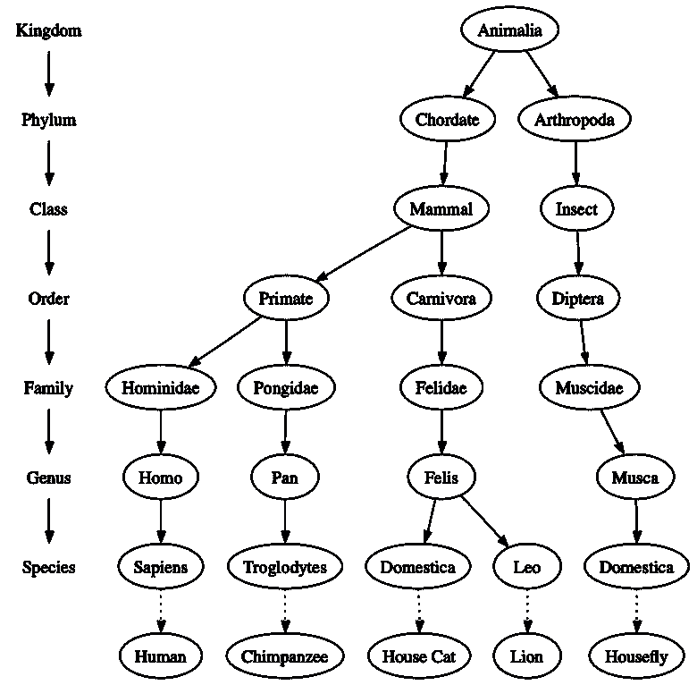
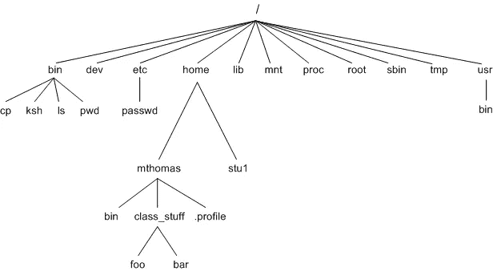
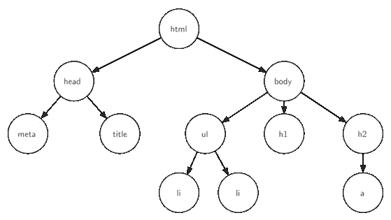
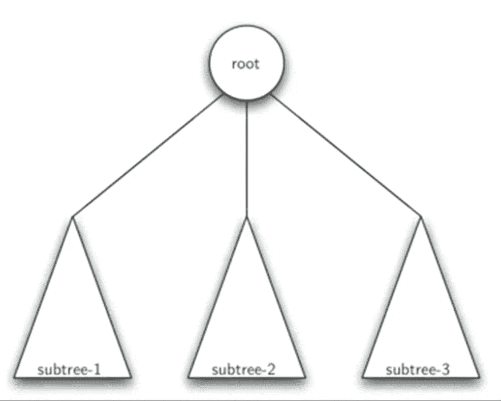

# 树木概论

> 原文：<https://medium.com/analytics-vidhya/introduction-to-trees-bef2396ab8d4?source=collection_archive---------18----------------------->

树数据结构有根、分支和叶子。自然界中的树和计算机科学中的树的区别在于，树数据结构的根在顶部，叶子在底部。

让我们看看下面几个常见的例子，我们可以把一棵树看作是生物学上的分类树。

[来源](https://www.google.com/url?sa=i&url=https%3A%2F%2Frunestone.academy%2Frunestone%2Fbooks%2Fpublished%2Fpythonds%2FTrees%2FExamplesofTrees.html&psig=AOvVaw1JFNLnFRhcPfqFMO_j7sJQ&ust=1610867047569000&source=images&cd=vfe&ved=0CAMQjB1qFwoTCIDq4cPxn-4CFQAAAAAdAAAAABAD)

我们对一些动物进行了生物分类，这是一个非常简单的例子，我们可以从中了解到树的属性，这个例子证明了树是有层次的，它们的结构和层次，更一般的东西在顶部，更具体的东西在底部。

树的第二个属性是一个节点的所有子节点都独立于另一个节点的子节点。第三个属性是每个叶节点都是唯一的。

另一个你可能每天都会用到的树结构的例子是文件系统。在文件系统中，目录或文件夹被构造为树

上图是一个例子，其中您基本上只有 UNIX 文件系统的一小部分作为层次结构，就像生物分类树一样，您可以沿着从根目录到任何目录的路径，该路径将唯一地标识子目录。

树的另一个重要属性也来自于层次结构，即可以将称为子树的树的整个部分移动到树中的不同位置，而不会影响层次结构的较低级别。例如，您可以从上面的树中取出 **bin 节点，并移动到树**中的任意节点，注意这不会影响同一级别的任何子节点，这一点很重要。

另一个例子是网页，对于那些熟悉 HTML 的人来说。它也有类似的结构

我们已经提到了一些术语，如节点、子节点、父节点，现在我们将复习一些他们在讨论树时应该知道的常用词汇。

## 节点:

一个**节点**是一棵树的基本部分。它可以有一个名字，我们称之为“**键**”。一个节点也可以有附加信息，我们称这个附加信息为“**有效载荷**”。虽然有效载荷信息对于许多树算法来说并不重要，但是在使用树的应用中，它通常是至关重要的。

## 边缘:

边是树的另一个基本部分。一条边连接两个节点，表示它们之间有关系。每个节点(除了根节点)都由另一个节点的一条输入边连接。每个节点可以有几个输出边

## 根:

树根是树中唯一没有传入边的节点。

## 路径:

路径是由边连接的节点的有序列表。

生物分类树中的表单示例

哺乳动物→食肉动物→猫科动物→猫科动物是一条路径。

## 儿童:

具有来自同一节点的传入边的节点集被称为该节点的子节点。

## 家长:

一个节点是它通过传出边连接到的所有节点的父节点。

## 兄弟姐妹:

树中作为同一父节点的子节点称为兄弟节点。

## 子树:

子树是一组节点和边，由父节点和该父节点的所有子节点组成。

## 叶节点:

叶节点是没有子节点的节点。

## 级别:

任何节点的级别是从根节点到 n 的路径上的边数。

## 高度:

树的高度等于树中任何节点的最高级别。

# 树的完整定义

树由一组节点和一组连接节点对的边组成。树具有以下属性:

1.  树的一个节点被指定为根节点。
2.  除了根节点之外，每个节点 n 都由恰好来自一个其他节点 P 的边连接，其中 P 是 n 的父节点。
3.  从根到每个节点都有一条唯一的路径。
4.  如果树中的每个节点最多有两个子节点，我们说该树是一棵**二叉树。**

## 树的递归定义

一棵树要么是空的，要么由一个根和零个或多个子树组成，每个子树也是一棵树。

每个子树的根通过一条边连接到父树的根。

在下一篇博客中，我们将使用列表和类在 python 中实现树形数据结构。

## 如果你有任何反馈或批评，请随时与我分享。如果本演练对您有所帮助，请喜欢👏文章。干杯！