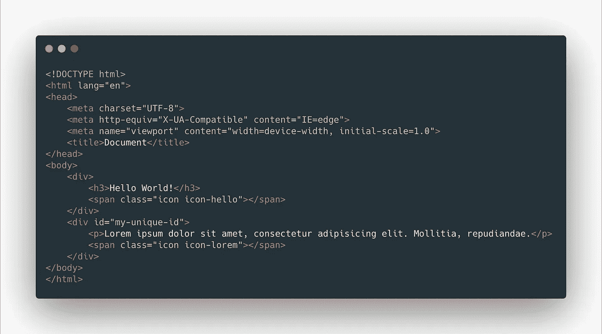

# Python 网页抓取简介

> 原文：<https://medium.com/analytics-vidhya/introduction-to-web-scraping-with-python-db5081047145?source=collection_archive---------8----------------------->

大家好。现在我和网络抓取有关系。在这个故事中，我们将尝试涵盖网络抓取的基础知识。我们如何选择元素？我们开始吧。

# 超文本标记语言

HTML 是超文本标记语言的缩写。正如我们从它的名字所知道的，它不是一种编程语言，而是一种标记语言。通常我们用它来排列网页上的元素。你可以从[这里](https://www.w3schools.com/)获得更多信息。

# XPath

XPath 是一种在 XML 中寻找东西的语言。我们可以通过使用 XPath 符号在 XML 中漫游。如果你想了解更多关于 xpath 的信息，你应该访问这里的。

## XPath 符号

我将给出一些关于 xpath 符号的例子。我希望在那之后我们会明白它们是什么，以及我们如何使用它们。假设我们有如下的 html 代码。



*   /html/body ->选择正文
*   /html/body/*-->选择 body 内部的所有内容(*是通配符)
*   /html/body//div ->选择正文中的所有 div
*   /html/body/div[1]/h3-->选择第一个 div 中的 H3
*   /div[@ id = " my-unique-id "]-->选择所有具有“my-unique-id”id 的 div。@ '表示标记的属性。
*   /span[@ class = " icon "]-->选择具有“icon”类的所有 span，但正如您所认为的，它不会选择任何内容。因为我们没有任何包含类“icon”的元素(只是 icon！)那样
*   /html/body//*[@ class = " icon "]-->我们还可以互相组合。这意味着选择所有具有“图标”类的元素
*   //*[包含(@class，" icon ")]-->选择其 class 属性中包含" icon "的所有项目

# CSS 选择器

我们也可以使用 CSS 选择器。它很简单，但是和 xpath 有一点不同。

我们使用“**>”**作为不同于 xpath 选择器中的“ **/** ”。示例:

*   html >正文>分类

" "(**空格**)与 xpath 选择器中的" **//** "不同。示例:

*   html >正文>分栏 p

"**:第 N 个类型(N)** "与 xpath 选择器中的"**【N】**"不同。示例:

*   body > div:n-of-type(2)

我们还可以通过使用类别和 id 进行选择:

*   body >部门类别名称
*   body > div#my-special-div

如果我们想用 css select 选择属性，我们需要使用这个符号:**' element::attr(attribute-name)'**

*   body > div#welcome > a::attr(href)

# Scrapy

我们用 [**scrapy**](https://scrapy.org/) 来刮网页:)我来做一个简单的例子。

```
!pip install requests # for request to web
!pip install scrapy # for scrapingimport requests
import scrapyreq = requests.get(
'https://docs.scrapy.org/en/latest/topics/contracts.html'
)
html = req.text # url's contentselector = scrapy.Selector(text=html) # created Selector instance based on html variableselector.xpath('//a') # select all a elements from html variable
                      # returns Selectors listselector.xpath('//a').extract() # extracts contents from all elements and returns as a list which created with extracted contentsselector.xpath('//a').extract_first() # extract first element
```

我们可以创建如下的链式选择。

```
selector.xpath('//div[@class="product-detail"]').xpath('./h3[@class="product-title"]')
```

我们可以一起使用 xpath 和 css 选择器。

```
selector.xpath('//div[@class="product-detail"]').css(h3.product-title)
```

我想展示 scrapy 的方法以及我们如何选择元素。希望有帮助。感谢阅读。

亲切的问候。