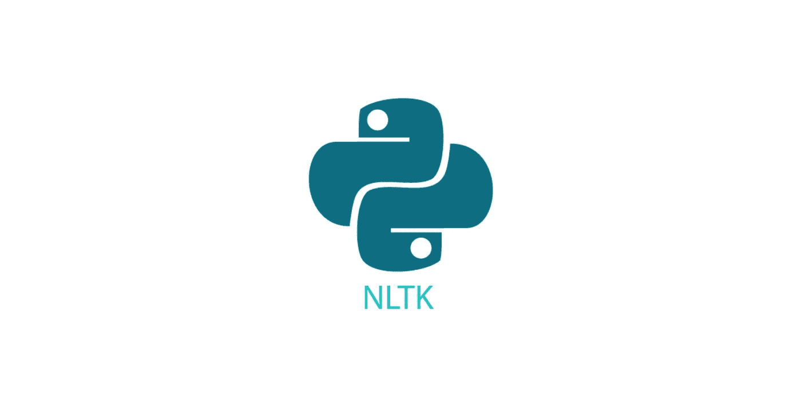

# 自然语言处理中的词频介绍

> 原文：<https://medium.com/analytics-vidhya/introduction-to-word-frequencies-in-nlp-4deb3a02ff43?source=collection_archive---------4----------------------->

自然语言处理是在机器学习应用中实现的最常用的技术之一，因为它可以执行广泛的分析、提取、处理和可视化任务。这个练习的主要目标是标记文本内容，删除停用词，并找到高频词。