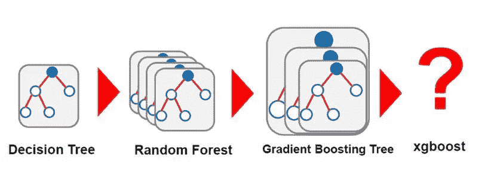

# XGBoost 算法简介

> 原文：<https://medium.com/analytics-vidhya/introduction-to-xgboost-algorithm-d2e7fad76b04?source=collection_archive---------0----------------------->

# 介绍

> XGBoost 代表“极限梯度提升”。XGBoost 是一个优化的分布式梯度增强库，设计为高效、灵活和可移植。它在梯度推进框架下实现机器学习算法。它提供了一种并行树提升，以快速准确的方式解决许多数据科学问题。

XGBoost 是一个软件库，您可以下载并安装到您的机器上，然后从各种界面访问它。具体来说，XGBoost 支持以下主要接口:

*   命令行界面(CLI)。
*   C++(编写库的语言)。
*   Python 接口以及 scikit-learn 中的一个模型。
*   r 接口以及 caret 包中的一个模型。
*   朱莉娅。
*   像 Scala 这样的 Java 和 JVM 语言以及 Hadoop 这样的平台。

# XGBoost 特性

该库专注于计算速度和模型性能，因此几乎没有多余的东西。然而，它确实提供了许多高级功能。

# 模型特征

该模型的实现支持 scikit-learn 和 R 实现的特性，并增加了正则化等新特性。支持三种主要形式的梯度增强:

*   **梯度推进**算法也叫梯度推进机包括学习率。
*   **随机梯度推进**，在每个分割级别的行、列和列进行子采样。
*   **L1 和 L2 正则化的正则化梯度增强**。

# 系统功能

该库提供了一个用于各种计算环境的系统，尤其是:

*   **树构造的并行化**在训练期间使用你所有的 CPU 核心。
*   **分布式计算**用于使用机器集群训练非常大的模型。
*   **核外计算**适用于不适合内存的超大型数据集。
*   **数据结构和算法的缓存优化**充分利用硬件。

# 算法特征

该算法的实现是为计算时间和存储器资源的效率而设计的。设计目标是充分利用可用资源来训练模型。一些关键的算法实现特性包括:

*   **稀疏感知**实现自动处理缺失数据值。
*   **块结构**支持树构造的并行化。
*   **继续训练**这样你就可以根据新数据进一步提升已经拟合好的模型。

XGBoost 是免费的开源软件，可以在许可的 Apache-2 许可下使用。

# 为什么要用 XGBoost？

使用 XGBoost 的两个原因也是该项目的两个目标:

1.  执行速度。
2.  模特表演。

# 什么是助推…？

> Boosting 是一种集成学习技术，用于从几个串联的弱分类器中构建一个强分类器。Boosting 算法在处理偏差-方差权衡时起着至关重要的作用。与仅控制模型中的高方差的 bagging 算法不同，boosting 控制两个方面(偏差和方差),并且被认为更有效。

以下是几种升压算法:

1.  自适应增强
2.  梯度推进
3.  XGBoost
4.  CATBoost
5.  轻型 GBM

# adaboost 算法

AdaBoost 是 Adaptive Boosting 的缩写。AdaBoost 是为二进制分类开发的第一个成功的 boosting 算法。此外，这也是理解 boosting 算法的最佳起点。从某种意义上说，它是自适应的，后续建立的分类器被调整以支持那些被先前分类器错误分类的实例。它对噪音数据和异常值很敏感。

AdaBoost 使用多次迭代来生成单个复合强学习器。它通过迭代添加弱学习者来创建强学习者。在训练的每个阶段，一个新的弱学习者被添加到集成中，并且一个加权向量被调整以聚焦于在前几轮中被错误分类的例子。结果是分类器比弱学习器分类器具有更高的准确度。

# 梯度推进

梯度推进是建立预测模型最强大的技术之一，它被称为 AdaBoost 的**推广。梯度提升的主要目的是通过使用梯度下降优化算法添加弱学习器来最小化损失函数。一般化允许使用任意可微分损失函数，将该技术扩展到二元分类问题之外，以支持回归、多类分类等。**

> **梯度推进有三个主要组成部分**。

*   **损失函数:**损失函数的作用是估计模型在用给定数据进行预测时有多好。这可能因问题的类型而异。
*   **弱学习者:**弱学习者是指与随机猜测相比，对数据分类很差的人。弱学习器主要是决策树，但是 GBM 中也可以使用其他模型。
*   **加法模型:**这是一个迭代和连续的过程，一次一步地添加决策树。每次迭代应该减少损失函数的值。添加固定数量的树，或者一旦损失达到可接受的水平或者在外部验证数据集上不再改善，训练就停止。

# 对梯度增强的改进

梯度提升是一种贪婪算法，可以快速地使训练数据集过拟合。因此，正则化方法被用来通过减少过拟合来提高算法的性能。

*   **子采样:**这是为 GBM 引入的最简单的正则化方法。这提高了模型的泛化性能并减少了计算量。子采样将随机性引入拟合过程。在每次学习迭代中，只有随机部分的训练数据被用于拟合连续的基础学习者。训练数据被采样而没有替换。
*   **收缩:**收缩常用于岭回归，它将回归系数收缩为零，从而减少潜在的不稳定回归系数的影响。在 GBM 中，收缩用于减少每个额外安装的基础学习者的影响。它减少了增量步骤的大小，从而降低了每次连续迭代的重要性。这种技术背后的直觉是，通过采取许多小步骤比采取较少的大步骤来改进模型更好。如果其中一个提升迭代被证明是错误的，其负面影响可以在后续步骤中轻松纠正。
*   **提前停止:**可以从决策树中得出的一个重要的实际考虑是提前停止或树修剪。这意味着，如果集合被修剪了树的数量，对应于误差曲线上的验证集最小值，则过拟合将以最小的精度代价被规避。另一个观察结果是，考虑提前停止的最佳推进次数随着收缩参数λ而变化。因此，应考虑提升次数和λ之间的权衡。

# XGBoost

XGBoost 代表极端梯度增强。它在最近几天变得流行起来，并由于其可伸缩性而在结构化数据的应用机器学习和 Kaggle 竞争中占据主导地位。

XGBoost 是梯度增强决策树(GBM)的扩展，专门用于提高速度和性能。

# XGBoost 特性

*   **正则化学习:**正则化项有助于平滑最终学习到的权重，以避免过拟合。规则化的目标将倾向于选择使用简单和预测函数的模型。
*   **梯度树提升:**在欧几里德空间中，不能使用传统的优化方法来优化树集成模型。相反，该模型是以相加的方式训练的。
*   **收缩和列子采样:**除了正则化目标，还使用了两种附加技术来进一步防止过拟合。第一种技术是弗里德曼提出的收缩。在树提升的每一步之后，收缩通过因子η缩放新增加的权重。类似于随机优化中的学习率，收缩减少了每棵树的影响，并为未来的树留下空间来改进模型。

第二种技术是列(特征)子采样。这种技术用于随机森林。列子采样比传统的行子采样更能防止过拟合。列子样本的使用也加速了并行算法的计算。

# 分裂算法

*   **精确贪婪算法:**树学习中的主要问题是寻找最佳分裂。该算法列举了所有特征上所有可能的分裂。枚举连续特征的所有可能的分裂在计算上要求很高。
*   **近似算法:**精确贪婪算法非常强大，因为它贪婪地列举了所有可能的分裂点。然而，当数据不完全适合内存时，就不可能有效地做到这一点。近似算法根据特征分布的百分位数提出候选分割点。然后，该算法将连续特征映射到由这些候选点分割的桶中，聚集统计数据，并基于聚集的统计数据在提议中找到最佳解决方案。
*   **加权分位数草图:**近似算法的一个重要步骤是提出候选分裂点。XGBoost 有一个分布式加权分位数草图算法，可以有效地处理加权数据。
*   **稀疏感知的分裂发现:**在许多现实世界的问题中，输入 x 稀疏是很常见的。稀疏有多种可能的原因:

1.  数据中存在缺失值
2.  统计数据中经常出现零条目
3.  特征工程的产物，例如一键编码

让算法知道数据中的稀疏模式是很重要的。XGBoost 以统一的方式处理所有稀疏模式。

# XGBoost 的系统特性

*   在训练过程中使用所有 CPU 核心并行构建树。收集每一列的统计数据可以并行化，为我们提供了一个并行的查找拆分的算法。
*   缓存感知访问:XGBoost 旨在优化硬件的使用。这是通过在每个线程中分配内部缓冲区来实现的，其中可以存储梯度统计数据。
*   内存中容纳不下的超大型数据集的核外计算块。
*   使用机器集群训练超大型模型的分布式计算。
*   用于并行学习的列块。树学习最耗时的部分是将数据排序。为了降低排序的成本，数据以压缩格式按排序顺序存储在列块中。

# XGBoost 的目标

*   执行速度:XGBoost 几乎总是比来自 R、Python Spark 和 H2O 的其他基准实现更快，而且与其他算法相比，它确实更快。
*   模型性能:在分类和回归预测建模问题上，XGBoost 在结构化或表格化数据集上占优势。

# XGBoost 算法—参数

# a.一般参数

以下是 Xgboost 算法中使用的一般参数:

*   **静音**:默认值为 0。您需要为打印运行消息指定 0，为静默模式指定 1。
*   **booster** :默认值为 GBtree。您需要指定要使用的助推器:GBtree(基于树)或 GBlinear(线性函数)。
*   **num_pbuffer** :由 XGBoost 算法自动设置，无需用户设置。更多细节请阅读 XGBoost 的文档。
*   **num_feature** :由 XGBoost 算法自动设置，无需用户设置。

# b.助推器参数

下面我们讨论了 Xgboost 算法中特定于树的参数:

*   **eta** :默认值设置为 0.3。您需要指定更新中使用的步长收缩，以防止过度拟合。在每一步提升之后，我们可以直接得到新特征的权重。eta 实际上缩小了特征权重，以使提升过程更加保守。范围是 0 到 1。低 eta 值意味着模型对过度拟合更稳健。
*   **伽玛**:默认值设置为 0。您需要指定在树的叶节点上进行进一步分区所需的最小损失减少量。越大，算法就越保守。范围是 0 到∞。伽玛越大，算法越保守。
*   **最大深度**:默认值设置为 6。您需要指定树的最大深度。范围是 1 到∞。
*   **min_child_weight** :默认值设置为 1。您需要指定子对象所需的最小实例重量总和(hessian)。如果树划分步骤产生叶节点。然后实例权重之和小于最小子权重。那么构建过程将放弃进一步的划分。在线性回归模式中，对应于每个节点中所需的最小实例数。越大，算法就越保守。范围是 0 到∞。
*   **max_delta_step** :默认值设置为 0。我们允许每棵树的重量估计值为。如果该值设置为 0，则表示没有约束。如果将其设置为正值，则有助于使更新步骤更加保守。通常，这个参数是不需要的，但它可能有助于逻辑回归。尤其是一个班级极度不平衡的时候。将其设置为 1–10 的值可能有助于控制更新。范围是 0 到∞。
*   **子采样**:默认值设置为 1。您需要指定训练实例的子样本比率。将其设置为 0.5 意味着 XGBoost 随机收集了一半的数据实例。需要种植树木，这将防止过度适应。范围是 0 到 1。
*   **colsample_bytree** :默认值设置为 1。构建每个树时，需要指定列的子抽样比率。范围是 0 到 1。

# c.线性助推器特定参数

这些是 XGBoost 算法中的线性升压器特定参数。

*   **λ和α**:这是关于权重的正则化项。Lambda 默认值假定为 1，alpha 为 0。
*   **lambda_bias** : L2 正则化项 on bias，默认值为 0。

# d.学习任务参数

以下是 XGBoost 算法中的学习任务参数

*   **base_score** :默认值设置为 0.5。您需要指定所有实例的初始预测得分，全局偏差。
*   **目标**:默认值设置为 reg: linear。您需要指定您想要的学习者类型。这包括线性回归、泊松回归等。
*   **eval_metric** :您需要指定验证数据的评估指标。并且将根据目标分配默认度量。
*   **seed** :和往常一样，您在这里指定种子来复制同一组输出。

# 摘要

在这篇文章中，您发现了应用机器学习的 XGBoost 算法。

你学到了:

*   XGBoost 是一个用于开发快速和高性能梯度增强树模型的库。
*   XGBoost 在一系列困难的机器学习任务上取得了最佳性能。

# 结论

与其他算法相比，XGBoost 是一种更快的算法，因为它是并行和分布式计算。XGBoost 是在系统优化和机器学习原则方面的深入考虑下开发的。这个库的目标是推动机器的计算极限，提供一个可伸缩的、可移植的、精确的库。

# 官方 XGBoost 资源

XGBoost 上最好的信息来源是项目的官方 GitHub 资源库。

从那里，您可以访问[问题跟踪器](https://github.com/dmlc/xgboost/issues)和[用户组](https://groups.google.com/forum/#!forum/xgboost-user/)，它们可用于提问和报告 bug。

包含示例代码和帮助的链接的一个很好的来源是[棒极了的 XGBoost 页面](https://github.com/dmlc/xgboost/tree/master/demo)。

还有一个[官方文档页面](https://xgboost.readthedocs.io/en/latest/)，其中包括一系列不同语言的入门指南、教程、操作指南等等。

XGBoost 上有一些更正式的论文，值得一读，以了解更多关于该库的背景知识:

*   2014 年，希格斯玻色子的发现与增强树。
*   [XGBoost:一个可扩展的树提升系统](https://arxiv.org/abs/1603.02754)，2016。

**参考文献**:

1.  [https://arxiv.org/pdf/1603.02754.pdf](https://arxiv.org/pdf/1603.02754.pdf)(XGBoost:一个可扩展的树提升系统)
2.  [https://xgboost . readthedocs . io/en/latest/tutorials/model . html](https://xgboost.readthedocs.io/en/latest/tutorials/model.html)
3.  [https://machine learning mastery . com/gentle-introduction-xgboost-applied-machine-learning/](https://machinelearningmastery.com/gentle-introduction-xgboost-applied-machine-learning/)