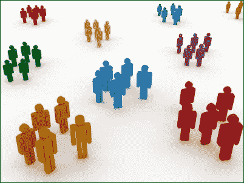
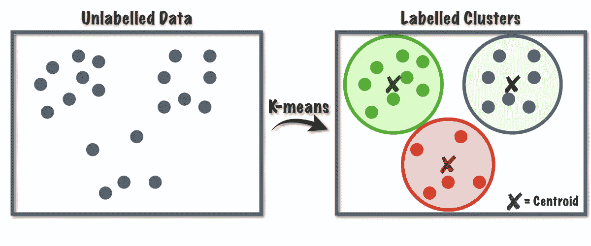
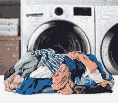
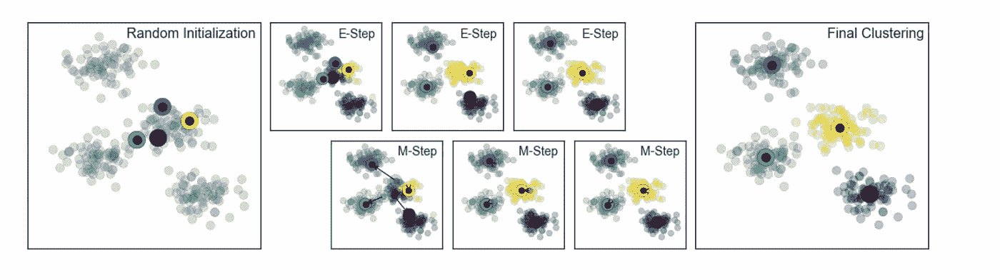
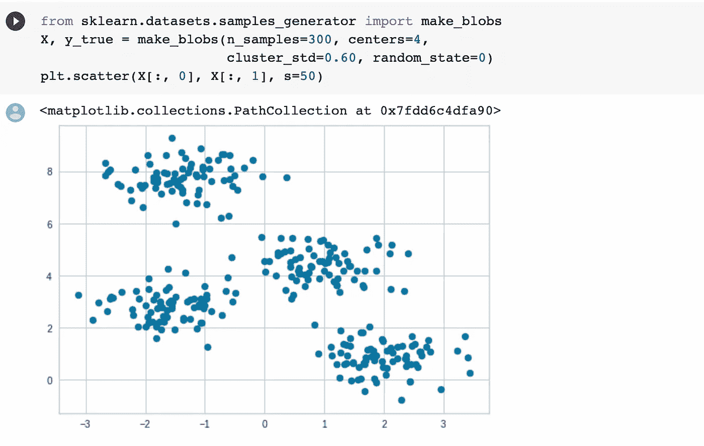
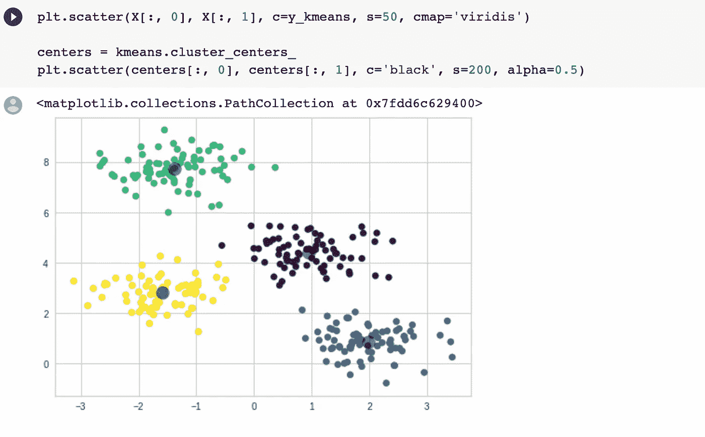

# K-均值聚类背后的直觉

> 原文：<https://medium.com/analytics-vidhya/intuition-behind-k-means-clustering-f1ef6006479?source=collection_archive---------7----------------------->

总体而言，聚类是许多人在生活中使用的一种技术。你可能会在世界各地找到无数集群的例子。可以是一群人在餐馆或食品店共享一张桌子，展示不同部分的食物，如肉、蔬菜等。

聚类的例子

类似地，在机器学习的世界中，聚类是对行业中普遍存在的各种无监督问题的非常常见的解决方案。它有助于理解和理解非结构化数据，从而形成具有相同集群中的**相似数据点**和其他集群中的**不相似数据点**的**集群**。聚类在现实生活中的一个主要用途来自推荐系统，如亚马逊等公司使用的推荐系统，根据您的购买历史向您显示您想要购买的东西，或者网飞等 OTT 公司根据您的偏好和观看历史向您推荐内容。

流行的聚类方法是 K-Means

# 什么是 K-Means 聚类？

让我们首先用一个日常的例子来理解这一点。假设你最近搬到了一家旅馆，你需要自己洗衣服。到了月底，你意识到你已经没有什么好衣服了，除了洗衣服别无他法，衣服现在已经堆积成了一大堆。以前从未做过，你立即打电话给你的母亲，征求她的意见。她解释说，每种衣服都有规格。有些用热水洗，有些用冷水洗，有些特别需要风干等等。

一批衣服

简单地说，K-Means 是最简单的聚类算法之一，其主要目标是将相似的元素或数据点分组到一个聚类中。这里 k 是一个输入值，表示您想要的聚类数，即给定 k=4 将从数据中获取正好 4 个聚类。

为了继续我们的类比并理解它如何转化为聚类，让我们假设你的母亲要求将一堆分成 3 个聚类(这里，k=3)。你随机挑选 3 件不同的衣服，这将是创建集群的开始过程。现在，仔细检查一大堆衣服，根据水温、烘干温度、颜色等属性，尝试将它们归入 3 个类别中的一个。要明白最适合的并不依赖于集群；这仅仅取决于你的出发点。从技术上讲，这个起始点被称为星团的**质心。此外，你试图适应的这些项目在本质上不会是相同的。因此，试着从 3 个选项中为他们选择最合适的。**

每组衣服都有不同的属性

***这种相似性是在什么基础上理解的？***

简单。你只需要根据衣服的相似程度，将你从衣服堆中挑选的每件衣服放在离起点更近/更远的地方，也就是说，越相似的衣服就离起点越近。在本活动结束时，你意识到你有 3 个不同的簇，你可以开始你的洗涤活动。但是等等……

这个过程是一个迭代的过程。由于我们的起点是随机的，我们需要确保最终我们的起点是最好的。为此，我们需要一次又一次地确定所有 3 个聚类的新质心值，直到这样一个点

1.  集群之间没有服装项目的转移
2.  您已经做了大量的迭代来尽可能地生成最佳集群。

最后，如果你是一个完美主义者，你将不得不对 k=4，5，…..依此类推，直到得到可能的最佳聚类。

# K-Means 背后的算法

1.  将数据聚类到 k 个组中，其中 k 的值是预定义的。
2.  随机选择总共 k 个点，这些点可能来自也可能不来自被称为聚类中心或质心的数据集。
3.  基于任何距离函数，将数据点指定给它们最近的质心。这个步骤被称为**期望**步骤。
4.  再次计算每个聚类的中心点/平均值，并将其替换为质心点。这是**最大化**步骤。
5.  重复*期望最大化*步骤，直到没有数据点从它们先前的聚类中移动，或者质心从先前的迭代没有改变。

K-均值聚类过程

下面给出了上述算法在 python 上对二维数据的实际实现。让我们看一看

以散点图形式表示的原始数据集

在 k=4 的情况下，使用 K-Means 可以很容易地将数据集分成聚类

使用该算法时观察到的某些缺点如下:

*   它需要预先指定簇的数量(k)。
*   它不能处理噪声数据和异常值。
*   它不适合识别具有非凸形状的簇。

# 结论

K-means 聚类可能是最主流的算法，并且通常是专家在处理分组任务以了解数据集的构造时应用的主要工具。

K-means 聚类可能是最主流的算法，并且通常是专家在处理分组任务以了解数据集的构造时应用的主要工具。k-means 的目标是将信息分组到非覆盖子组中。当束具有某种球形结构时，它做得很好。作为一名专家，了解每种算法的计算/技术背后的假设是很好的，这样你就会对每种策略的优点和缺点有一个非常聪明的直觉。这将帮助你选择何时以及在什么条件下使用每一种策略。

这篇博客让你对 K-Means 的概念和算法背后的直觉有了一个全面的了解。