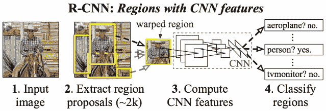

# 使用 OCR 和深度学习的发票信息提取

> 原文：<https://medium.com/analytics-vidhya/invoice-information-extraction-using-ocr-and-deep-learning-b79464f54d69?source=collection_archive---------0----------------------->

文档信息提取被认为是计算机视觉中的一个主要挑战，并且涉及场景中对象分类和对象定位的组合。深度学习中现代进步的出现导致了对象检测中的重大进步，大多数研究集中在设计越来越复杂的对象检测网络以提高准确性，例如 SSD、R-CNN、Mask R-CNN 和这些网络的其他扩展变体。该项目主要旨在使用最新的深度学习技术从发票中提取信息，可用于对象检测。这种深度卷积神经网络模型将被引入嵌入式对象检测。

# **主要优势**

> **降低成本**:这有助于组织降低雇佣人力进行手工数据提取的成本。员工可以专注于其他生产性工作。
> 
> **减少错误:**由于格式不同，从发票中提取信息很困难。此外，人为错误是另一个大问题，它会导致数据丢失和不准确。OCR 有助于减少人为错误并使提取准确。
> 
> **随时可用:** OCR 提取和验证过程不需要人工干预，一旦发票输入系统，它将从中提取文本，并以相同的流程将其推送到库存。
> 
> **安全性:**完整的自动化提取流程为组织提供了数据级安全性，数据不容易被外界看到。

# **研究当前文献**

深度学习中现代进步的出现导致了对象检测中的重大进步，大多数研究集中在设计越来越复杂的对象检测网络以提高准确性，例如 SSD、R-CNN、Mask R-CNN 和这些网络的其他扩展变体。本文主要研究利用卷积神经网络(CNN)进行图像中的目标检测。图像检测问题基于预定义的标签来预测图像的标签。基于假设，它选择图像中感兴趣的单个对象，并试图覆盖该图像上的重要部分。检测工作不仅仅是定义该对象的类别，而是定位该图像中对象的范围。

先前用作对象检测方法的逐块方向直方图(SIFT 或 HOG)特征对对象的非常低级的特征进行编码，因此该技术适合于在不同标签之间进行正确区分。深度卷积神经网络成为图像中对象检测的最新技术。

## **卷积神经网络架构**

CNN 架构类似于人脑中神经元的连接模式。CNN 擅长使用不同的过滤器捕捉图像中的空间和时间依赖性。因此，为了理解图像的复杂性，可以使用 CNN 来训练网络。卷积网络由两个主要特征组成:特征学习(也称为隐藏层)包括卷积、ReLU 和池化，以及分类层包括 FC 和 Softmax。

从技术上讲，在 ConvNet 中，每幅图像都经过一系列卷积层，这些卷积层具有多个内核或过滤器、池、全连接层，在网络的末端，它实现 Softmax 函数，使用概率值[0，1]对图像中的对象进行分类。图 1 描述了处理输入图像的 CNN 管道，并根据值对对象进行分类。

*CNN 的架构(*[https://www . data science . com/blog/卷积神经网络](https://www.datascience.com/blog/convolutional-neural-network) *)*

## **基于区域的卷积网络(RCNN):**

RCNN 网络在图像中创建一堆边界框，并寻找这些框包含的任何对象的存在，而不是处理大量的区域。RCNN 采用选择性搜索来创建包围盒或区域建议。选择性搜索在图像上抓取不同大小的窗口，并通过不同的比例、颜色、纹理和包围将相邻像素组合在一起。

R-CNN 架构(https://towardsdatascience . com/r-CNN-fast-r-CNN-faster-r-CNN-yolo-object-detection-algorithms-36d 53571365 e)

创建区域提案。(https://arxiv.org/abs/1311.2524。)

RCNN 检测图像中对象的步骤如下:

*   迁移学习是深度学习范式中的一个关键概念。所以我们会考虑一个预训练的卷积神经网络，根据需要检测的类别重新训练模型的末端层。
*   在下一步中，我们将计算每个图像的感兴趣区域(ROI ),并对所有这些区域进行整形，以匹配 CNN 输入。
*   一旦计算出所有的区域，我们需要训练支持向量机(SVM ),以便以二元分类器的形式对目标和背景进行分类。
*   然后，我们将使用线性回归模型，以便为盒子输出更紧密的坐标。

## **更快-R-CNN (FRCN)**

在更快的 R-CNN 上描述的最先进的对象检测框架，其基于深度卷积网络，并且包括区域提议网络(RPN)和对象检测网络。RPN 和 R-FCN 网络都被训练为共享卷积层以进行快速计算和测试。RPN 利用检测网络产生完整图像卷积特征，该检测网络实现几乎无成本的区域提议，其中每个对象提议具有作为输出的对象性分数。

FRCNN 架构—(https://towardsdatascience . com/deep-learning-for-object-detection-a-comprehensive-review-73930816 d8d 9)

## 区域提案网络

*   RNP 取一个 3×3 的滑动窗口流过特征图并映射到一个较低的维度。
*   然后，它为每个滑动窗口位置生成 k 个不同形状大小的固定锚盒。
*   一旦锚框生成，RPN 计算锚框是对象的 softmax 概率。
*   然后，为了更好地拟合对象，执行边界框回归以调整锚。

RPN 架构—[https://www . analyticsvidhya . com/blog/2018/10/a-分步介绍-基础-对象-检测-算法-第一部分/](https://www.analyticsvidhya.com/blog/2018/10/a-step-by-step-introduction-to-the-basic-object-detection-algorithms-part-1/)

由于我们有了所有的建议区域，下一步是直接馈送到快速 R-CNN 网络，该网络由一个汇集层、一些全连接层以及最后的 softmax 分类层和边界框回归器组成。

## **单发多盒探测器(SSD)**

2016 年底 Christian Szegedy 在对象检测领域提出了单次多盒检测器，在 COCO 和 PascalVOC 标准数据集上的平均精度为 74%。在训练期间，SSD 只需要每个对象的输入图像和地面真相盒。它基于前馈卷积网络。它生成限定大小的边界框集合和这些框中存在的对象类实例的相应分数，以及产生最终检测结果的非最大值抑制步骤。

单发多箱探测器架构(【https://arxiv.org/pdf/1512.02325.pdf】T4

*   **架构:** VGG-16 是图像分类领域最强的网络之一，具有高性能和高质量。因此，基于 VGG-16 架构，Christian Szegedy 设计了 SSD 架构，但从架构中丢弃了完全连接的层。为了逐渐减小每个后续层的输入大小，实现了一组辅助卷积层。下面提到的 VGG-16 架构。

输入为 224x224x3 的 VGG 架构

*   **多盒检测器:**基于 Christian Szegedy 多盒方法，设计了 SSD 的包围盒回归。它获得具有 p 个通道的尺寸为 m×n 的特征层(m×n×p)。对于每个位置，我们有 k 个不同大小和长宽比的边界框。例如，人的垂直边界框和汽车的水平边界框。然后，它计算类分数和相对于原始地面真实边界框形状的 4 个坐标偏移。
*   MultiBox 的损失函数有两个关键部分进入 SSD，**置信度损失:**交叉熵用于测量多个类别置信度的 softmax 损失，以及**定位损失:**平滑 L1 用于计算预测框和地面真实框之间的损失，包括边界框的中心点(cx，cy)、宽度(w)和高度(h)的偏移

> ***multibox_loss =置信度 _loss + alpha *位置 _loss***

用于定位和置信度的多个边界框([https://arxiv.org/pdf/1512.02325.pdf](https://arxiv.org/pdf/1512.02325.pdf))

*   **并集上的交集(IOU):** IOU 是一种评估技术，用于测量对象检测模型的准确性。我们需要找到 IOU 的组件是作为对象检测模型的输出的真实边界框和预测边界框。实际上，预测的边界框坐标不可能完全符合真实边界框坐标。因此，为了找到与基本事实框高度重叠的边界框，我们设置了一个 IOU 阈值。这确保了我们预测的边界框尽可能接近地匹配基本事实框。

Union 上的交集(https://www . pyimagesearch . com/2016/11/07/intersection-Over-Union-iou-for-object-detection/)

*   **非最大值抑制:**在推断阶段，使用 NMS 修剪由模型生成的大部分边界框。通过设置置信度阈值 0.01 和 IOU 阈值 0.5，我们可以过滤掉大部分框，仅保留 N 个预测。它有助于在推理过程中优化模型输出，并消除噪声较大的预测。

非最大抑制示例(https://medium . com/@ yusuken/object-detection-1-NMS-ed 00d 16 fdcf 9)

# **管道设计**

# **高层架构**

在这个用例的开始，我们使用了一些计算机视觉技术来识别 PDF 或图像文件中的表格结构，其中我们通过应用两个内核 1 来尝试边缘检测的形态学操作。内核检测水平线 2。内核来检测垂直线。这种方法在表格不包含任何水平线或垂直线的情况下会失败。如今，结构提取是深度学习领域中的关键研究领域之一，因此我们决定进一步使用深度神经网络作为我们的用例。我们将此用例分为三个不同的部分 1。使用深度学习技术的区域检测，2 .使用 OCR 工具从检测区域中提取文本。3.实施文本分析以识别提取的文本之间的关系，并将其转储到存储库中。

流水线架构

**图像预处理:**这里的图像是为训练和测试过程准备的。首先，我们使用(600x600x3)和 300 DPI 将 PDF 发票转换为 JPG，然后使用第[6]节中提到的不同预处理技术。一旦所有图像都被收集和处理，它将被解析以用于深度学习模型的训练(正在使用 FRCN 和 SSD)。

**使用深度学习的结构提取:**我们将提取部分分为两类，如下所述。

*   **检测模型:**一旦数据集准备好，我们将把它传递给检测模型，以便识别输入图像中的表格、段落和表格。我们目前正在处理 FRCN 和 SSD 模型，根据准确性，我们将选择最终使用案例的模型。所有的测量细节和比较将在最终文件中展示。
*   文本提取:管道中的下一个组件是文本提取。我们目前正在使用名为 Tesseract-OCR 的开源 OCR 工具从检测到的区域中提取文本。这是要提到的，提取模块正在进行中，我们可能会转移到其他方法，以获得更好的性能和准确性。

文本分类:文本分类由两部分组成。1.使用自然语言处理技术将用于识别提取的文本作为键-值对和 2 之间的关系。用于计算最终输出精度的分类算法。

> **开发环境:** Anaconda3，Google 云平台**，** protobuf-compiler，python-pil，python-lxml，python-tk
> 
> **Python 包:** Cython，matplotlib，PIL (pillow)，tensorflow-gpu，keras，LabelImg，Imgaug，spaCy

# **训练数据集的准备**

## **图像采集和准备**

近 1K 的图像是从不同的来源收集的，如 Google、Being 和一些供应商发票，30%的图像用于测试和验证模型。为了加强模型的准确性，采用了图像增强技术。

*   **图像归一化:**图像归一化技术用于改变像素强度值的范围，以提高图像的对比度。直方图均衡或对比度拉伸机制广泛用于图像归一化。在这个用例中，我们采用了对比拉伸技术。

图像标准化。原始拉伸与对比拉伸

*   **图像大小调整:**我们用 600x600 像素的图像来训练深度神经网络。PIL python 模块的 Resize 函数已经被用来调整图像的大小。
*   **图像转换:**将所有图像转换为 RGB(通道 3)格式并编码为 JEPG。OpenCV 包用于转换。
*   **每英寸点数(DPI)转换**:在整个项目中，我们致力于高强度的图像，将所有图像转换为 300 DPI。

## **图像标注**

图像标记是目标检测领域最重要的任务之一。我们已经使用基于 GUI 的标签工具 [labelImg](https://github.com/tzutalin/labelImg) 手动标注了 1000 张图片，分为三类:段落、表格和表单。所有的注释都作为 XML 文件保存在不同的目录中，并且使用 PascalVOC 格式。创建一个自定义 python 脚本来准备所有 XML 文件的 CSV 文件，包含文件名、图像大小、边界框坐标和类，这些将在 TFRecord 创建期间使用。

XML 文件包含关于图像和注释的所有细节。

*   图像位置。
*   尺寸和通道(RGB)
*   类别(段落、表格、表单)
*   边界框坐标为 xmin，ymin，xmax，ymax。

使用标签的图像注释

带有边界框坐标的 XML 文件

## **图像增强**

为了在深度网络中取得良好的性能，我们需要大量的数据进行训练。由于我们只收集了 1000 幅图像，因此采用了图像增强技术来提高我们网络的性能。python 库 [imgaug](https://github.com/aleju/imgaug) 帮助我们生成增强图像以及边界框移动。在我们的使用案例中使用了以下增强器:

*   **仿射平移:**使用仿射平移技术，我们将图像在 x 轴上平移 40 像素，在 y 轴上平移 60 像素，并缩放至其原始大小的 50–70%。这影响了边界框的位置，因此我们移动了增强图像的边界框坐标。
*   **亮度:**为了让图像更亮，我们将所有像素乘以(1.2，1.5)。
*   **高斯模糊**:高斯内核用于以 1.5 的西格玛增强图像。
*   **水平翻转:**与缩放 1.0 一起使用的增强器翻转器，用于水平翻转图像。

图像增强

# 模型结构

如前所述，Fast-RCNN 是 RPN 而不是选择性搜索和 Fast-RCNN 框架的结合。选择性搜索采用 SIFT 和 HOG 描述符来生成对象提议，在 CPU 上每幅图像需要 2 秒，其中，使用 VGGnet 或 ResNext 作为后端网络，RCNN 的工作速度更快，为 5fps(每秒帧数)。

Keras 提供不同的预训练模型，通过加载现有重量来生成定制模型。预训练模型在 1000 个类和 25，636，712 个参数的 ImageNet 数据集上训练。我们已经使用 VGG16 和 ResNet50 网络为我们的定制模型实现了作为独立特征提取器和权重初始化器的迁移学习，并且已经从互联网下载了预训练模型。这个模型可以在包括 inception_v3 的另一个网络上进行训练。

## **优化**

损失函数可以针对所有锚点进行优化，但是由于图像的最大部分不包含任何对象，因此它会偏向负样本。正如 FRCN 论文中提到的，我们随机抽样了 256 个锚，以计算正负锚比例高达 1:1 的小批量的损失函数。我们使用标准差为 0.01 的零均值高斯分布来初始化其他层。在 PASCAL 数据集上，我们使用 0.001 的初始学习率直到 23k 小批量，以及 0.0001 用于接下来的 20k 小批量。

## **超参数**

*   初始学习率:前 23k 步 0.001
*   预定学习率:接下来 20k 步为 0.0001。
*   动量优化器值:0.9
*   使用移动平均线:假
*   按规范进行渐变剪裁:10.0
*   标准偏差:0.01
*   纪元:25 年
*   步骤/时期:1000
*   nms_iou_threshold : 0.8

## **最终损失计算**

如前所述，我们已经用每个 1000 步的 25 个时期训练了该模型，并且最终损失被计算为 RPN 损失和检测损失。对于包围盒分类器，我们实现了 88.9%的准确率。

## **激活层输出的可视化**

激活层的可视化

## 最终分割图像

# **使用宇宙魔方提取文本:**

光学字符识别是近二十年来计算机科学领域的热门话题之一。OCR 检测图像上的文本内容，并将图像翻译成机器编码的文本供计算机处理。OCR 涉及的步骤如下所述。

*   图像被扫描并转换成位图，位图是黑白点的矩阵。
*   为了提高精度，必须对图像进行亮度和对比度调整的预处理。
*   然后使用分割算法找到图像中文本所在的感兴趣区域。
*   现在感兴趣的区域可以被进一步分割成线条、单词和字符。然后，使用比较和检测算法进行字符匹配。

我们选择了谷歌的 [Tesseract-OCR](https://en.wikipedia.org/wiki/Tesseract_(software)) 引擎，该引擎最初是由惠普在 20 世纪 80 年代开发的，谷歌在 2006 年接管了它。Tesseract-OCR 是基于深度学习的开源软件，它支持 130 种语言和超过 35 种脚本。我们使用的[pytesseracat](https://pypi.org/project/pytesseract/)是用于文本提取的 Tesseract-OCR 引擎的 python 包装器。

## **图像预处理**

为了提高 Tesseract-OCR 的精度，需要对输入图像进行处理。有几种技术可用于图像的预处理，其中我们采用了一些基本技术，即灰度转换、大小调整和亮度调整。我们使用 python 包 Pillow(是 Python 图像库(PIL))进行图像预处理

## **内容提取**

FRCN 模型推理图接受图像并生成检测框、检测分数和检测类作为 python 字典，其中检测框保存边界框坐标。我们正在转换坐标并计算 xmin、ymin、xmax、ymax 和 python OpenCV，以裁剪边界框并将其传递给[pytesserac](https://pypi.org/project/pytesseract/)进行文本提取。

> 使用的 Python 包:Pytesseract，Numpy，Matplotlib，OpenCV。

# **使用命名实体识别的文本分类**

命名实体识别( [NER](https://spacy.io/usage/training/#ner) )是自然语言处理中使用的文本分类技术之一，也称为实体识别、实体分块和实体提取。它旨在定位非结构化数据中描述的命名实体并将其分类为预定义的类别，如名称、国家、组织、货币等。NLTK 和 [SpaCy](https://spacy.io/) 是 NER 最常用的 python 包。我们使用 SpaCy 构建了 NER 模型，该模型支持英语、西班牙语、法语、意大利语、荷兰语和多种语言的 NER。我们采用了 OCR 的输出，并训练了一个定制的 NER 模型，以便对以下实体进行分类。

1.  发票号
2.  发票日期
3.  货币
4.  总数
5.  采购订单

## **数据集准备**

我们使用了 [spaCy NER 注释器](https://github.com/ManivannanMurugavel/spacy-ner-annotator)工具来标记从训练图像中提取的所有文本，它生成一个合并。包含所有注释的 json 文件。spaCy 接受训练过程的元组列表，因此我们创建了 python 代码来将 json 数据转换为 SpaCy 格式。

用于数据预处理的 NER 标注工具

## **培训 NER 模特**

NER 培训从创建一个空白模型开始，并将其添加到内置管道中。SpaCy 小批量组件用于训练批次。因为我们正在训练一个新的模型，因此随机重置和初始化权重。模型经过 200 次迭代训练，下降 0.5，小批量复合学习率为(4.0，32.0，1.001)。

## NER 模型评估

我们已经使用 spaCy 内置类黄金和 scorer API 来评估出 NER 模型。精确度得分为 93.33，召回率为 94.27，F1 得分为 94.12。

## **测试和验证**

训练后，它将模型存储到预定义的目录中。经过训练的模型对从 FRCN 推理图中提取的输入文本进行分类，并随着标记化对上述实体进行分类。 [Displacy](https://spacy.io/usage/visualizers) 组件已用于可视化分类输出。提取的文本存储到字典中，同样可以用于存储到 CSV 文件或直接推送到 SAP 系统。

可视化最终输出

# **结论和未来工作**

本文涵盖了为期 16 周的工作，其中我们研究了深度神经网络的不同先进模型，并选择了其中的几个用于我们的用例，我们已经完成了培训活动所需的所有数据预处理。我们已经建立了一个现实生活的数据集来训练模型。我们已经训练了用于区域检测的所有三个模型，并且基于其准确性和时间复杂性，决定继续使用 FRCN。作为未来的范围，我们正在探索图形卷积神经网络，以更好地把握表格标题、行和单元格之间的关系，并建立一个图形模型以获得更好的准确性。

# **参考文献**

*   并集上的广义交集([来源](https://arxiv.org/pdf/1902.09630.pdf)
*   SSD:单次多盒探测器([来源](https://arxiv.org/abs/1512.02325))
*   用于精确对象检测和语义分割的丰富特征层次([来源](https://arxiv.org/abs/1311.2524))
*   更快的 R-CNN:用区域提议网络实现实时目标检测([来源](https://arxiv.org/abs/1506.01497)
*   用于大规模图像识别的深度卷积网络([来源](https://arxiv.org/abs/1409.1556)
*   快速 R-CNN ( [来源](https://arxiv.org/abs/1504.08083)
*   用于语义分割的全卷积网络— ( [来源](https://ieeexplore.ieee.org/document/7478072))
*   SegNet:一种用于图像分割的深度卷积编码器-解码器架构
*   深度学习模型中命名实体识别的最新进展综述([来源](https://www.aclweb.org/anthology/C18-1182.pdf)
*   科学:生物医学自然语言处理的快速和健壮模型([来源](https://arxiv.org/pdf/1902.07669.pdf)
*   [https://medium . com/@ fractal dle/guide-to-build-faster-rcnn-in-py torch-95b 10 c 273439](/@fractaldle/guide-to-build-faster-rcnn-in-pytorch-95b10c273439)
*   [https://towards data science . com/named-entity-recognition-with-nltk-and-spacy-8 C4 a7d 88 E7 da](https://towardsdatascience.com/named-entity-recognition-with-nltk-and-spacy-8c4a7d88e7da)
*   [https://medium . com/@ manivannan _ data/how-to-train-ner-with-custom-training-data-using-spacy-188 E0 e 508 c 6](/@manivannan_data/how-to-train-ner-with-custom-training-data-using-spacy-188e0e508c6)
*   [https://towards data science . com/activation-functions-neural-networks-1 CBD 9 F8 d 91d 6](https://towardsdatascience.com/activation-functions-neural-networks-1cbd9f8d91d6)
*   [https://www . analyticsvidhya . com/blog/2018/10/a-step-by-step-introduction-to-the-basic-object-detection-algorithms-part-1/](https://www.analyticsvidhya.com/blog/2018/10/a-step-by-step-introduction-to-the-basic-object-detection-algorithms-part-1/)
*   [https://towards data science . com/review-fcn-semantic-segmentation-EB 8 c 9 b 50d 2d 1](https://towardsdatascience.com/review-fcn-semantic-segmentation-eb8c9b50d2d1)
*   [https://people . eecs . Berkeley . edu/~ Jon long/long _ shelhamer _ fcn . pdf](https://people.eecs.berkeley.edu/~jonlong/long_shelhamer_fcn.pdf)
*   [https://towards data science . com/review-seg net-semantic-segmentation-e 66 F2 e 30 FB 96](https://towardsdatascience.com/review-segnet-semantic-segmentation-e66f2e30fb96)
*   [https://nano nets . com/blog/how-do-semantic-segmentation-using-deep-learning/](https://nanonets.com/blog/how-to-do-semantic-segmentation-using-deep-learning/)
*   [http://cvlab . postech . AC . kr/~ bhhan/class/CSE 703 r _ 2016s/csed 703 r _ lecture 6 . pdf](http://cvlab.postech.ac.kr/~bhhan/class/cse703r_2016s/csed703r_lecture6.pdf)
*   [https://www . pyimagesearch . com/2016/11/07/intersection-over-union-iou-for-object-detection/](https://www.pyimagesearch.com/2016/11/07/intersection-over-union-iou-for-object-detection/)