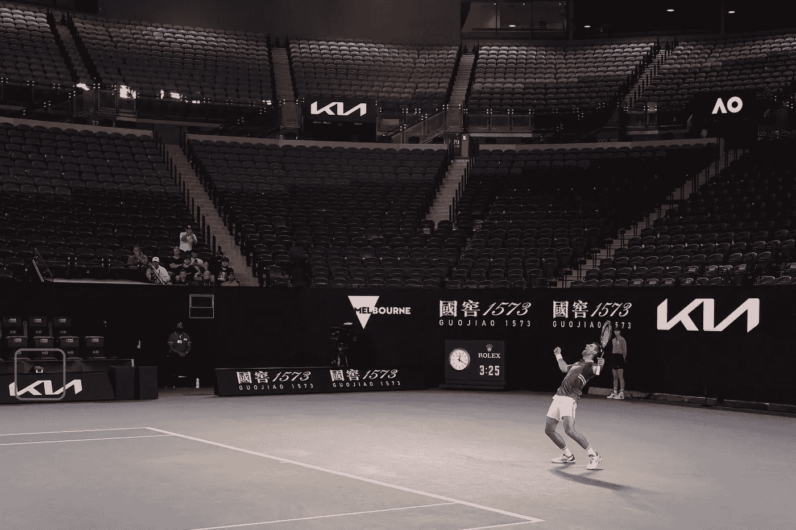

# 物联网取代澳大利亚网球公开赛的场内裁判员

> 原文：<https://medium.com/analytics-vidhya/iot-replaces-on-court-line-umpires-in-australia-open-tennis-bf6c84f82c12?source=collection_archive---------10----------------------->

# 在 2021 年澳大利亚网球公开赛上，不再需要场上法官，传感器和人工智能实时完成这项工作。

过去，在一场比赛中，球员有机会在有限的次数内挑战边线裁判的决定，监控边线的摄像机会回放并显示球是在内还是在外。但在许多情况下，法官会做出错误的决定，玩家会用尽挑战的尝试。

研究和创新始于 20 世纪 70 年代初的电子线路裁判，但现在随着传感器、相机和人工智能(AI)算法的进步，这成为了现实。

丹·埃文斯对卡伦·卡恰诺夫戏剧性的比赛，可怕的场内线判决

由于新冠肺炎和利用物联网(IoT)和传感器的改进，澳网决定用通过覆盖球场的远程跟踪摄像机传送的实时电子线路呼叫来取代场内的线路裁判。这些摄像头连接到一个智能人工智能系统，该系统会实时自动发送录音电话。

“如果球员要求他们想看一个没有自动动画的结束点镜头，那么如果主裁判认为该要求是合理的，比赛可以停止，并且主裁判应该宣布重赛。在大屏幕上显示该镜头之前，游戏不应继续。”澳网赛事总监克雷格·蒂利说。

红色框中显示的是行摄像机。图片来源 AO 页面。

# 球跟踪技术

球跟踪技术并不新鲜，它已经在网球比赛中用于当球员对裁判员的判罚有争议时，也在足球比赛(救援)中用于进球或不进球的判定。在球跟踪中，使用高质量的摄像机来跟踪球。

**Hawk-Eye** 是一种计算机视觉系统，用于网球和足球(Succor)等多种运动，以视觉方式跟踪球场，并以移动图像的形式显示其统计上最可能的路径。屏幕上显示的跟踪结果被称为**拍摄点**。

玉林大学的一项研究表明，33%的网球运动员鹰眼挑战赛是成功的。不可否认，人类的视觉判断是有限的，原因很多，包括:天气、角度、障碍物、速度、距离、高度、光影、视差、深度和颜色。这些因素的影响将直接影响到裁判员判罚的准确性。

# 鹰-现场

鹰眼球呼叫系统在过去的 14 年里一直用于线判断挑战，新的 Hawk-Live 几乎没有增加什么。

Hawk-Live 系统基于三角测量原理，利用放置在网球场周围战略位置和角度的 12 个跟踪和 6 英尺故障高速摄像机提供的视觉图像和计时数据。该系统使用预定义的嵌入式模型来模拟球场，并包括关于网球规则的数据，这允许通过高速摄像机和球跟踪器系统来快速处理视频馈送。

在从摄像机发送的每一帧中，系统识别对应于球的图像的像素组。然后，通过比较球在同一时刻在至少两个物理上分离的摄像机上的位置，为每一帧计算球的 3D 位置。一连串的画面构成了球行进路线的记录。

然后，该系统生成球路线和网球场线的图形图像，允许将信息提供给充当线裁判的裁判模型系统。

**Hawk-Live 使用公共广播系统** ( **PA 系统**)，这是一个由麦克风、扩音器、扬声器及相关设备组成的电子系统。公共广播系统用于播放裁判的录音，以实时判断球或脚的失误。

此外，经过训练的人工智能系统，一组审查官员设置在一个房间内，以监测系统和故障的情况下，他们干预。

预计澳大利亚公开赛裁判系统的模式将用于未来的网球 ATP 和 WTA 巡回赛。该系统还不能用于红土球场，但已经在硬地和草地球场上测试成功。