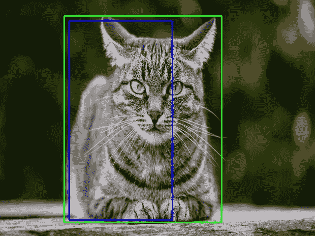

# 并集交集

> 原文：<https://medium.com/analytics-vidhya/iou-intersection-over-union-705a39e7acef?source=collection_archive---------0----------------------->

**借据是什么，用在什么地方？**

*   **IOU** (交集超过并集)是一个用来描述两个盒子重叠程度的术语。重叠区域越大，IOU 就越大。
*   IOU 主要用于与对象检测相关的应用中，在这些应用中，我们训练一个模型来输出一个完全适合对象的方框。例如在下图中，我们有一个绿色的盒子和一个蓝色的盒子。绿框代表正确的框，蓝框代表我们模型的预测。该模型的目的是不断改进其预测，直到蓝框和绿框完全重叠，即两个框之间的 IOU 等于 1。

图 13:对象检测任务的描述

*   IOU 也用于非最大抑制，用于根据哪个框具有更高的可信度来消除围绕同一对象的多个框。我将在下一篇文章中详细讨论非最大抑制。

**计算欠条:**

假设盒子 1 由[x1，y1，x2，y2]表示，盒子 2 由[x3，y3，x4，y4]表示。(我们稍后将使用这个约定来计算面积。)

图 1:两个盒子的交集

图 IOU 计算公式的图示

1.  **计算方框相交的面积**

图 3:盒子可以以许多不同的方式相交，甚至完全相互重叠

*   让我们将相交矩形的坐标表示为
    [x_inter1，y_inter1，x_inter2，y_inter2 ]，以表示交叉点的左上和右下坐标。

图 4:命名需要计算的坐标

*   让我们从定义参考坐标系开始。我们使用计算机图形惯例，X 轴向右移动，Y 轴向下移动。

图 5:参考坐标轴

*   为了计算交叉点的左上角，我们比较每个方框的左上角。从上面的例子中我们可以看出，可以通过查看哪个盒子的左上角更靠右来找到 **x_inter1** 。类似地 **y_inter1** 可以通过查看哪个框的左上角比另一个低来找到。数学上，它们可以计算为:

图 6:计算交叉点的左上角

*   为了计算交叉点的右下角，我们比较每个方框的右下角。 **x_inter2** 可以通过查看哪个方框的右下角更靠左来找到。类似地 **y_inter2** 可以通过查看哪个盒子的右下角比另一个盒子高来找到。数学上，它们可以计算为:

图 7:计算交叉点的底部右角

*   例如，图 4 中的框完全重叠，或者对于特定的坐标具有相同的值。在这种情况下，将一个值与其自身进行比较的最小值或最大值运算就是该值本身。

图 8:比较具有相同坐标值的方框的例子

*   现在我们有了交点的坐标，交点的面积就是所形成的矩形的面积。(在实践中，我们将取宽度和高度的模数，以确保即使盒子的顺序改变，宽度和高度仍然是正的；也就是说，如果 x_inter1>x_inter2，我们仍然会得到宽度的正值)

图 8:计算交叉点的面积

2.**计算盒子并集的面积**

*   如图 2 所示，两个框的结合是两个框覆盖的总面积。
*   为了计算总面积，我们首先计算各个盒子的面积。

图 9:计算两个盒子的面积

*   如果我们观察两个框所覆盖的总面积，我们会发现两个框都覆盖了相交的部分，即相交的面积同时包含在 **area_box1** 和 **area_box2 中。**

图 10:描绘了两个框中覆盖的相交区域。

*   由于我们只想计算一次公共相交面积，所以我们可以从两个盒子的总面积中减去我们计算的相交面积。

图 11:盒子联合的区域

3.**计算欠条**

图 12:计算 IOU 的公式

**借据可以有哪些取值范围？**

*   两个盒子的 IOU 可以有 0 到 1 之间的任何值。
*   如果有两个盒子不相交，它们相交的面积将是 0，因此 IOU 也将是 0。
*   如果有两个盒子完全重叠，那么交集的面积将等于并集的面积，因此 IOU 将为 1。

**用 python 编写 IOU 函数:**

*   对于上面显示的同一幅图像，让我们用 python 编写一个函数来计算绿色和蓝色方框的 IOU。

图 14:python 中实现 IOU 的函数

*   函数 IOU 接受两个框，即框 1 和框 2 作为输入。每个框中的数据是一个包含[x1，y1，x2，y2]的列表，它是左上角和右下角的坐标。
*   如前所述，我们先求出交集的面积，然后求出并集的面积。
*   abs 函数是 python 中的内置函数，用于计算模数。这确保我们永远不会以负的宽度或高度结束。
*   返回的 IOU 是 float 类型的值，介于 0 和 1 之间。
*   我写了一个代码，可以让我们看到在借据上改变边框的效果。完整代码的链接是[这里是](https://github.com/vineeth2309/IOU)