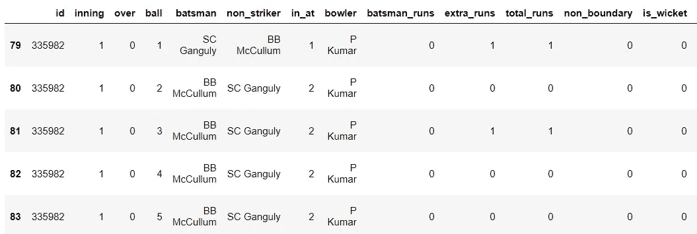
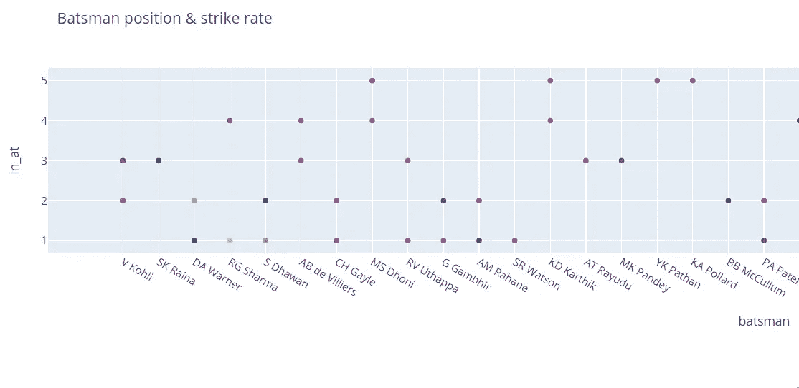

# IPL 分析第 2 部分:Dream-11 的击球手分析

> 原文：<https://medium.com/analytics-vidhya/ipl-analysis-part-2-batsmen-analysis-for-dream-11-5a6e05c4674d?source=collection_archive---------7----------------------->


我们从开始用 IPL 分析 [**第一部分**](/analytics-vidhya/ipl-analysis-using-pandas-read-this-if-you-are-planning-to-make-a-team-in-dream11-f23754188e22) **。现在我们可以从那里开始，继续深入研究击球手的数据。**

虽然我们可以使用相同的代码分析所有的击球手，但我将选择 **V. Kohli** 作为击球手进行分析。

## 我们将在这一个中涉及的问题

1.  维拉·科勒是如何逃出来的？
2.  让他出局次数最多的投球手。
3.  维拉·科勒跑出最高成绩的比赛。
4.  Virat 出来的球
5.  通过边界得分
6.  V Kohli 的总得分
7.  六对投球手
8.  六在回合中击中
9.  消除器中的 Virat Kohli
10.  第一棒和第二棒击球得分
11.  V Kohli 对 MI bowlers
12.  不同位置的 V Kohli
13.  V·科利和其他击球手面对的总球数
14.  不同位置不同球员的命中率

## 1.V·科利是如何逃脱的

```
import pyforest
ball_data= pd.read_csv("ballbyball.csv")
virat= ball_data[ball_data["batsman"]== "V Kohli"]
virat.head()
```


```
virat["dismissal_kind"].value_counts()
```


```
virat["dismissal_kind"].value_counts().plot.pie(autopct='%1.1f%%',shadow=False,rotatelabels=False)
plt.title("Dismissal Type",fontweight="bold",fontsize=15)
plt.show()
```


## 2.让他出局次数最多的投球手

```
dismissed= virat[virat["player_dismissed"]=="V Kohli"]
dismissed.head()
bowler_dismissed=dismissed['bowler'].value_counts()
bowler_dismissed.head(20)
```


有趣的是看看名单上有多少快速投球手。桑迪普·夏尔马名列榜首。

## 3.维拉·科利出界次数最多的比赛

```
dismissed_over= virat[virat["player_dismissed"]=="V Kohli"]over_dismissed=dismissed_over['over'].value_counts()
over_dismissed.head(20)
```


## 4.Virat 出来的球

```
virat_out_ball=virat[virat["is_wicket"]==1]
virat_out_ball["ball"].value_counts()
```


Virat 在第一个和最后一个球上出局的机会比其他球稍小。

## 5.Virat Kohli 通过边界得分


Virat 打出了 504 个 4 和 202 个 6。

## 6.V. Kohli 的总得分

```
def count(virat, runs):
    return len(virat[virat["batsman_runs"]==runs])*runs

print("Runs scored from 1's :",count(virat,1))
print("Runs scored from 2's :",count(virat,2))
print("Runs scored from 3's :",count(virat,3))
print("Runs scored from 4's :",count(virat,4))
print("Runs scored from 6's :",count(virat,6))
```


```
slices=[1919,692,39,2016,1212]
labels=[1,2,3,4,6]
explode=[0.08,0,0,0,0]
plt.pie(slices,labels=labels,autopct='%1.1f%%',explode=explode,shadow=True)
plt.title("Virat Kohli total runs contribution",fontweight="bold",fontsize=15)
plt.tight_layout()
plt.show()
```


## 7.六对投球手

```
virat_six=virat[virat["batsman_runs"]==6]
virat_six=virat_six['bowler'].value_counts()
virat_six.head(25)
```


有趣的是看看名单上有多少纺纱工。

## 8.六在回合中击中

```
virat_six=virat[virat["batsman_runs"]==6]
virat_six_over=virat_six['over'].value_counts()
virat_six_over.head(25)
```


## 9.Virat Kohli 在淘汰赛中得分

```
eliminator=virat_kohli.groupby("eliminator").sum()
eliminator[["batsman_runs","extra_runs"]]
```


维拉特在淘汰赛中仅得了 114 分。

## 10.V. Kohli 先击球后击球得分

```
virat_kohli_score=virat_kohli.groupby("toss_decision").sum()
virat_kohli_score["batsman_runs"]
```


## 11.对我投球手的精彩表演

维拉特的第一场比赛是对阵米。让我们来看看他和米的比赛

**维拉特 VS 贾斯普里特·布姆拉**

```
virat_wicket=virat[virat["bowler"]=="JJ Bumrah"]
virat_wicket["dismissal_kind"].value_counts()
```


```
virat_wicket["total_runs"value_counts()
```


维拉已经和布姆拉打了 27 点。

**维拉特 VS 博尔特**

```
virat_wicket=virat[virat["bowler"]=="TA Boult"]
virat_wicket["batsman_runs"].value_counts()
```


博尔特从未解雇过科利，而科利对博尔特打了 14 个点球。

## 12.不同位置的 Virat Kohli

```
import plotly.express as px
matches = pd.read_csv('matches.csv')df=ball_data[['id','inning','over','ball','batsman_runs']].sort_values(by=['id','inning','over','ball'])bat_man={}; y=1
for i in df.id.unique():
    for j in range(1,3):
        df=ball_data.query("id==[@i](http://twitter.com/i) and inning==[@j](http://twitter.com/j)").sort_values(by=['inning','over'])
        for x in range(len(df.index)):
            if (i,j,df.batsman.values[x]) not in bat_man:
                bat_man.update({(i,j,df.batsman.values[x]):y})
                y+=1
        y=1ball_data['con'] = tuple(zip(ball_data.id.values, ball_data.inning.values, ball_data.batsman.values))
ball_data['in_at'] = ball_data.con.map(bat_man)
ball_data=ball_data.drop('con',axis=1)df=ball_data[np.hstack((ball_data.columns.values[:6], ball_data.columns.values[-1], ball_data.columns.values[6:-1]))]
df.query("id==335982").sort_values(by=['inning','over','ball']).head()
```



```
df=ball_data.groupby('batsman')['batsman_runs'].sum().sort_values(ascending=False).head(50)
blist=df.index
df=ball_data.query("batsman in [@blist](http://twitter.com/blist)").groupby(['batsman','in_at'])['batsman_runs'].sum().reset_index()
df[df["batsman"]=="V Kohli"]
```


```
batting_position = ex.scatter(df, x='batsman', y="in_at", color = 'batsman_runs', width=1800, height=400, title='Batsman position & score')batting_position.show()
```


## 13.维拉特和其他球员在不同位置面对的球总数

```
batsman_runs=ball_data.groupby('batsman')['batsman_runs'].sum().sort_values(ascending=False).head(50)
batsman_runs.head()
```


```
bats_names=batsman_runs.index

df_balls=ball_data.query("batsman in [@bats_names](http://twitter.com/bats_names)").groupby(['batsman','in_at'])['id'].count().sort_values(ascending=False).head(50).reset_index()
```


## 14.不同击球手在不同位置的击球率

```
bat=pd.merge(batsman_runs, df_balls, left_on='batsman', right_on='batsman')
bat['strike_rate']=(100*bat.batsman_runs/bat.id)fig = px.scatter(bat, x='batsman', y="in_at", color = 'strike_rate', width=1800, height=400, title='Batsman position & strike rate')
fig.show()
```



## 结论

Virat Kohli 大部分时间都在接球投球。桑迪普·夏尔马得到他的次数最多。

> 这清楚地表明 V Kohli 对中速挥杆保龄球有一些探索。

Virat Kohli 在缓慢起步后从第 13 名开始加速。除了第一球和第六球，他在所有的球上都得分相等。Virat Kohli 通过跑动得分比边界得分多，这再次暗示了一个谨慎的首发和一个勤奋的球员。

> 他开始是一个谨慎的球员，在底线很努力。

他的大部分六分都碰到了旋转球，这要么是因为他喜欢与旋转球对抗的球员，要么是因为他在中途加速。Virat Kohli 显然是一个更好的击球手，当他追逐时，他知道如何调整他的局。他开局时的命中率最高。

> Virat Kohli 在开场时将是最佳球员，同时追逐一个比分，对面的球队有很多快速步行者和旋转者。