# 使用 Pandas 的 IPL 分析第 1 部分:建立一个好的梦之队的指南

> 原文：<https://medium.com/analytics-vidhya/ipl-analysis-using-pandas-read-this-if-you-are-planning-to-make-a-team-in-dream11-f23754188e22?source=collection_archive---------4----------------------->


在印度，四月是一个喜庆的日子。IPL 将在不到一周的时间内开始，作为一个狂热的 IPL 追随者和 Dream11 玩家，我想分析一些互联网上可用的 IPL 历史数据。

这将是一个介绍性的分析，我们将研究基本的 IPL 统计。从这里开始，在接下来的部分中，我们将找到最适合 Dream11 团队的人，并赢得大量资金。


**我们将在这部分回答一些问题:**

1.  谁面对 IPL 的第一个球和最后一个球
2.  IPL 的最高得分者
3.  IPL 的最低得分者
4.  IPL 迄今为止的比赛总数
5.  IPL 使用的所有场馆
6.  所有参赛的队伍
7.  每个赛季的比赛总数
8.  每个赛季得分
9.  IPL 比赛中的顶级裁判
10.  IPL 中最高投掷冠军队
11.  抛硬币后做出了什么决定
12.  赢得掷硬币后的掷硬币决定-明智的
13.  掷硬币获胜后的获胜号码
14.  第一击球队和第二击球队的获胜号码
15.  球队的幸运体育场

让我们从**[**Kaggle**](https://www.kaggle.com/patrickb1912/ipl-complete-dataset-20082020)**下载数据。**我们将得到一个包含 2 个文件的 zip 文件。一个文件将包含从 2008 年到 2020 年每场比赛的数据。**

**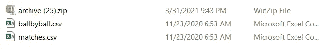**

# **逐球数据**

```
import pyforest
df= pd.read_csv("ballbyball.csv")
df.head()
```

**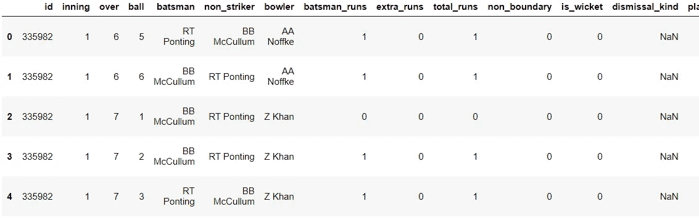**

## **1.IPL 中最后一个和第一个球**

**让我对数据框进行排序，并检查 IPL 中的第一个投球和最近结束的 IPL 赛季中的最后一个投球。**

```
df = df.sort_values(["id","inning", "over", "ball"], ascending=False)
```

**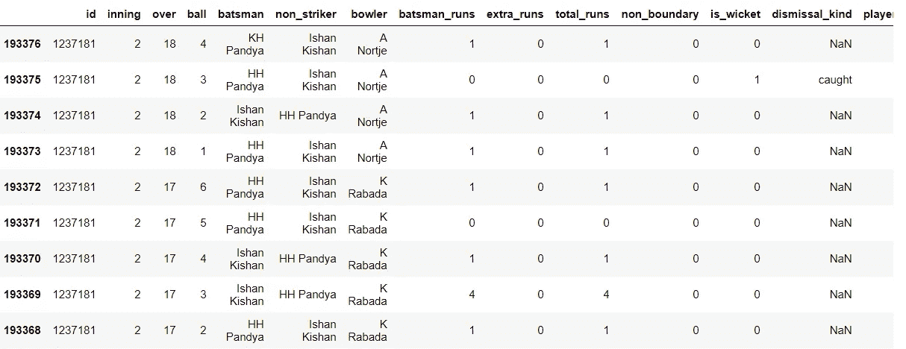**

```
df = df.sort_values(["id","inning", "over", "ball"], ascending=True)
```

**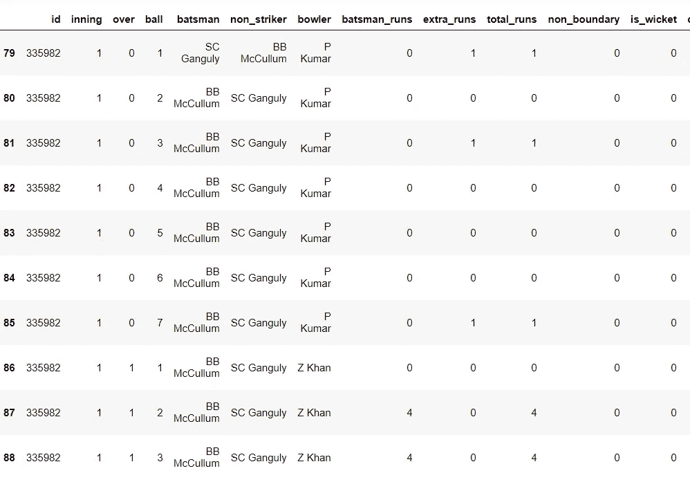**

**谁能忘记第一场比赛和第一次呢？BMAC 在第一场比赛中就取得了惊人的一百分，在锦标赛中引起了轰动。**

## **2.IPL 的最高得分者**

```
df2=df.groupby('batsman').sum()df3 = df2.sort_values(["batsman_runs"], ascending=False)
```

**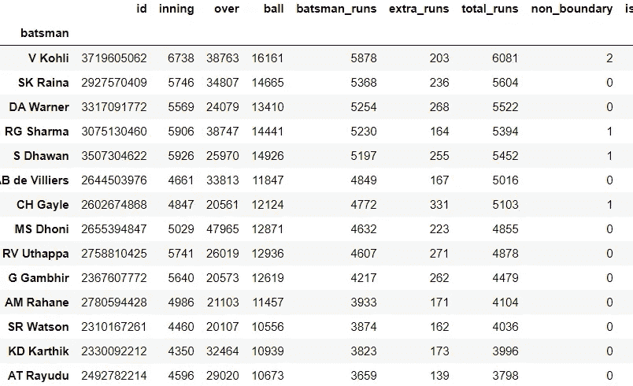**

> **动词 （verb 的缩写）Kohli 是这个时代无可争议的焦点人物，是 IPL 的顶级吸气剂**

## **3.IPL 中运行率最低的**

```
df2=df.groupby('batsman').sum()df3 = df2.sort_values(["batsman_runs"], ascending=True)
```

**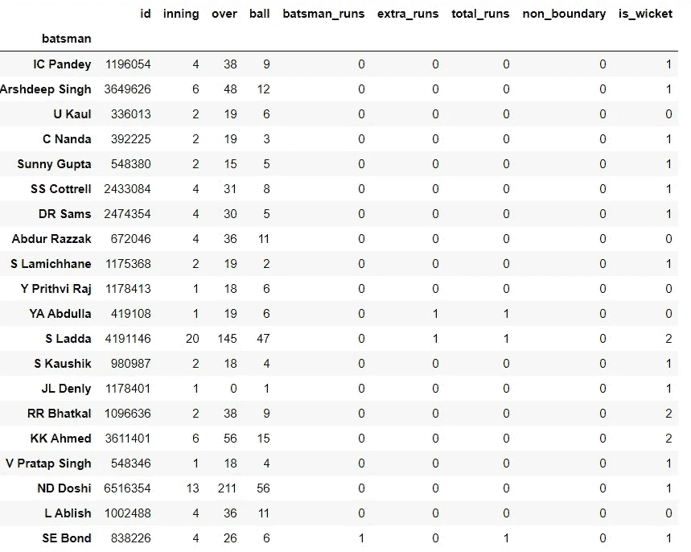**

# **匹配数据**

**让我们检查数据库中的所有列。我们可以相应地探索数据**

```
match_data=pd.read_csv("matches.csv")
match_data.columns
```

**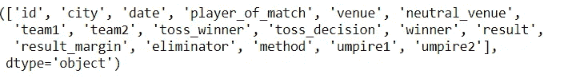**

## **4.5.6.IPL 中的比赛、场馆、球队总数**

```
print("Total Matches Played:", match_data.shape[0])
print("\n\nVenues for cricket matches are:", match_Data["city"].unique())
print("\n\n All teams that participated in all IPL conducted till 2020:", match_Data["team1"].unique())
```

**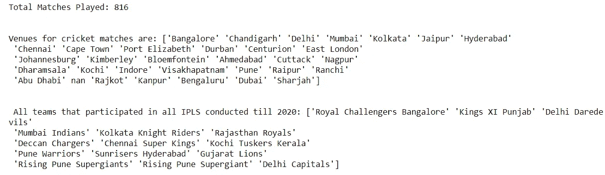**

## **7.每个赛季的比赛总数**

**我将在数据框中添加一个名为“季节”的新列。**

```
match_Data["Season"]=pd.DatetimeIndex(match_data["date"]).year
```

**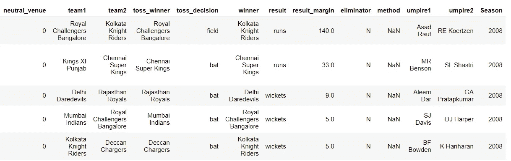**

```
total_match_per_season=match_Data.groupby(['Season'])['id'].count().reset_index().rename(columns={'id':'matches'}) 
```

**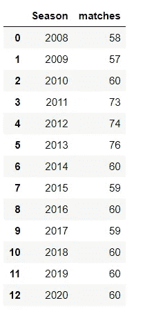**

**使用 SNS plot 的数据可视化。**

```
ax = plt.axes()
ax.set(facecolor = "white")
sns.set(rc={'figure.figsize':(15,10)})
sns.countplot(match_Data['Season'],saturation=1)
plt.xticks(rotation=90,fontsize=10)
plt.yticks(fontsize=10)
plt.xlabel('Season',fontsize=15)
plt.ylabel('Count',fontsize=15)
plt.title('Number of matches',fontsize=15,fontweight="bold")
```

**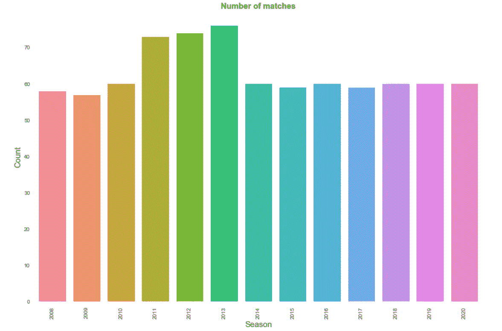**

## **8.每个赛季得分**

**使用左连接合并两个数据集，并找出每个赛季的总得分。**

```
ball_details=pd.read_csv("ballbyball.csv")
match_detail=match_Data[['id', 'Season']].merge(ball_details, left_on='id', right_on='id', how='left')
```

**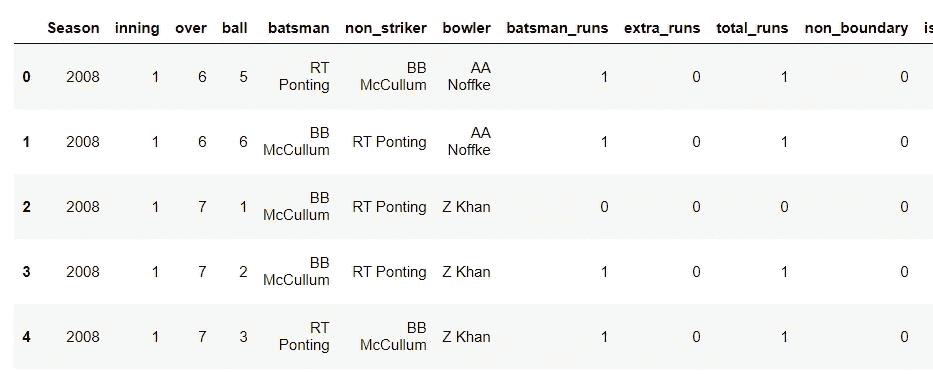**

```
match_detail.groupby(['Season'])['total_runs'].sum().reset_index()
```

****

**有趣的是，尽管上个赛季是在阿联酋举行的，但在过去的两届 IPL 比赛中，比分是多么接近。**

**IPL 2009 得分最低，是在南非举行的。**

## **9.IPL 中的裁判也算**

**我将连接裁判的两列，然后计算每个裁判的价值。我们会发现 IPL 中每个裁判执法的比赛数量。**

```
ump=pd.concat([match_data['umpire1'],match_data['umpire2']])
ump=ump.value_counts()ump.head(20)
```

**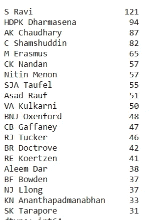**

## **10.投掷 IPL 的获胜者**

**我们知道投掷是板球运动中最重要的变量之一。我们将尝试理解投掷对胜率的影响。**

```
match_data["toss_winner"].value_counts()
```

**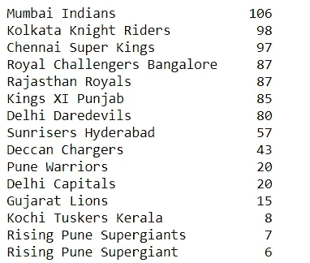**

## **11.掷硬币获胜后的决定**

```
toss_decision = match_data.toss_decision.value_counts()
toss_decision.head()
```

**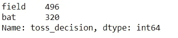**

```
labels = (np.array(toss_decision.index))
sizes = (np.array((toss_decsion / toss_decision.sum())*100))
colors = ['orange', 'lightgreen']
plt.pie(sizes, labels=labels, colors=colors,
        autopct='**%1.1f%%**', shadow=True, startangle=90)
plt.title("Toss decision percentage",fontweight="bold",fontsize=15)
plt.show()
```

**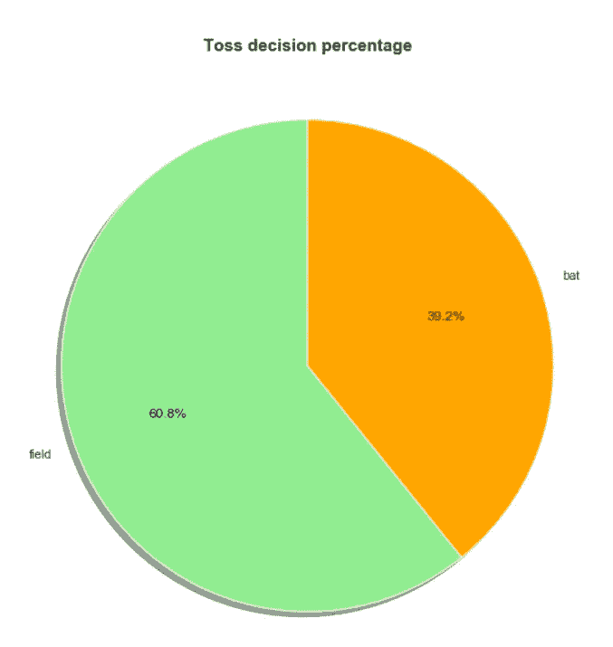**

## **12.赢得掷硬币后的掷硬币决定，依季节而定**

```
ax = plt.axes()
ax.set(facecolor = "white")

sns.countplot(x='Season', hue='toss_decision', data=match_Data,palette="gnuplot2",saturation=1)
plt.xticks(rotation=90,fontsize=10)
plt.yticks(fontsize=10)
plt.xlabel('\n Season',fontsize=15)
plt.ylabel('Count',fontsize=15)
plt.title('Toss decision in different seasons',fontsize=15,fontweight="bold")
plt.show()
```

**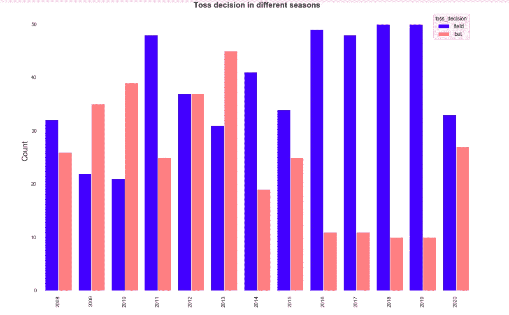**

**2016，17，18，19 压倒性数量的队伍在掷硬币获胜后走向赛场。2020 年，由于 IPL 在阿联酋举行，这一趋势略有改变。我先把*场除了*走势再回来。**

**我会新建一个专栏，展示 coss 折腾对球队输赢的影响。**

## **13.掷硬币获胜后的获胜号码**

```
match_data['toss_win_game_win'] = np.where((match_data.toss_winner == match_data.winner),'Yes','No')match_data['toss_win_game_win'].value_counts()
```

****

## **14.根据队击球第一和队击球第二赢得号码**

```
match_data['result'].value_counts()
```

**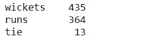**

> **在 IPL 13 比赛中，435 次团队击球第二次获胜，而 364 次团队击球第一次获胜以平局告终。**

## **15.球队的幸运体育场**

```
def lucky(match_data,team_name):
    return match_data[match_data['winner']==team_name]['venue'].value_counts().nlargest(3)ax = plt.axes()
ax.set(facecolor = "white")
sns.set(palette="Blues_r",style='darkgrid')
lucky(match_data,'Mumbai Indians').plot(kind='bar')
```

**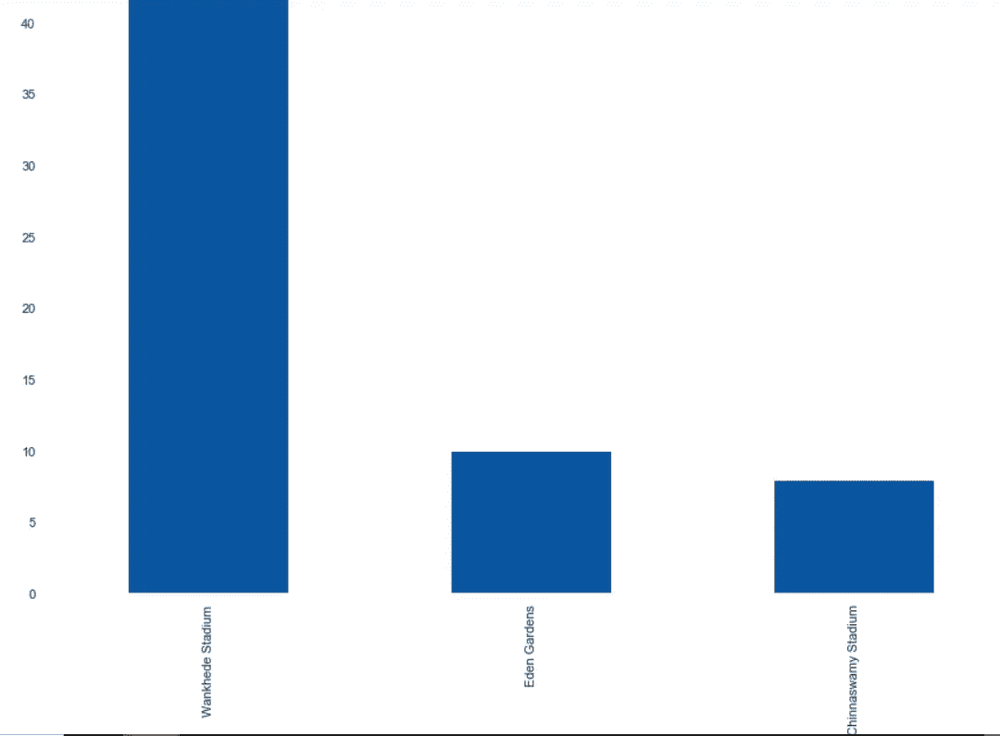**

***万科德球场、伊甸园球场、奇纳斯瓦米球场*依次是米帕尔坦最幸运的球场。**

## **结论:**

**这是 IPL 系列的第 1 部分，我们将更深入地研究详细的分析和其他有助于 IPL 团队成功的重要因素。你可以在 Dream11 中阅读/学习和明智地选择你的球员/团队，并赢得金钱。**