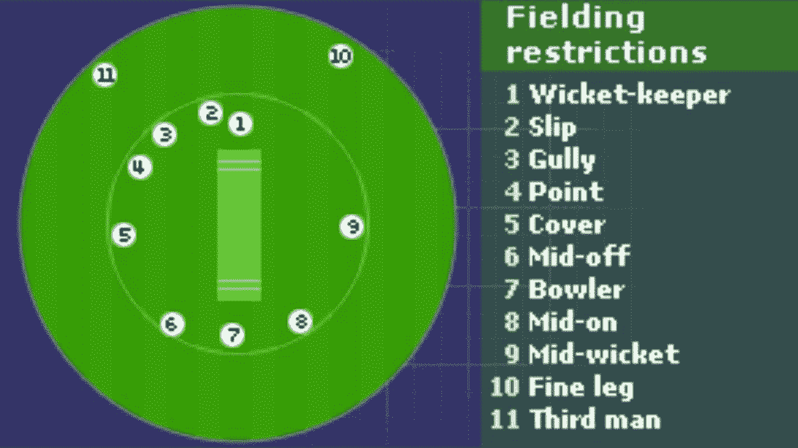

# 使用 AWS Lambda 预测 IPL Powerplay 分数

> 原文：<https://medium.com/analytics-vidhya/ipl-powerplay-score-prediction-using-aws-lambda-73a580b63ba2?source=collection_archive---------17----------------------->


我们首先对 IPL 中的 powerplay 有一个基本的了解，然后快速浏览“Powerplay”分数预测演练& Hyper Parameters Optimization →在此基础上 20 遍预测分数。

你想获取密码？[点击这里](https://github.com/sumankanukollu/cricket_scorePredict_in_first6_overs/blob/main/IPL_Powerplay_Score_Prediction_v2.ipynb)

你想预测分数吗？[点击这里](https://suman-projects.s3.ap-south-1.amazonaws.com/myWebPage/index.html)

**免责声明:**此处的分析和预测仅供学习之用，不得用于任何非法活动，如赌博。

# 项目演示:

预测 6 比 20 得分的演示视频

# 简介:

COVID 封锁时间到了。每个人都担心越来越多的 COVID 病例，在家工作(WFH)的环境。没有办法出去，没有聚会，没有郊游，没有度假计划，没有聚会……

政府宣布封锁:1.0，2.0，3.0，4.0 …..

当时每个板球迷都有一个问题。**“做新政府。lockdown 4.0 中的规则为 IPL 2020 铺路？?"**终于 IPL 2020 发生了。即使是疫情的情况也不能让 IPL 的强大力量脱轨。

IPL 2020 的收入为 400 亿卢比，

*   成本降低 35%,并且
*   收视率增加了 25%。

作为一名板球迷，我观看了所有的比赛，在那段时间里，我观察到**“力量发挥了主要作用”**，这在球队比分预测中非常重要。

# IPL 里什么 Powerplay？

IPL 中的“Powerplay”在 1 st6-overs 中有 fielding 限制，即..

*   只有两名外野手可以留在内圈之外



权力游戏中的防守限制

*   在 powerplay 之后，最多 5 名外野手可以留在内圈之外，4 名外野手必须留在内圈之内。


权力游戏后的防守限制

# 效果和重要性:

Powerplay 使击球相对容易。对于击球手来说，这也是一个陷阱，因为这将使他们冒险并在 1 比 6 的比赛中失去检票口。因此，这些比赛被认为是任何球队胜利的支柱。 **75%的胜算**取决于 Powerplay 的分数。所以，每个队对前三名击球手的期望是**“开局大”**

# 该博客的步骤如下图所示:


这篇博文中解释的步骤

# 1.加载数据集:

实际上，这一步是数据连接层，对于这个非常简单的原型，我们将保持它简单易用，就像从 [cricsheet](https://cricsheet.org/downloads/ipl_male_csv.zip) 加载数据集一样

下载数据集

# 2.数据帧:

这里我们将使用 pandas 将数据集加载到 pandas 对象中。可以通过下面的代码来完成:

其中包含 200664 行，22 列

# 3.探索性数据分析(EDA):

在分析数据之前，**“数据处理”**被认为是创建学习模型中最重要的步骤！

我们可以很容易地获得各种数据集形式的大量数据，但要使这些数据适合从中获得各种见解，需要大量的观察、修改、操作和许多其他步骤。


当我们为我们的项目新下载一个数据集时，它包含的数据是随机的(大部分时间)，即没有按照我们需要的方式排列或填充。有时，它可能有`NULL Values, Unnecessary Features, Datatypes not in a proper format. etc...`

因此，为了解决所有这些缺点，我们要经历一个过程，这个过程通常被称为“数据预处理”。

回到我们的 IPL 数据集，我们必须做如下数据处理，以训练模型。

这里，这个数据集的头是不言自明的。

## 数据处理步骤:

*   数据集中的第一个`Identify the "Null" values`，希望这个数据集中的**必填字段**没有空值。

所有必填字段都不为空

*   **选择 1st6-Overs 比赛详情&下降休息:**

> -在这里，由于我们预测的是“powerplay”得分，我们可以忽略其余数据，除了第一个 6-overs 和
> 
> -放弃所有超过 2 局的比赛，因为没有第 3 局和第 4 局的比赛

*   **识别&掉局比赛< 6 局:
    *** 在我们的数据中，有几场比赛没有进行，并被宣布为“没有结果”，可能是因为下雨…一些技术问题。
    ***** 任一比赛结果都是用 DCB 方法申报的，我们无法预测比分。

这可能会导致异常值。因为如果球队只打了 3 局，那么得分最小值会影响到接下来的“正常化”过程。所以最好在我们的预测中去掉这些数据。

*   在这里，我们的预测不需要“季节”和“开始日期”列。`So we can drop the columns 'season' and 'start_date' from the dataset.`

*   删除不存在的团队:

*   用新团队名称替换旧团队名称:

*   使用唯一的名称更正场地列。在这个数据集中，同一个体育场以多种方式呈现。因此，确定这些并重新命名。

*   创建一列`"Total_score" : which reflects the runs through bat and extra runs`通过宽的，轮空，无球，腿轮空...等等。

*   处理`['wides', 'noballs', 'byes', 'legbyes', 'penalty', 'wicket_type','other_wicket_type', 'other_player_dismissed']`时可以忽略考虑数据框中的列

## 数据帧看起来像:

然后，我们的数据帧如下所示，有 54525 行，13 列(最初是 200664 行，22 列)

# 4.编码:

到目前为止，作为第一步，

*   我们用所有“空”值清理了数据集
*   过滤列/行数据(不用于预测)和
*   添加了带有值的必需列(如 total_score ),以使数据集更清晰。

正如您在上面看到的，我们清理的数据集有 13 列多种 Dtype，如 int64 和 float64 和 object。

因此，接下来我要做的是尝试将所有这些多种数据类型转换为单一数据类型，以训练模型。

```
1   venue                54525 non-null  object4   batting_team         54525 non-null  object5   bowling_team         54525 non-null  object6   batsmen              54525 non-null  object7   bowlers              54525 non-null  object
```

# 4.1.对“击球手”和“投球手”列值进行编码:

*   在这里我们可以看到，很少有球员可以像保龄球一样击球。意味着相同的球员将被列为击球手和保龄球手。
*   因此，为了正确地进行预测，我创建了一个包含所有玩家的数据帧，将其命名为“players_df”，我用它来对玩家进行编码，以识别一些值。
*   为了进一步推理，我用所有这些编码值创建了一个字典

# 4.2.对“场地”、“击球队”和“保龄球队”列值进行编码:

# 4.3.将编码值保存到 json 文件中:

# 4.4.格式化数据集:

在这一步中，我尝试根据比赛 ID 和比赛局来排列所有行(因为比赛 ID 是识别特定比赛和比赛局的唯一方式，以识别谁先击球)。

基于这两个细节，

*   获取所有击球手和投球手的详细资料，他们在第一个 6 回合中击球和投球
*   计算总分(击球得分+额外得分)
*   在前 6 回合中有多少球员被罚出场

```
print('### Shape of Dataframe before format_data : {}'.format(df_parsed.shape))Runs_off_Bat_6_overs = df_parsed.groupby(['match_id', 'venue', 'innings', 'batting_team', 'bowling_team'])['runs_off_bat'].sum()Extras_6_overs = df_parsed.groupby(['match_id', 'venue', 'innings', 'batting_team', 'bowling_team'])['extras'].sum()TotalScore_6_overs = df_parsed.groupby(['match_id', 'venue', 'innings', 'batting_team', 'bowling_team'])['Total_score'].sum()Total_WktsDown = df_parsed.groupby(['match_id', 'venue', 'innings', 'batting_team', 'bowling_team'])['player_dismissed'].count()bat_df = df_parsed.groupby(['match_id', 'venue', 'innings','batting_team', 'bowling_team'])['batsmen'].apply(list)bow_df = df_parsed.groupby(['match_id', 'venue', 'innings','batting_team', 'bowling_team'])['bowlers'].apply(list)df_parsed = pd.DataFrame(pd.concat([bat_df, bow_df, Runs_off_Bat_6_overs, Extras_6_overs, TotalScore_6_overs, Total_WktsDown],axis=1)).reset_index()
```

# 4.5.将击球手和投球手的详细资料排成单独的一列:

在上面格式化的数据集中，我们得到了击球手和投球手的详细列表，他们在 6 回合中击球和投球。

现在我们要把这些击球手排成单独的一列，

在这里，我只选择了 10 个击球手(因为我们只有 10 个三柱门)，和 6 个投球手(可以在 6 回合中投球)，因为在 6 回合中这是唯一可能的。

# 4.6.创建击球手和投球手虚拟数据框:

为了保持顺序一致，首先我将创建一个虚拟数据帧

*   列名为[bat1，bat2，…的 10 人击球手..bat9，bat10]
*   带列名的 6 人保龄球[保龄球 1、保龄球 2、保龄球 3、保龄球 4、保龄球 5、保龄球 6]

# 4.7.以相同的顺序将 batsmen 元素列表更新到每一列中:

意味着，在每个 matchID 的元素列表中的数据和局以相同的顺序进入相应的单个击球手列。

因此，我们的数据框终于准备好了击球手和投球手的详细信息。所以我们可以删除一些不重要的列。

# 4.8.将多个数据类型编码成单个数据类型:

现在该使用标签编码值(在前面的步骤中已经完成)对数据帧进行编码了。

# 4.9.在这一步结束时，我们的数据框看起来像这样:

编码数据帧

# 5.标准化:

在编码步骤中，所有数据都被转换成不同范围内的数值。

在这个标准化步骤中，借助于**“minmax scaler”**，我们用一个通用的数据标度表示数字列值，而不会丢失信息和扭曲值范围的差异。

在这一步结束时，数据帧看起来像:

标准化数据帧

# 6.分割训练和测试数据:

将数据集分成 70%用于训练，30%用于测试


1.  从 pandas 数据框架中识别输入与目标，并转换为 Torch 张量
2.  创建 torch 数据集
3.  现在将 torch_ds 分成 train_ds 和 test_ds 数据集(70%对 30%)
4.  为 train_ds 和 test_ds 创建数据加载器

# 7.型号选择:

这里我用的是线性回归模型。

基本线性回归模型

# 8.超参数优化:

我尝试了许多关于 LR、动量、NAG、批量大小、优化器和调度器的组合来找到全局最小值。

所有结果均可在[记录指标](https://github.com/sumankanukollu/cricket_scorePredict_in_first6_overs/blob/main/Recorded_Metrics.csv)获得

在所有测试中，以下确定的超参数给出了更好的结果:

# 9.评估:


培训与测试损失

从上图中，我们在第 36 个时期达到了全局最小值，训练损失= 0.0061，测试损失= 0.0117

# 10.评分:

让我们看看模型对测试数据的预测值:

基于这些可以说这个模型有 83.33%的准确率。仍然有改进的余地。任何人都可以从这个点开始[从这里获取代码](https://github.com/sumankanukollu/cricket_scorePredict_in_first6_overs/blob/main/IPL_Powerplay_Score_Prediction_v2.ipynb)

【http://github.com】最初发表于[](https://gist.github.com/ae2d72bdd43bbf3386addd29276f7fef)**。**