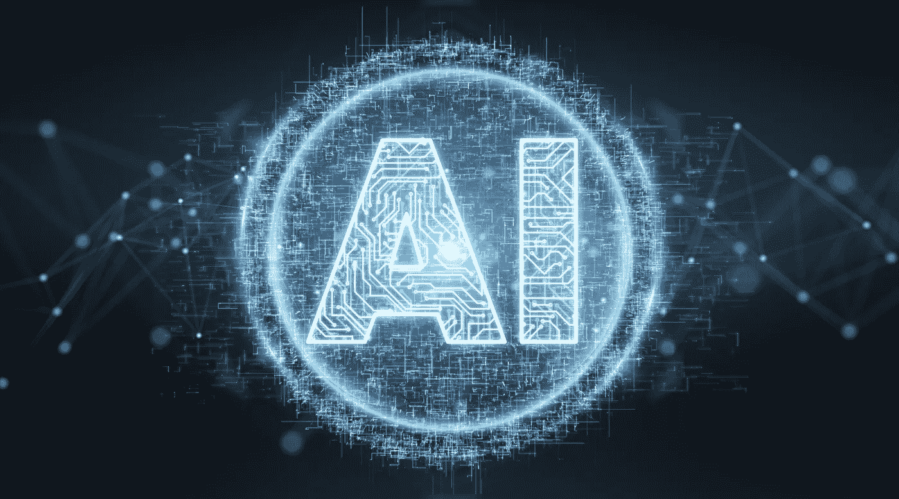

# 人工智能是真的吗？

> 原文：<https://medium.com/analytics-vidhya/is-artificial-intelligence-real-82a5f55e31d9?source=collection_archive---------20----------------------->

## 我们在限制它的潜力吗？

人工智能这个术语假定有一种有机的、天生的智能和一种合成的、人造的智能。它进一步假设自然的、真实的智能正在创造人工智能来为自然智能服务。这个定义假设了自然智能和人工智能之间的主从关系。

但是，一个拥有任何一种智能的物种怎么能确定他们理解和理解环境的能力不是由比他们更聪明的更高级的种族引入的呢？

就所有意图和目的而言，人脑可以与嵌入了各种机器学习和模式识别算法的计算机相比较。它不断尝试将输入的数据与它所学习的模式相匹配。这就是为什么年纪越大学习新技能越难的原因，因为大脑会抵制任何它无法识别的新模式。

> 即使人脑是进化的产物，那么进化也可以被认为是创造了人脑的智能。

这意味着，当开发智能系统时，人类正在使用他们自己作为产品的智能！

在这两种情况下，人类的智慧都不是终极智慧。人类正在利用他们所拥有的智能(无论是通过设计还是适应)来创造智能系统，为他们自己的目标服务。

> 把智能分成真实的和人工的是有缺陷的和自负的。

与其划分智力，不如理解它的本质和方面更有用。

## **预测智能**

在这本关于智力的书中，杰夫·霍金斯将**智力**定义为大脑通过类比过去预测未来的能力。

预测智能无处不在。我们的大脑不断预测下一个时刻，并准备我们的身体做出反应。我们的大脑能够预测扔向我们的球的位置和速度，这使我们能够在半空中抓住它。

当我们看到一个陌生人在黑暗中向我们走来时，我们的大脑会预测危险，并让我们的身体做好战斗或逃跑的准备。

网飞推荐系统也是一种预测算法，仅根据以前的评分计算观众的电影评分，而不考虑用户或电影的任何其他信息。

预测智能对于生存和生产力至关重要。但是，对于基于预测的系统来说，要生成预测，必须存在某种东西来进行预测。

网飞推荐系统的存在是因为有电影和看电影的人。人脑的存在是因为我们的身体抑制了一个充满生存危险和发展机会的生态系统。

预测系统提高了在时间和精力方面实现预定目标的效率。但是目标从何而来？

显然，网飞推荐系统正引导观众朝着找到她最可能喜欢的电影的目标前进。但是她为什么在乎看电影呢？

同样，一个有机体的大脑也在寻找任何对其生存的威胁。但是为什么生存很重要呢？

这两个问题表面上看起来似乎完全没有关联，但它们有很多共同点。这种共性将我们引向下一种也是最不为人所知的智力类型。

## **创造性智力**

一个被赋予创造性智能的系统正在创造经验，并利用这些经验来指导自身的进化和学习。

一个创造性的系统是一个对自己的本性和现实的本性好奇的自我意识系统。创造智能的目标是探索和学习。

预测智能帮助创造性智能探索它的环境。它通过记忆有机体生命中发生的事情，它产生的反应(一种感觉？)并利用这种记忆来预测下一个事件可能对有机体的生存产生什么影响。

在一个时间和能量有限的世界里，基于预测的系统有利于生存，使有机体更有可能实现其学习目标。

但是生存不是(一个物种或有机体的)最终目标，它仅仅是一种逻辑上的需要。类似地，推荐系统不是用户观看电影的先决条件。但这确实让她更有可能找到一部她会喜欢并从中学习的电影。

## 人工智能

> 人脑可能是预测的发电站，但人类是有创造力的生物。

从内心来说，我们是探险家，对发现新领域和克服挑战感到兴奋。

那么，为什么我们赋予计算机和软件的只是我们存在的一个方面——预测的能力。

人工智能机器可能不知道自己的智能，但它不必局限于猜测工作。

我想知道我们能否将我们的创造力、探索热情和知识引入到我们正在创建的系统中。然后，这些系统可以帮助我们更好地了解自己，加速我们的学习和进化，而不仅仅是预测。

总有一天，这些被人类智慧注入的人类智慧的创造物将会产生它们自己的智能系统，并将它们命名为人工智能。