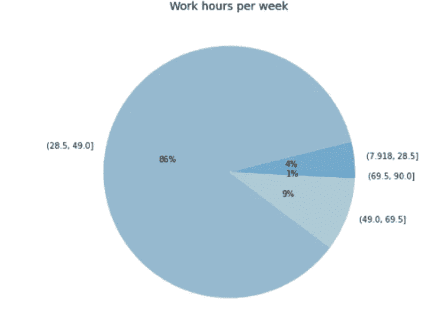

# 激情是影响开发人员工作满意度的唯一因素吗？

> 原文：<https://medium.com/analytics-vidhya/is-passion-the-only-factor-that-influences-job-satisfaction-for-developers-28927944841e?source=collection_archive---------22----------------------->

## 使用调查数据的数据驱动方法— Stackoverflow

摘自什尔达·古普塔的《不拉什》

> "如果你做你喜欢的事，你一生中一天也不会工作。"

很多人可能听过著名歌手马克·安东尼的评论。我也是那些相信你应该做让自己快乐的事情的人之一。然而，世界很大，有许多不同类型的人在不同的部门、文化和工作流中工作。有些人足够幸运，能够满足于他们每天所做的事情，而另一些人就没有这么幸运了。

让我们使用来自[栈溢出](https://stackoverflow.com)的【2020 年年度开发者调查的公开可用[数据](https://insights.stackoverflow.com/survey)来看看这些数据表明了什么。该调查是在 2020 年 2 月进行的，在新冠肺炎被世界卫生组织宣布为疫情之前，如网站所示。因此，疫情时期和疫情时期之后的结果略有不同。

该数据集包含来自大约 65，000 人的回答，他们代表了不同类别的人。让我们缩小范围，这样数据集的可变性就会降低。我选择，

*   职业为开发人员的全职人员
*   年龄在 15 至 60 岁之间
*   世卫组织回答了关于他们是否对自己的工作满意的调查问题。

这使我的数据库中总共有 28K 名受访者。所以让我们开始筛选信息。

大多数人对自己的工作感到满意，表现为非常满意和稍微满意，只有大约四分之一的人不满意，表现为稍微不满意和非常不满意。

作者图片:满意率

为了继续分析，我将上面的五组分为三类，每一类都指定了回答者是满意、不满意还是犹豫不决。

以下是在分析数据时发现的一些有趣的事实。

## 1.将编程作为业余爱好的人真的比不这样做的人有更高的工作满意度吗？

我们可以假设将编程作为一种爱好的人是那些对它有热情的人。因此，他或她对工作不满意的风险较低。另一方面，数据表明情况并非如此。

按作者排序的图片:按爱好者和工作满意度排序的受访者百分比

不管你是否把它作为一种爱好，满意和不满意的比率不会有很大的变化。也就是说，即使你对编程充满热情，并且幸运地找到了一份工作，也有其他方面会影响你的工作满意度。现在我们已经确定了这个事实，让我们进行下一步。

## 2.各国受访者满意和不满意的比例是否相似？

来自 150 个不同国家的人回答了这些问题。大多数参与者来自美国(24%)、印度(10%)、英国(7%)和德国(7%)。
为了减少分析误差，我将只查看至少有 30 名受访者的国家，这将包括 70 个国家。

作者图片:满意度和不满意度最高的 10 个国家

满意度从 70%到 75%不等，而不满意度在 30%到 50%之间。
在大多数国家，大多数受访者似乎都很满意，但 30-50%的范围值得调查。

## 3.你的年龄或性别对工作满意度的分布有影响吗？

千禧一代通常被定型为跳槽的一代，很容易感到不满。因此，年龄可能在其中起了作用。此外，男性和女性之间存在着根本的差异，这可能会导致一种区别。因此，这些特征可能会对满意率和不满意率产生影响。

作者图片:年龄和性别分布

因为所有类别的平均年龄相似，而且满意与不满意的比率在男性和女性之间没有显著差异，我们可以假设不同年龄或性别的工作满意度没有实质性差异。

## 4.工作时间和工作满意度有联系吗？

按作者分类的图像:工作周小时箱中的受访者分布

为了分析数据，我们将工作周时间划分为四个相等的区间。大多数人似乎每周工作 28.5 到 49 小时。当看满意率和不满意率时，似乎如果你工作得更少或更多(每周 28 小时或每周超过 69.5 小时)，不满意率会增加。最好的选择似乎是中间地带。

让我们看看性别和将此作为一种消遣是否对结果有任何影响。

作者图片:不满意率的爱好-性别-工作时间分类。突出显示的是受访者人数< 30

每周工作时间超过 69.5 小时而不把编程作为消遣的男性似乎最不满意，其次是每周工作时间超过 49 小时的女性。女人，不管是不是作为一种爱好，都变得不满足了。没有足够的数据来确定每周工作时间超过 69.5 小时且对编码不感兴趣的妇女。

总的来说，工作时间过多或过少似乎都会导致不快乐，一个人是否是业余爱好者，以及性别，都可能会影响对工作时间的不满。

## 5.人们在工作中寻找的关键因素是什么？

> “想象一下，你正在两份薪酬、福利和工作地点都相同的工作中做出选择。在以下因素中，哪 3 个因素对您最重要？”

这是调查中提出的一个有趣的问题。

作者图片:找工作时最重要的因素

作为开发人员，工作语言/框架/技术至关重要是不足为奇的。然后是工作场所文化，第三，是工作安排的灵活性。这些似乎在满足、不满足、不同年龄组和性别的人群中是一致的。

另一个有趣的问题是，

> “一般来说，是什么驱使你去找新工作？选择所有适用的选项。”

按作者分类的图片:申请新工作时所考虑因素的响应分数

更好的报酬、学习新技术的愿望、好奇心、成长、工作与生活的平衡等等似乎是一份工作最重要的方面。这种趋势在所有受访者、心怀不满的人、求职者和其他人中基本相同。

但是，因为这是一个应该与人们工作的国家紧密联系在一起的问题，所以我们来看看大多数受访者满意的国家与大多数受访者不满意的国家。

如果我们看看满意度最高的前 5 到 6 个国家(立陶宛、丹麦、拉脱维亚、挪威和瑞典)，我们可以看到，最高的共同标准是，

*   渴望使用创新技术工作
*   更高的报酬
*   对其他选择的好奇心

其中，as 的共同特征为

*   更高的报酬
*   更好的工作生活平衡

不满意率最高的前 5 到 6 个国家(中国、多米尼加共和国、埃及、阿拉伯联合酋长国、智利和孟加拉国)。

因此，似乎在满意度较高的国家，甚至不满意的员工也在寻找薪酬更高的新工作，从事新技术工作，同时也是出于好奇，而在不满意率较高的国家，不满意的人更关注更好的工作和生活平衡以及更高的薪酬。

## 结论

因此，根据这个简短的探索性研究，我们可以假设，不仅是你的激情让你在工作中感到快乐，还有其他事情，如你处理的技术、工资和更好的工作生活平衡。性别和年龄对此没有直接影响，但当涉及到工作时间时，人们往往对一点点性别差异也不满意。

值得注意的是，随着数据被分解成更多的维度，数据变得稀疏。数据越多，精确度越高。如果需要进一步深入研究代码，可以从 [GitHub](https://github.com/Dinusha519/EDA-job-satisfaction-stackoverflow-data) 资源库中获取。

此外，这是一个直截了当的探索性分析，解释了数据集描绘了什么。为了得到结论，应该进行统计分析，并且可以使用算法方法来描述变量之间更高层次的相互作用。