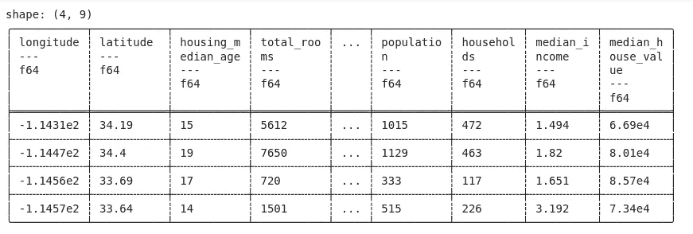

# 大熊猫是熊猫的新替代品吗？

> 原文：<https://medium.com/analytics-vidhya/is-pypolars-the-new-alternative-to-pandas-916400f03fd7?source=collection_archive---------1----------------------->

# 目标

*   当涉及到数据操作和分析时，Pandas 是数据科学家最著名的库之一。
*   让我们看看我们有没有大熊猫的替代品。

# 介绍

Pandas 是一个非常受欢迎的库，甚至非 Python 程序员和数据科学专业人士也听说过很多。如果你是一个经验丰富的 Python 程序员，那么你会非常熟悉 Pandas 库的灵活性。

Pandas 是每个数据科学家都会遇到的基本库之一。这是一个超级强大，快速，易于使用的 python 库，用于数据分析和操作。从创建数据框到读取不同格式的文件，无论是文本文件、CSV、JSON，还是从分割数据到组合多个数据源，Pandas 都是一站式解决方案。


如果我们知道镇上有一个新的图书馆，挑战熊猫在数据处理方面的垄断，会怎么样？是的，对我来说，深入一个叫做 pypolars 的新图书馆是令人兴奋的。

在这篇文章中，我们将看到 pypolars 是如何运作的，以及它是如何与熊猫相比较的。

# 目录

*   什么是 pypolars
*   如何安装
*   急切而懒惰的 API
*   如何使用 pypolars
*   与熊猫的比较

# pypolars 是什么？

Polars 是一个在 Rust 中实现的快速库。polars 的记忆模型是基于 Apache Arrow 的。py-polars 是绑定到 polars 的 python，它支持 polars 所支持的数据类型和操作的一小部分。py-polars 最好的一点是，它类似于熊猫，这使得用户更容易打开新的图书馆。

让我们更深入地研究 pypolars，看看它是如何工作的。

# 如何安装

安装 pypolars 很简单，类似于使用 pip 的其他 python 库，并且已经完成。

```
pip install py-polars
```

# 急切而懒惰的 API

如果我们谈论 API，Polar 由两个 API 组成。一个好学，一个懒。Eager API 类似于 pandas，即执行将立即发生并产生结果。比如执行一些聚合、连接或分组，这样您就可以立即得到结果。


另一方面，懒惰的 API 就像 Spark 一样。在这里，查询首先被转换成一个逻辑计划，然后该计划被优化和重组，以减少执行时间和内存使用。一旦请求了结果，polars 就在可用的执行上分配任务，并在运行中并行化任务。因为所有的计划都是已知的和优化的，所以不需要花费太多时间来呈现输出。

# 如何使用 py-polars？

现在我们要看看 py-polars 是如何工作的，让我们看一些实现代码的例子。

# 创建数据框架

在 py-polars 中创建数据框类似于熊猫。使用 pl.DataFrame

```
import pypolars as pl 
df= pl.DataFrame({'City':['A','B','C','D','E','F','G','H'],         'Temperature':[30.5,32,25,38,40,29.6,21.3,24.9],
 'Rain':[103,125,90,75,130,200,155,127] })
```

首先，让我们检查创建的数据框的类型和存在的列。


现在，我想访问数据框的顶行。就像熊猫 DataFrame 对象一样，我们有 head()函数。如果没有传递参数，它将显示前 5 行。


# 子设置数据帧

我们也可以根据熊猫的情况选择数据帧的子集。

```
df[df['Rain']>120]
```


# 连接数据帧

很多时候我们需要组合多个数据框。polars 提供了连接数据帧的功能。一个是水平堆叠的 hstack，另一个是垂直堆叠的 vstack。看看下面给出的例子。

在下面的示例中，我首先创建了一个新的数据框，用随机值初始化列湿度。后来，我使用 hstack 水平合并了两个可用的数据帧。

```
import numpy as np 
df1= pl.DataFrame({'Humidity':np.random.rand(8)})
df1
```


```
df.hstack(df1.get_columns())
```


现在，我们有了一个由两个数据帧的数据组成的新数据帧。我发现这个功能真的很有趣。

此外，我们将了解如何垂直组合这两个数据帧。这里我们需要两个具有相似列的数据框。在堆叠之前，我将创建另一个数据帧，它是使用另一个令人兴奋的功能(称为克隆)的 df 的副本。

克隆创建给定系列或数据帧的副本。在 polar 中创建克隆是超堆，因为 polar 支持的底层内存是不可变的。这进一步提高了库的性能。

在创建了给定数据帧的副本之后，我使用 vstack 来连接这两个数据帧。

```
df2= df.clone()
df2.vstack(df)
```


# 读取 CSV 文件

与熊猫相似，polars 提供了读取不同格式文件的功能。这里我使用一个 CSV 文件，并将数据放入一个名为“data”的数据框中。“数据”是 pypolars 数据框，因为我们可以看到对象的类型。

```
data = pl.read_csv('california_housing_train.csv') 
type(data)
```


使用给出最后几行的 tail 函数检查数据框中的几行。



虽然 polar 与 pandas 相似，并且支持大多数功能，但它仍然在努力，我们需要将 polar 数据框转换为 pandas。Polars 提供了一个简单的函数 to_pandas()，允许用户将极坐标数据框转换为 pandas。

```
pandas_df=data.to_pandas()
type(pandas_df)
```


现在我们将看到一个简单的例子，我们如何将我们的数据帧转换成一个惰性帧来优化我们的性能。


正如我们可以看到的，我们的数据框已成功转换为惰性数据框，但它没有显示数据。现在，我将使用过滤器对 lazy_df 进行子集化，然后通过 collect()请求结果。

```
lazy_df = lazy_df.filter(col("Rain") > (lit(120))) 
lazy_df.collect()
```


# 为什么是 Polars？

这是 pypolars 的一个小介绍，我试图帮助您理解这个库及其功能。请注意，当涉及到 eager API 时，该库的工作方式与 pandas 非常相似。用户不需要付出额外的努力来学习，它很容易使用。

此外，Polars 与 NumPy 的 ufunc 功能的交互成本为零。这意味着，如果它不被 Polars 支持，我们可以使用 NumPy，没有任何开销。

此外，Polars 是一个内存高效的库，创建克隆或切片非常经济，因为 Polars 支持的底层内存是不可变的。

lazy API 使得 polars 更令人兴奋，因为当它涉及到更大的数据集时，时间和空间复杂性很重要。由于优化和懒惰的执行 polars 成为一个高效和低成本的选择。[这里](https://github.com/ritchie46/polars/blob/master/examples/lazy_py-polars.ipynb)可以看到 polars 的性能对比。

如果你想了解更多细节，我建议你查看 polars 的[文档](https://github.com/ritchie46/polars)。

# 结束注释

Polars 相对较新，不支持数据科学家所需的其他库。但另一方面，熊猫是一个成熟的玩家，拥有庞大的社区基础和高效的生态系统。目前还很难说它能成为熊猫的替代品。但毫无疑问，这是一个有趣的选择。

总之，Polars 是执行数据操作和分析的一个有趣的选项。如果你的数据集对熊猫来说太大，对 spark 来说又太小。Polars 是一个高效的解决方案，因为它利用机器中所有可用的内核进行并行执行。

请在评论区告诉我你对此的看法。