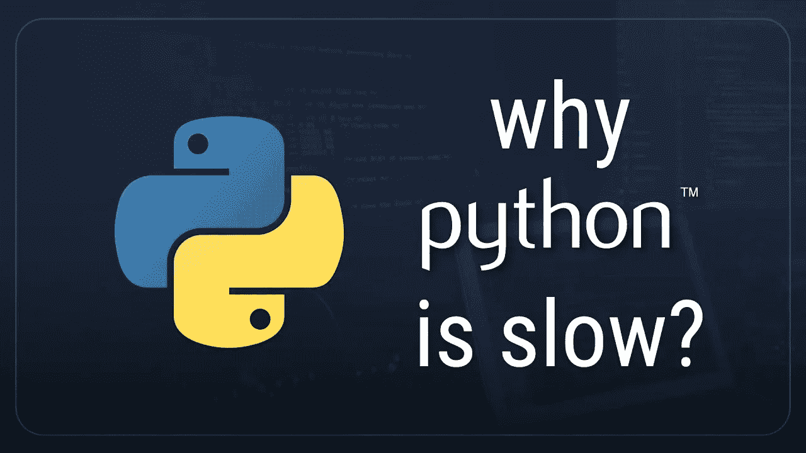

# Python 真的很慢吗？使 Python 非常慢的两个主要问题

> 原文：<https://medium.com/analytics-vidhya/is-python-really-very-slow-2-major-problems-to-know-which-makes-python-very-slow-9e92653265ea?source=collection_archive---------4----------------------->

那么 Python 是不是太慢了？

现实是，当我们看其他语言如 Java C 和 C++时，Python 是一种很慢的编程语言。但令人尴尬的是，他们做事情的速度比 Python 快得多。事实上，特定的算法和应用程序实际上可以比原生 Python 语言快一百倍到两百倍。

现在，在我讲得太远之前，值得注意的是 python 在开发时间和成本方面所缺乏的速度，通常用 python 开发程序要快得多，简单得多，并且最终成本更低，因为项目涉及的劳动力更少。

现在，这是一个巨大的优势，在很多情况下，你可以用 Python 写一个类似 Java 鞭的代码，比用那种语言快四到五倍。

## 那么 Python 为什么慢呢？

这种语言速度慢有各种不同的原因，但我只想在这里提几个传言，这种语言速度慢的主要原因不是全局解释器锁，尽管这肯定是速度的一个因素，你可以编写更快的 python 程序，但这不是 Python 语言速度慢的根本原因。

# 1.Python 是动态类型的

这种语言速度慢的原因是它是动态类型的，现在我们将更详细地讨论这一点，但我想与 Java 这样的语言进行比较，我实际上是用 Java 编写的。

现在在 Java 中， 一切都是静态类型的，这种语言实际上是在运行前编译的，不像 Python，它是在运行时通过解释器编译的。现在，在 Java 中，当你写代码时，你需要定义每个变量的类型，你知道你的方法和函数将返回什么类型，你必须准确地定义所有东西在你的代码中的位置，尽管这会导致你 知道更长的开发时间和花更长的时间来写你的代码，它的作用是在你现在编译的时候成倍地提高效率，这实际上有效的原因和它比 Python 代码快得多的原因是，如果你知道一个特定的变量或对象将是什么类型，你可以执行大量不同的优化，避免在你实际运行代码的时候执行大量不同的检查。

因为这些检查是在编译时用 Java 执行的，本质上你不能编译任何 Java 代码，当你写代码的时候，如果没有实际的或者你甚至知道是类型错误，所以你要试着编译它，它会说你知道这个类型是不准确的，你不能这么做，你不能编译它，因为它知道在运行时是行不通的。

实际上，所有这些在代码运行时需要在 Python 中执行的检查都是预先执行的，由于这种静态类型的长度，只需要做大量的优化。

## 现在你可能会问为什么 Python 不这样做呢？

Python 是动态类型的，这意味着任何变量都可以改变它的类型，并且可以在程序运行的任何时候改变它的值。

这实质上意味着我们不能事先编译整个程序，因为我们不能一次完成所有的检查，因为我们不知道这些变量是什么类型。

它们会在运行时发生变化，会发生不同的事情，正因为如此，你知道我们无法获得 Java C 或 C++等低级语言可能拥有的所有优化，这也是这种语言速度慢的基本原因。

这种类型化，这种动态类型化，以及任何快速语言，都将会有一个编译器，它将会运行以确保一切正常，它将会在运行时结束运行代码之前完成所有这些检查，在 python 中，所有的代码都将在运行时被编译和检查。

# **2。Python 中缺乏并发性使得它很慢**

如果你用 Java C sharp 编写一个应用程序，你可以把所有的东西分散到多个线程中，这样你就可以利用所有的 CPU 内核。为了在现代计算中打破这种局面，我们大多数人都有四个或更多核心 CPU，这允许我们实际上同时运行任务。现在使用 Python，这是不可能的，因为对于每个解释器，我们一次最多只能运行一个线程，而一个线程运行在一个 CPU 内核上。这意味着，即使我们在 Python 程序中创建大量不同的线程，我们也只能使用一个 CPU 内核，我们知道 Java 程序或 C 程序可能会使用全部八个或全部四个，这显然会导致速度提高 4 倍，现在我们可以通过使用称为多处理的东西来解决这个问题。

## 现在很多人可能想知道为什么 Python 中存在全局解释器锁？

嗯，这又归结到 Python 的动态类型，所以实际上在 Python 中管理内存的方式，我不是这方面的专家，我只是查找了一些东西，并确保我有点明白我所说的不是线程安全的。

这意味着，如果两个线程要分开，你知道代码片段试图同时访问内存中的一个特定对象，你会遇到问题，本质上我们不允许这种情况发生。

我们所做的是，我们说至少 python 所做的是正确的，我们将有一个全局解释器锁，这意味着一次只能运行一个线程，以防止这种情况发生，因为我们知道运行多处理和多线程应用程序的一个主要问题是，您需要处理锁定和共享内存，这是我现在将在 python 的多处理模块中讨论的事情之一。

因此，尽管在 Python 中通过使用称为多处理的模块可以实现并发，这实质上允许您生成另一个可以运行自己线程的 Python 解释器，但实际上很难有效实现。

这很难做到，而且你知道实际工作起来并不直观，所以这是它的一个问题，即使你可以做到这一点，你仍然会遇到很多速度问题，这些问题来自于 Python 的解释方式和工作方式。你实际上不能在 Python 中实现多处理和并发，但这很困难，你必须处理更多的问题 在 Java C 和其他类似的语言中，你可以创建线程，它们会在其他内核上自动运行，而不需要定义共享内存对象和锁之类的东西。

# 所以除了 M **ultiprocessing** 之外，你还能如何真正提高 python 的速度呢？

好吧，一种方法是实际使用 C 代码作为我们 Python 库或我们正在创建的任何东西的扩展。现在 python 实际上是建立在 C 之上的，很多人不知道这一点，但是有很多你实际使用的函数和东西是原生编写的，C 和 Python 都有一个允许你使用它们的扩展，这就是为什么例如 Python 中的排序算法运行起来比你自己编写原生排序要快得多实际上在 Python 中我们做了很多优化，在 know 中写了很多底层的东西。

这实际上意味着你可以自己做这件事，所以如果你需要创建一个在 Python 中运行非常快的东西，而你不能使用不同的语言，你实际上可以做的是写那个算法，看到并把它导入到你的 Python 代码中，因为你知道一个扩展，所以你可以比你在 Python 中直接写代码运行得更快。

要真正提高 Python 代码的速度，你可以引入某种线程和并发性，你可以使用多处理模块，这将允许你同时运行多个解释器，并通过全局解释器锁，但你可能会遇到一些共享和锁定内存的问题。

你也可以为你的 Python 代码编写 C 扩展，很明显这并不适合所有人，因为你需要知道 C 才能做到这一点，但是如果你真的陷入困境，你需要快速得到一些东西，你需要使用 Python 来编写一些东西，C 和导入会大大加快你的代码的速度，特别是如果你有像搜索或排序算法之类的东西 密集的计算，如果你写在里面，那将会成倍地加快时间的执行，这将会节省你大量的时间和大量的麻烦，而不是试图去学习你知道一个全新的语言，当你可以选择一些 C 语言，为你的 Python 代码写一个小的扩展。

# 简单地

综上所述，python 速度慢主要是因为两个主要原因。一个是动态类型语言，这意味着，与 java 不同，python 没有变量声明，这使得编译时间很长，有时变量在运行过程中会在我们不知情的情况下发生变化。另一个是 python 使用一个 CPU 内核在解释器中运行一个线程，不管你在程序中创建了多少个线程。

现在，这让我们想到如何才能让 Python 变得可用并且更快，现在 Python 显然是可用的，并且在许多情况下，你实际上并不关心你的代码的运行时间，或者如果它运行得更快会更好，但是在一天结束时，你知道几毫秒对于你正在构建的任何应用或产品来说都不会是剧烈的，在这种情况下， Python 之所以很棒，是因为它开发和编写代码的速度更快，而且在开发项目时通常更容易、可读性更强。

也就是说，这就是 Python 速度慢的原因，如何让它快一点，以及一些关于这种语言的信息。请不要犹豫，在下面留下评论，让我知道，就像你们一样，我也在学习，这是我对 Python 语言的表面理解。