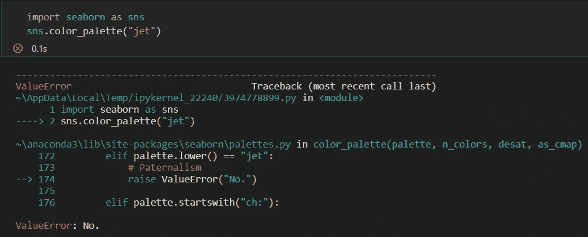

# Seaborn 有时是否过于自信？

> 原文：<https://medium.com/analytics-vidhya/is-seaborn-too-assertive-at-times-45f10e7835c0?source=collection_archive---------0----------------------->

## 没有人是完美的—

## 需要警惕的事情

[https://gist . github . com/mwaskom/7 EB 7d 01d 9 aa 25 ea 83894293027d 12 a 8c](https://gist.github.com/mwaskom/7eb7d01d9aa25ea83894293027d12a8c)

Seaborn 是一个 python 库，它允许可视化数据，并使用户更容易理解。从内部来说，这个库完全建立在 Matplotlib 之上，从而更容易生成视觉上吸引人且信息量更大的数据可视化。熊猫的数据结构与这个库相连。

Seaborn 是开发人员、分析师、数据科学家和顾问最喜欢的数据可视化 python 包之一。不可否认的是 Seaborn 带来的优势，从易用性和可访问性，到它提供的创建信息丰富的情节的灵活性。每个人都喜欢和 Seaborn 一起工作，而不是 Matplotlib。

然而，即使是 Seaborn 也有一些局限和限制，人们应该小心谨慎，以避免意外的不准确。

# **Seaborn 不让你用‘jet’调色板**

Jet 是 Matplotlib 使用的默认颜色主题，Seaborn 也继承了它。不使用它的原因有很多。亮度曲线是不使用它的主要原因。喷气跳跃用的颜色遍地都是；因此，无法区分亮点和特征。因此，没有人喜欢这种调色板。此外，大多数数据科学家强烈建议避免使用 jet 进行任何可视化。

Seaborn 值错误:否

如果您试图使用 Jet 调色板进行任何可视化，Seaborn 会抛出 ***ValueError: No，*** 这似乎是 Seaborn 开发人员有意添加的功能，以阻止用户选择它。这在连续数据的情况下是可以理解的；然而，它并不适用于所有情况。对于需要离散箱的不同使用情况，喷射调色板可能是有利的。因此，Seaborn 库应该为用户提供灵活性，根据他们的需求决定是否使用 *jet、*。

# Seaborn 估计器不是为小数据集设计的

为了在图中计算和绘制置信区间，Seaborn 使用了 bootstrap 方法。然而，如果您有一个小样本，这种方法将产生一个不准确的置信区间，因为 bootstrap 算法只适用于大样本。没有向用户提供计算小数据置信区间的替代方法。为了解决这个问题，用户必须使用公式独立计算置信区间，并将其与数据一起绘制在同一个图中。

尽管 Seaborn 有这些限制，但总有办法绕过它们，并且由于它的优点多于缺点，所以它是大多数数据科学家和分析师的首选。