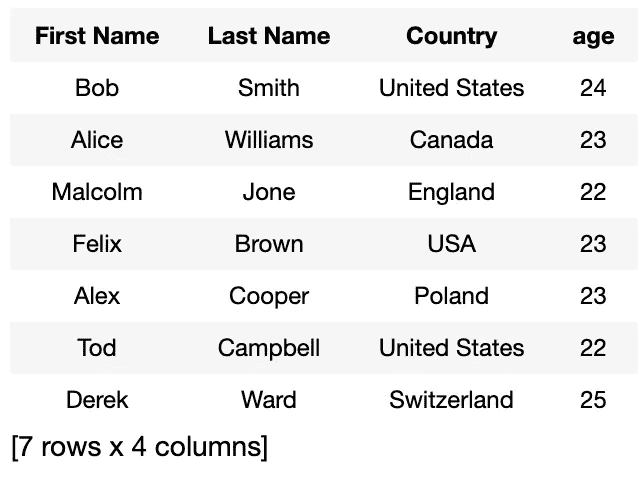
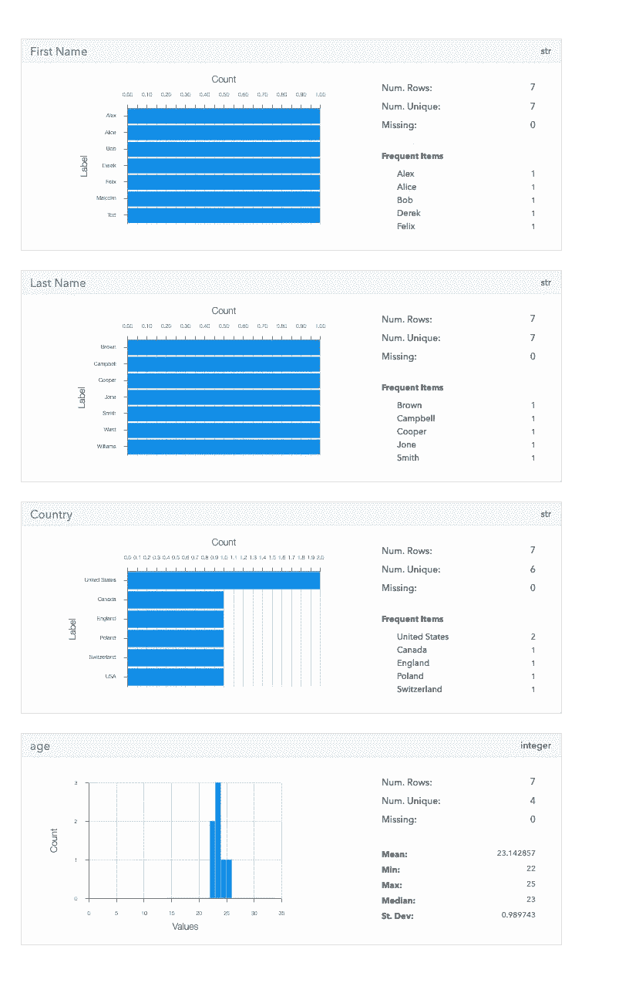

# SFrame 比熊猫好看吗？：

> 原文：<https://medium.com/analytics-vidhya/is-sframe-better-than-pandas-ac9aff86387c?source=collection_archive---------5----------------------->

Pandas 是最常用和最著名的 python 包之一。“面板数据”的简称；它使处理表格数据变得容易。

从构建关键的生产系统到编写概念验证脚本，它是大多数开发人员的首选软件包。

但是它有一定的局限性。*最大的是，Pandas 是一个内存中的数据结构。这意味着你通常不能存储大于主内存的数据，即你机器上的 RAM。*

起初，这似乎不是一个巨大的障碍，但我们生活在大数据和机器学习的时代。大量的数据被收集并输入到分析和学习系统中，以产生见解，提出建议，应用程序的列表还在继续。

*因此，我们能够处理远远超出内存容量的数据是至关重要的。这就是 SFrame 的用武之地！*

SFrames 是“可伸缩框架”的缩写，是一个更大的生态系统“Turicreate”的一部分。在讨论如何使用 SFrames 之前，让我们先定义一些东西:

*   **Turicreate** — Turicreate 是一个开源工具集，用于创建核心 ML 模型，用于图像分类、对象检测、风格转换、推荐等任务。
*   **SF frame**—一个列可变的表格数据框架式对象，可以扩展以适应大数据。SFrame 数据以列的方式存储在 SArrays 中
*   **SArray**—SF frame 中的每一列都称为一个 SArray。

既然我们从概念上理解了 Turicreate 和 SFrame 是什么，让我们看一个例子:

让我们安装 Turicreate 生态系统来使用 SFrame。

```
pip install -U turicreate
```

设置完成后，让我们从导入数据集开始。

输出:



这里的文件可能比你的计算机内存所能容纳的要大得多。使用 Turicreate 和 SFrame 的额外好处是它提供了强大的可视化功能。

输出:



综上所述，SFrames 是否比熊猫更好的问题就像是在问哪种语言是最好的编码语言。答案是*取决于用例*。

如果你正在处理的文件大小大大超过了你的内存容量，那么 SFrames 比 Pandas 更好。此外，Turicreate 提供的广泛数据可视化功能让我们离使用和理解大数据更近了一步。

希望这篇文章有所帮助！