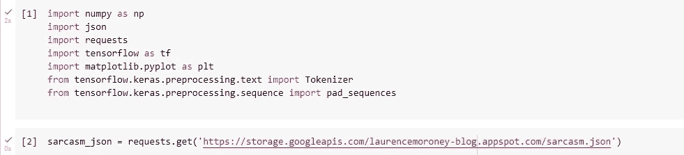

# 那条短信是讽刺吗…？🤔

> 原文：<https://medium.com/analytics-vidhya/is-that-text-sarcastic-36fe4369a6a?source=collection_archive---------13----------------------->

众所周知，人工智能和机器学习正在改变世界。它在从医学到视频游戏的各个领域都有大量的应用。

电子商务和社交媒体等领域已经幸运地使用了人工智能，并受益最大。(AI)预计到 2026 年**这个市场将增长到 1260 亿美元**。

***然而，在这个项目中，我决定用 AI 来完成一项有趣的任务。我试图建立一个模型来检测文本中的讽刺。***

来源:谷歌图片

这听起来可能难以置信，但随着人工智能领域每天都有新的研究和改进，建立这种模型是可能的。我能够创建一个模型，以 83 %的准确率检测文本中的讽刺。

在开始解释模型的构建之前，让我们尝试在一些著名的电影/网络系列中发现讽刺:

电影:《死侍 2》

2.

生活大爆炸第四季第二十四集

# **解释模型:**

## **1。使用的库和数据集:**

整个项目用 python 语言制作，在 google colab 环境下进行。为了设计神经网络，使用 Keras 顺序 API，TensorFlow 作为后端。

对于可视化数据和数据分析:pandas，使用 matplotlib 库。

该数据集可在一个开源网站上获得，*[***kaggle***](http://kaggle.com)。数据集在。 *json* 格式。因此，使用 python 的 ***json*** 和 ***requests*** 库来获取模型的数据集。*

**

## ***2。标记和填充文本数据***

*为了让模型做出预测，它需要有数字格式的文本数据。因此我们需要通过 ***分词*** 和 ***填充*** 对数据进行预处理。
通过在 TensorFlow 中创建 Tokenizer 类的实例，可以轻松完成标记化。为了将原始文本转换成数字序列，我在标记器上使用了***texts _ to _ sequences***方法。
将所有文本串转换成序列后，进行填充，使所有训练文本长度一致。*

**

## ***3。建立长短期记忆神经网络:***

***长短期记忆神经网络**或 **LSTM** 是一类神经网络，最常用于**序列预测问题**。*

*建立的模型是连续的，包括:嵌入层，双向 LSTM 层，具有 24 个神经元和“relu”激活的密集层，以及具有 sigmoid 激活的输出层。*

*由于我们的任务是二进制分类，即预测文本是否讽刺，我在最终输出层使用一个神经元的 sigmoid 激活，并使用“二进制交叉熵”来计算损失。*

*为了在神经网络上执行梯度下降，我使用了 Adam optimizer。*

**

## ***4。评估模型***

***观想:***

*为了可视化每个时期后训练和验证数据集的准确性和损失，我在 matplotlib 库的帮助下绘制了它们。*

****

*最后，在测试集上对该模型进行了评估，即在它从未见过的文本上，其准确率为 81.71 %*

***现在让我们在其他一些著名电影或网络系列对话上测试我们的模型:***

*1)*

**

*复仇者联盟:奥创时代*

**

*2)*

**

*老友记(第六季第五集)*

**

*3)*

**

*办公室(第九季第二十三集)*

**

*4)阿姆:**“被 B 方谋杀的音乐”——阿尔弗雷德的主题曲***

*歌词— *“所以叫我圣诞老人吧，因为现在，我比他们唱得都好”**

****

*参考资料:*

1.  *Google Colab 项目:[https://Colab . research . Google . com/drive/1 knz 8 la 6 hkzkq _ qssz 9 jxm-Tzuk _ V8 unx？usp =共享](https://colab.research.google.com/drive/1knz8La6hkzkq_qssz9JxM-Tzuk_v8UNX?usp=sharing)*
2.  *dataset:[https://www . ka ggle . com/RMI SRA/news-headlines-dataset-for-spirus-detection](https://www.kaggle.com/rmisra/news-headlines-dataset-for-sarcasm-detection)*