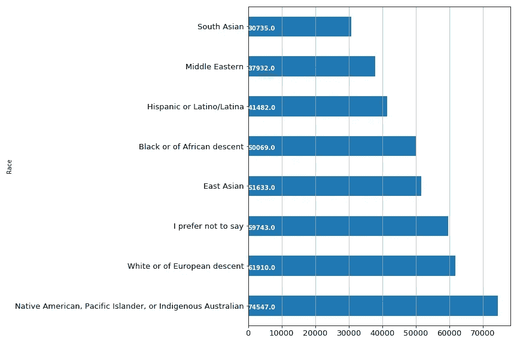
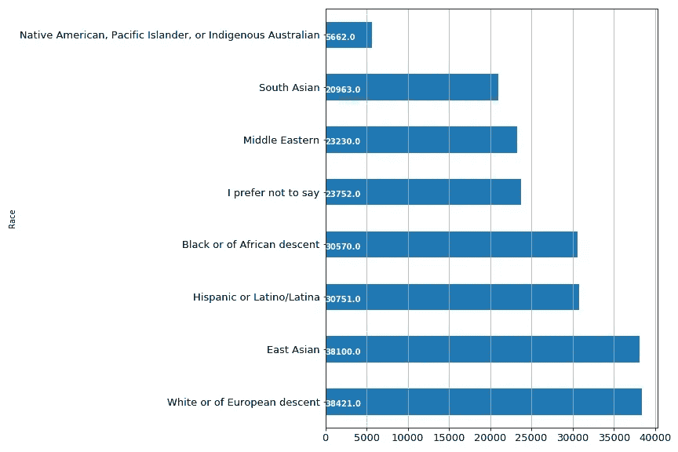
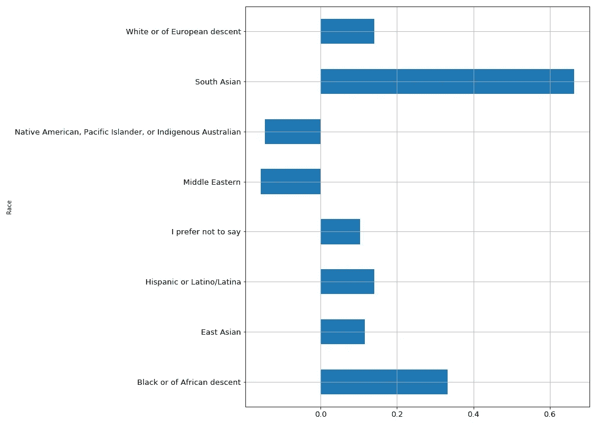

# 这就是你比同事挣得少的原因吗？

> 原文：<https://medium.com/analytics-vidhya/is-this-why-you-earn-less-than-your-colleagues-79d9639f651a?source=collection_archive---------11----------------------->

## 种族和家庭背景与收入——对数据的深入研究

学分:istockphoto.com

# **简介**

M 任何学术论文都已经证实[家庭背景在孩子的学业成就和最终人生成功中扮演着重要角色。在这篇文章中，我的目标仅仅是考察开发者的家庭背景和他们目前在科技行业的收入水平之间的关系。](https://journalofchinesesociology.springeropen.com/articles/10.1186/s40711-018-0083-8)

当谈到不同种族和社会背景的收入分配和收入时，大多数人都会同意存在巨大的差距和不平衡。虽然这些收入差距还没有被证明是教养和种族身份的直接结果，但自从在几项经济指标中观察到不断扩大的种族财富差距以来，这个话题在公共领域正受到越来越多的关注。

在科技行业，开发人员拥有一些世界上最抢手、最赚钱的工作。工作的全球化消除了收入的市场和地域障碍，因此，在我们当前的社会中，背景和种族身份对收入的影响应该很小。

不管我的看法或其他人的看法如何，让我们看看有什么数据能告诉我们这些。这就是为什么我决定查询 [Stackoverflow 的 2017 年度开发者调查](https://insights.stackoverflow.com/survey/2017)来寻找一些非常有趣的问题的答案，这些问题应该会给我们一些启示。

这项调查有来自 213 个国家的 64，000 名参与者。它的目标是每年整理软件开发和数据分析角色的多个方面的信息。调查中提出了多达 150 个问题，包括:

> > >您认为以下哪一项是正确的？
> 
> > >您是将编程作为业余爱好还是为开源项目做贡献？
> 
> > >你父母中任何一方接受的最高教育程度是什么？
> 
> > >除奖金、补助金或其他报酬外，您目前的税前基本年薪是多少？

为了这个分析，我开始回答以下问题。

# 开发者的年收入在不同种族之间有怎样的差异？

快速浏览一下调查受访者的人口统计数据可以发现，超过 70%的调查受访者是*白人或欧洲*后裔，而*美洲土著、太平洋岛民或澳大利亚土著*后裔的开发者最少，仅占 1%。

尽管美国原住民、太平洋岛民或澳大利亚土著开发商的受访者人数最少，但数据显示，他们是唯一一个平均年收入超过 7 万美元的族裔群体。

图 1:不同种族群体的平均年薪差异

几个因素可能导致该群体的高收入水平，如参与者的经验年限、提交数据的质量和地点。尽管在一个日益全球化的世界中，随着远程工作成为当前的主流，我认为开发人员的地理位置越来越不重要。

一个非常奇怪的例子是南亚人。调查结果显示，他们的参与人数位居第二，但很明显，他们的年薪最低，只有大约 31，000 美元。那么，这是否能告诉我们南亚的总体收入水平，或者我们可以说南亚人的工资比这个行业的其他人都低？无论情况如何，这些发现只是观察。现实可能会非常不同。

# 这些背景的学生开发者是否也有和同龄人不一样的薪资期望？

由于该调查还询问了当时学习编程的学生毕业后的预期工资，我想我也可以了解哪个民族的哪些学生已经限制了他们的收入潜力。预期学生的工资预测也将遵循与上面探讨的专业开发人员的工资相似的模式。

图 2:不同背景的学生开发人员的期望薪资

不出所料，*白人或欧洲人*和*东亚人* 学生比其他人对自己在就业市场上的价值有更高的认知。

另一方面，印第安人、太平洋岛民或澳大利亚土著学生的预期年收入在所有群体中最低，差距较大。这是一个令人惊讶的发展，因为我们刚刚发现，这些后裔的专业开发人员在市场上收入最高。因此，这就引出了一个问题:是学生们对这个行业有足够的了解，还是受访者提供的数据存在问题。

南亚人的期望薪资排在倒数第二。这一结果并不令人惊讶，因为它证明了南亚开发商的收入水平可能普遍低于他们的同行。

# 最后，如果你的父母中有一人大学毕业，你会挣得更多吗？

父母的教育水平是一个巨大的因素，可以限制孩子取得成功的水平。这就是为什么决策者甚至一些雇主试图为第一代大学生提供额外的支持。

考虑到这一点，我决定看看如果我把那些父母至少拥有**学士学位**的人和那些父母没有学士学位的人分开，同一种族的开发者的年收入会是什么样。

下图显示了每个种族群体中两个群体之间的收入差距比例。

图 3:父母至少有学士学位的开发者(+ve 轴)和没有学士学位的开发者(-ve 轴)之间的收入差距比例

对于除了 T4、中东、美洲原住民、太平洋岛民或澳大利亚原住民之外的大多数种族来说，那些父母大学毕业的人比那些父母没有大学毕业的人挣得多。

收入差距对南亚人来说最为明显——父母至少拥有学士学位的开发人员比父母受教育程度低的开发人员收入高出 65%。紧随其后的是 ***黑人或者非洲血统*** 的开发者——相差 33%左右。

# 结论

概括地说，我们研究了 2017 年堆栈溢出调查数据，以回答我们在上面提出的三个问题。我们发现:

*   ***美洲土著、太平洋岛民、或澳大利亚土著*******白人或欧洲人*** 开发商比其他人挣得多，而**南亚人**挣得最少。*
*   *学习编码的学生，如果有白人或欧洲人和东亚人的祖先，他们的薪水期望值会比其他任何种族都高。*
*   *父母至少拥有学士学位的开发人员通常比父母受教育程度较低的开发人员挣得多。*

*因此，除非你有中东、澳大利亚土著或美国土著的祖先，否则如果你的父母没有大学毕业，你有可能比你的同事挣得少——但是你可以放松，这不是一项正式研究的结果，这纯粹是观察所得。*

> **那么，你* ***你*** *认为你的家庭背景或种族影响了你的收入吗？**

*让我知道你的想法！*

*有关分析的更多信息，请访问 GitHub [这里](https://github.com/joshasgard/Diversity_RepresentationInTech.git)*