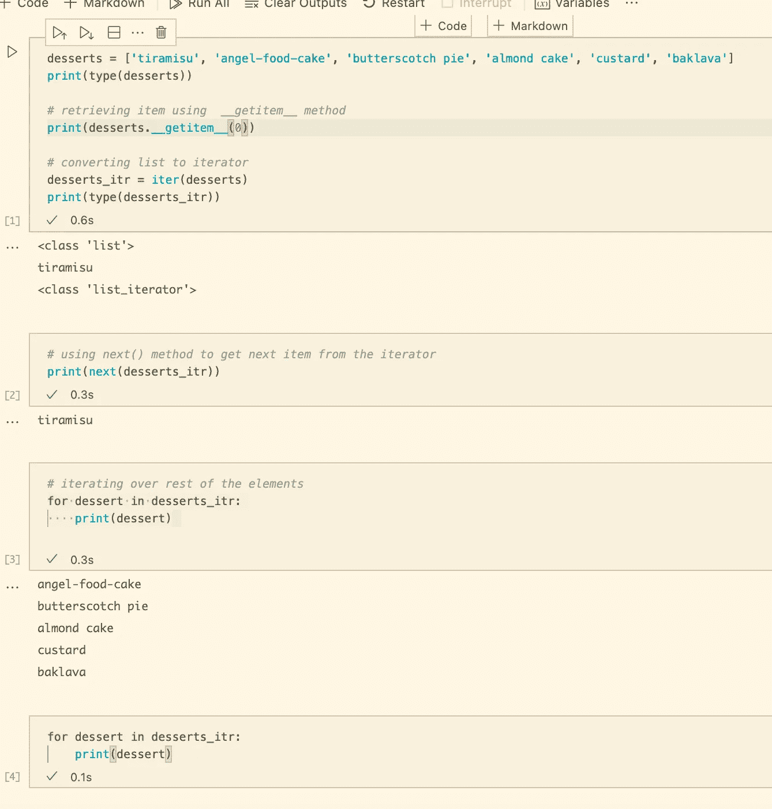

# 可迭代与迭代器— Python

> 原文：<https://medium.com/analytics-vidhya/iterable-vs-iterator-python-d14aedaa0197?source=collection_archive---------4----------------------->


Rick van der Haar 在 [Unsplash](https://unsplash.com/s/photos/mantis?utm_source=unsplash&utm_medium=referral&utm_content=creditCopyText) 上拍摄的照片

我们都出于各种目的扫描物品。在计算中，我们也扫描项目集合。Iterable 和 Iterator 是扫描的概念。我很高兴看到这个概念，并愿意分享它。

在这篇文章中，我们将通过例子来回顾什么是可迭代的和迭代器。让我们开始吧。🙌

Iterable 是实现`__iter__` dunder 方法的对象。

迭代器是实现`__iter__`和`__next__` dunder 方法的对象。

我们看到迭代器是可迭代的**但是**它们是被耗尽的可迭代的。另一方面，iterables 永远不会耗尽，因为它们总是返回一个用于迭代的新迭代器。

让我们看一个例子:

下面是一个输出:

```
First iteration...
daffodil
rose
gerbera
orchid
carnation
peony
lily2nd iteration...instantiating BouquetIterator once again...
3rd iteration...
daffodil
rose
gerbera
orchid
carnation
peony
lily
```

你看，第一次迭代之后，迭代器就用完了。因此，第二次迭代是空的。您需要重新实例化您的迭代器，以便能够再次迭代。

怎样才能让迭代器用之不竭？这就是 iterable 的用武之地。iterable 所做的是用它的`__iter__` dunder 方法返回迭代器。让我们把上面的例子转换成 iterable，这样我们可以迭代尽可能多的次数而不会耗尽迭代器。

运行该文件时，我们得到:

```
First iteration...
daffodil
rose
gerbera
orchid
carnation
peony
lily2nd iteration...
daffodil
rose
gerbera
orchid
carnation
peony
lily3rd iteration...
daffodil
rose
gerbera
orchid
carnation
peony
lily
```

看，我们可以迭代任意多次，而不必用项目集合重新实例化迭代器。

你可能会想为什么这很酷？这很酷，因为如果您从外部来源接收数据，这需要大量的资源和时间，现在您不必每次需要迭代它们时都进行外部调用。调用一次，迭代到你的心满意足！

我们也可以调用迭代器来处理只实现了`__getitem__`的序列类型，如列表所示。我们有`iter()`方法将序列类型转换成迭代器。

让我们看一个例子:



看，我们使用`iter()`方法将`list`转换为`list_iterator`，并使用`next()`方法获取项目。我们也可以使用普通的`for`循环来迭代迭代器中的其余元素。

参见单元格#4，一旦迭代器用完，就没有元素了。因此，没有输出。

总之，

*   **可迭代**是实现`__iter__`方法的**不可穷尽** e，而**迭代器**是实现`__iter__`和`__next__`方法的**可穷尽**。
*   Iterables 能够是无穷无尽的，因为在`__iter__`方法中，它**返回迭代集合的迭代器对象**。而在迭代器中，`__iter__` **返回自身**。

这就是这篇文章的全部内容。感谢您的阅读，我希望这是一篇有用的文章。

**灵感**:

*   [蟒蛇 3:深潜](https://www.udemy.com/course/python-3-deep-dive-part-2/)

你可以在[上支持我！](https://www.patreon.com/dkhambu)