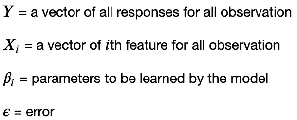

# 这都是关于回归——普通最小二乘法(OLS)

> 原文：<https://medium.com/analytics-vidhya/its-all-about-regression-part-1-c002fcaa8a55?source=collection_archive---------13----------------------->

在这个由多个博客组成的系列中，我们将研究回归模型。这将与你可能在网上看到的许多其他回归教程/讲座不同，因为我们将从多个角度讨论这个主题

本系列与众不同之处在于
-真实世界示例和应用
-预测分析
-推理分析(几乎总是被遗忘的东西)
-此外，我们将研究普通最小二乘法之外的回归(OLS)

因此，没有任何进一步的麻烦，让我们开始吧。

# **线性回归**

线性回归是一种统计模型，它映射了预测因子/特征和响应变量之间的关系。它表示如下


在哪里



出于本教程的目的，将误差项*ε*视为与 *E* (残差)相同。两者在被观测(E，属于可观测样本，可约化)和不被观测(ε，属于总体，常被称为不可约误差)方面是不同的。

要获得更具体的理解，请点击下面的链接。[https://en.wikipedia.org/wiki/Errors_and_residuals](https://en.wikipedia.org/wiki/Errors_and_residuals)

线性回归模型试图通过降低成本函数来找到 betas 的最优值。成本函数可以基于不同的方法/算法而变化。要获得详细的解释，请查看这个关于最常用成本函数的博客。

# 普通最小二乘法

普通最小二乘法，或 OLS，是一种估计回归模型参数的方法。它试图通过降低成本函数来估计贝塔系数；即响应变量和由模型做出的预测之间的平方距离之和。

OLS 的成本函数定义为


在哪里，

n =观察次数

p =特征数量

为了说明的目的，让我们假设我们有一个数据集如下

```
X = [1,2,3,4,5,6,7,8,9]Y = [3,5,7,9,11,13,15,17,19]
```


输入数据

我们需要找到 X 和 y 之间的关系，让我们看看能否用 OLS 来做这件事。

由于线性回归属于所谓的参数族，我们需要定义一组我们希望 OLS 过程估计的参数(或者 X 和 Y 之间的关系)。因此，一般来说，由于我们有一个特征 X 和一个响应 Y，我们需要找到 X 和 Y 之间的关系，这样我们就可以估计给定 X 时 Y 的值。


在这里，我们希望 OLS 估计 beta_{0}和 beta_{1}的值，这样我们就可以绘制 X 和 y 之间的关系

OLS 试图用一种叫做梯度下降的方法来估计贝塔系数。在这个博客的范围内，我们关注线性回归的应用方面，因此不会深入研究梯度下降算法。现在把梯度下降想象成一种算法，其中你给出方程(成本函数),它给出一个β值，对于任何特定的关系，它把成本函数减到最小。为了更好地理解梯度下降，看看这个博客。

在 python 中，我们利用 *statsmodel* 包来使用 OLS。它负责成本函数及其背后的数学的所有优化，我们需要给出的只是输入特征和响应变量。OLS 函数将拟合模型并估计参数。

```
model = sm.OLS(Y,sm.add_constant(X)).fit()
```

我们符合 OLS 模型，让我们来看看摘要。

```
model.summary()
```


这里我们可以在**系数**(系数)中看到，模型估计为


因此映射如下:

```
Y = 1 + ( 2 * X )
```


预测与输入数据

在给定 X 的情况下，模型在预测 Y 的值方面似乎做得非常好，所以现在如果我们给模型一个 x = 67 的值，这是模型从未见过的，它应该会得出一个值
1 + (67 * 2) = 135

# 预言；预测；预告

假设当 X 为[67，45，555，123]时，您想要获得 Y 的预测值

```
X_pred = [67,45,555,123]
Y_pred = model.predict(sm.add_constant(X_pred))
```

上面命令的输出将是一个数组[ 135，91，1111，247]

***恭喜*** ，那是你的第一个机器学习模型。
尽管线性回归是一个非常简单的模型，但如果它所依据的假设成立，它就会变得非常强大。

# 假设

无论模型多么简单，它都需要满足以下假设才能按预期工作
-线性:模型假设特征 X 和响应 Y 之间存在线性关系
-残差的正态性:残差/误差是独立的且呈正态分布
-恒定可变性:残差的方差是恒定的，同质性

接下来，我们将深入探讨成本函数和梯度下降算法。在这里查看。

在那之前，继续摇摆吧！