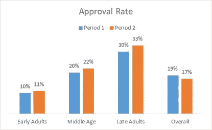
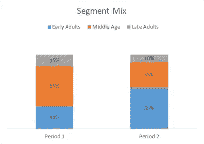

# 这就是混合——辛普森悖论

> 原文：<https://medium.com/analytics-vidhya/its-all-about-the-mix-simpson-s-paradox-e4e2c0f7f97?source=collection_archive---------5----------------------->

图片由 Usman Yousaf 在 Unsplash 上提供

让我们说，你正在运行一个非常低的信用卡报价在线营销活动。

人们访问你的银行网站，填写他们的收入和人口统计数据来申请这项服务。这些被称为线索，然后通过银行的核保流程，要么被批准，要么被拒绝。

衡量你的活动成功与否的一个标准是信用卡批准率。这只是批准的申请数量占您的营销活动产生的销售线索的百分比。

支持率越高，你对自己的竞选感觉越好。做营销的，靠细分生存，靠细分死亡。你关注的一个基本细分是你的潜在客户的*年龄*人口统计数据，并将他们分为早期成年人(18-25 岁)、中年人(26-40 岁)和晚期成年人(41-60 岁)。

批准率因年龄而异——早期成人 10%,中年 20%,晚期 30%。

最近，您看到所有三个细分市场的支持率都有所上升(*原因不是本次讨论的重点*)。你很高兴，拿出一份报告，显示整体和细分市场的趋势。

这就是你看到的。

批准率—按细分市场和整体

虽然每个部分看起来都不错，但最后一个数据点让你很困扰。

> **怎么可能当所有细分市场的支持率都有所提高时，总体支持率却下降了 2 个百分点。数学有问题吗？**

答案在于细分市场的组合。正如您在下图中所看到的，细分市场的组合已经转向早期成人，与其他两者相比，早期成人的认可率要低得多。

每个细分市场的销售线索百分比

这种转变对总体支持率造成了压力，尽管所有细分市场都呈上升趋势，但总体支持率却呈下降趋势。

这种转变背后可能有多种原因。也许更多的年轻人开始登陆你的网站，因为他们在寻找信用卡。营销人员应该认识到不断变化的细分市场组合，并相应地重新调整他们的目标和定位策略。

分析专业人员应在上下文中查看指标，即在这种情况下查看批准率以及相应的细分市场组合。

> 我们在上面看到的在统计学上被称为辛普森悖论。

# **在你的经历中，哪里遇到过辛普森悖论？**