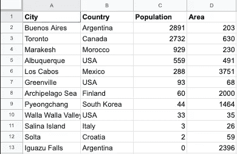
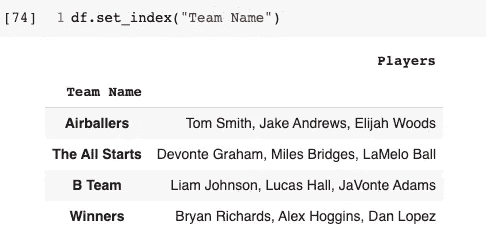

# 是潘达铵！

> 原文：<https://medium.com/analytics-vidhya/its-pandamonium-59245b3fb3b2?source=collection_archive---------23----------------------->

虽然有了熊猫的帮助，也不尽然。“StackOverflow 引用 pandas 作为 Python 成为发展最快的主要编程语言的原因之一”[1]。该软件包提供了许多项目来帮助数据科学家的工作变得更容易。其中一些项目包括快速处理、易变、灵活的分组功能、易于转换、合并或连接数据，以及时间序列功能。为了开始我们的 pandas 探索，我们将讨论如何安装 pandas，导入 pandas，以及 pandas 必须提供的两种数据结构。


图片来自维基百科

# 安装熊猫

使用 conda:

```
conda install pandas
```

使用画中画:

```
pip install pandas
```

# 导入

```
import pandas as pd#numpy is often used with pandas as well so normally I import these at the same time.
import numpy as np
```

# 熊猫数据结构

pandas 的包中使用了两种类型的数据结构:**系列**和**数据帧。**

## ***系列:***

这个数据结构是一个 1D 标记的同类数组，可以保存任何类型的数据。为了使这个定义更容易理解，可以将一个系列想象成数据帧或 excel 电子表格中的一列。使用下面的 excel 电子表格，我们可以看到四个独立的系列:城市、国家、人口和地区。


我电脑上 excel 文件的屏幕截图

如果我想从上面的数据框中获得一个序列，例如:

```
df["Country"]
```

现在，我将拥有一个包含我的数据框架中列出的国家的系列。

*如果我想从零开始制作自己的系列怎么办？*

**例 1** :不带和带 np.array

```
#without numpy
city_ratings = pd.Series([5, 10, 1, 2, 6, 8, 8, 9, 10, 4, 7, 6])#with numpy 
city_ratings_np = pd.Series(np.array([5, 10, 1, 2, 6, 8, 8, 9, 10, 4, 7, 6])
```


截图来自我的 google colab

**例 2** :改变索引

如果没有指定索引，将创建一个值为[0，…，len(data) -1]的索引。如果我们想要分配我们的索引，我们只需要通过传递 index =[index with same length of data inserted here]。下面是一个例子。

```
#changing our index
city_ratings = pd.Series([5, 10, 1, 2, 6, 8, 8, 9, 10, 4, 7, 6],        index = ["a", "b", "c", "d", "e", "f", "g", "h", "i", "j", "k", "l"])
```


请注意索引是如何从示例 1 中的数字索引切换到示例 2 中的字母索引的。

**例 3** :如果我们希望我们的索引只有偶数。

```
city_ratings_np = pd.Series(np.array([5, 10, 1, 2, 6, 8, 8, 9, 10, 4, 7, 6], index = np.arange(0, 24, 2)#Explanation of np.arange
    #0 = the starting number
    #24 = the number it goes up to but does not include
    #2 = the step progression
```


**例 4** :使用字典分配一个索引并创建一个序列。

```
ratings = {"a": 5, "b": 20}
new_ratings = pd.Series(ratings)
```


**例 5** :检查你的指数

若要检查索引，请使用 Series_name.index。注意，它还提供了索引的数据类型。下面我们有对象和一个 int64。


pandas 系列有许多功能，可以用来查看/检查数据、进行选择、清理数据、与他人一起加入系列等。随意看看我最喜欢的熊猫小抄[这里](https://www.dataquest.io/blog/pandas-cheat-sheet/)。[2]

## 数据帧:

pandas 数据帧是一个“具有潜在不同类型的列的二维标记数据结构”[1]。简单来说，数据框架就是整个 excel 电子表格或 SQL 表。



我的电脑截图

我们可以选择将数据导入我们的 pandas 数据框架或创建我们自己的数据框架。

## 导入数据

我认为使用 pandas 导入数据帧的最常见方式是从 csv 文件导入。

```
df = pd.read_csv('path to where the csv is stored\file name.csv')
```

除 read_csv 之外的其他选项有:

*   pd.read_table(文件名)
*   pd.read_sql(查询，连接对象)
*   pd.read_excel(文件名)
*   pd.read_json(json_string)
*   pd.read_html(url)
*   pd.read_clipboard()
*   警察。数据帧

*源参考[2]*

因为我们将数据帧指定为 df，所以现在可以键入 df.head()来查看数据帧的前五行。

## 创建我们自己的数据框架:

也许我想创建一个 3 对 3 篮球锦标赛的数据框架。

```
bball_team =pd.DataFrame(
           {"Team Name": ["Airballers", "The All Starts", "B Team"],
            "Players": ["Tom Smith, Jake Andrews, Elijah Woods",
                       "Devonte Graham, Miles Bridges, LaMelo Ball",
                       "Liam Johnson, Lucas Hall, JaVonte Adams"]})
```


我的电脑截图

我们还可以在数据框架中添加一个系列。

```
#Series
additional_team = pd.Series({'Team Name': 'Winners', 
                             'Players': ["Bryan Richards", "Alex Hoggins", "Dan Lopez"]})#adding Series to DataFrame
df = pd.concat([bball_team, additional_team.to_frame().T])
```


我的电脑截图

添加索引:如果我想将团队名称设置为索引。

```
df.set_index("Team Name")
```



我的电脑截图

我们可以在 DataFrame 中使用许多有用的函数，包括检查数据类型(df.dtypes)、查看头部或尾部(df.head()或 df.tail())、查看列(df.columns)或删除列(df.drop(["Players"])。我再一次敦促你使用此处找到的备忘单更深入地研究熊猫的数据框架和系列。

感谢阅读！

**参考文献:**

【https://pandas.pydata.org/community/blog/pandas-1.0.html】【1】→

**【2】**→[https://www.dataquest.io/blog/pandas-cheat-sheet/](https://www.dataquest.io/blog/pandas-cheat-sheet/)