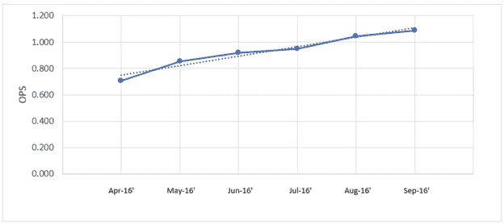

# 又到了闹腾的时候了

> 原文：<https://medium.com/analytics-vidhya/its-time-to-get-rowdy-once-again-95109aa829d9?source=collection_archive---------15----------------------->

> 如果你想向朋友展示证据，解释为什么 Rowdy 在 2020 年比 2019 年更好，只需看看表 4。

当这位身高 6 英尺 4 英寸、体重 255 磅的一垒手发射棒球创下有争议的距离记录时，你可能会听到“变得粗暴”这句话在体育馆里回荡。

众所周知，他的力量，高大的身材和令人难忘的名字，粗暴的特列斯是边境北部蓝鸟队进攻阵容中众多令人兴奋的球员之一。但是 Rowdy 是从哪里来的，他又是如何成为今天这样的强力击球手的呢？他需要重新关注 2020 赛季的哪些元素才能扭转这个早期赛季的局面？让我们从头开始:

2013 年，罗迪·特列斯在第 30 轮(总排名第 895 位)被多伦多蓝鸟队选中，开始了他的职业生涯。有趣的是，他仅比他现在的队友卡万·比吉奥(第 29 轮，总排名第 871 位)晚 1 轮被选中。

如果说 Rowdy 在他的小联盟职业生涯中取得了成功，这是一种保守的说法。年复一年，Rowdy 作为一名击球手不断提高着自己的得分。

**图表 1:吵闹的特列斯行动(7 月 13 日至 15 日)**

**图 2:喧闹的特列斯行动(4 月 16 日’—9 月 16 日’)**

图表 1 和 2 突出了 Rowdy 作为击球手的统治地位，因为他通过了未成年人，更具体地说，在 AA 球。在他与新罕布什尔州费希尔猫队打球的最后三个月里，Rowdy 的 SLG%分别是 0.563，0.640 和 0.688，给这个令人印象深刻的赛季画上了圆满的句号。可以想象，这样的进步不会被忽视。Rowdy 的 2016 年竞选活动为他赢得了 AAA 队的晋升，水牛野牛队。

仅比 MLB 低一个级别，Rowdy 比以往任何时候都更接近他的梦想。然而，他在那么大的压力下挣扎。他在野牛队的 2017 赛季极具挑战性，因为他在整个赛季中都打出了 0.222/. 295/. 333 的击球线。他表演中最令人吃惊的缺点是罗迪的本垒打数。在 AA，Rowdy 打了 23 个往返旅行，但在 AAA，这个数字被削减到 6 个，几乎同样多的蝙蝠。

虽然这对于一个崭露头角的强力击球手来说有点令人担忧，但他还是得到了在 AAA 队的另一次机会。Rowdy 抓住了这个机会，就像前几年一样，他进一步提高了他的击球能力。

**图 3:吵闹的特列斯和 AAA (17' & 18')**

图表 3 比较了 Rowdy 在 2017 年的挣扎和他在 2018 年的大幅改善。在 AAA 俱乐部的那个赛季，他大砍. 270/.340/.425。九月，Rowdy 终于得到了他的机会…

2018 年 9 月 5 日，多伦多蓝鸟队在罗杰斯中心迎战坦帕湾光芒队。在第六局，阿列迪斯·迪亚兹在二垒，两人出局，粗暴的特列斯为乔纳森·戴维斯进行了他在大联盟的首次捏击。Rowdy 以 108.9 英里/小时的惊人出口速度(整场比赛中最难击中的球)将他所见过的第一个 MLB 球击到了右中外场缺口，获得了两分打点。随着他名字和球棒的声音在体育场回荡，每个人都知道了他是谁。

在接下来的四天里，罗迪这样做了:

**表 1:吵闹的特列斯在 MLB 的前四场比赛**

他在前四场比赛中打出了令人难以置信的 0.571/0.600/1.214。大多数菜鸟会很高兴在他们的头几场比赛中上垒，但 Rowdy 想要更多。Rowdy 在收集他的第一个非额外安打之前，记录了 7 个额外安打。当然，他的快速步伐不会持续太久，但是即使在他冷静下来之后，他在九月剩下的时间里还是打出了令人尊敬的(也更像新秀)250/.263/.464 的成绩。虽然看着 Rowdy 炫耀他的力量很有趣，而且*肯定*也很有趣，但这位大个子以 28.4%的三振率显示出了他的弱点。在他早期职业生涯中困扰他的一个缺点。

当 2019 年春天到来时，Rowdy 再次加入达尼丁的球队，这对蓝鸟球迷来说并不奇怪。在春训期间，Rowdy 在 52 场比赛中击出了 5 支全垒打，并在四分之一的比赛中三振出局。随着他的三振率攀升至 28.7%(联盟平均水平:23%)，他的三振率一直持续到他的新秀赛季。

对棒球迷来说，高三振率并不令人担忧，因为这在强力击球手中很常见。然而，在 2020 年的竞选中，Rowdy 完成了其他 MLB 合格击球手没有做到的事情:他的三振率下降了令人难以置信的 12.7%。进步第二大的球员是圣地亚哥的威尔·迈尔斯，进步了 8.6%。然而，Rowdy 不仅仅改进了他的击球方法…他彻底改变了它。

对比 Rowdy 在 2019 年和 2020 年的表现，可以清楚地看到，几乎所有热门类别都有所改善。尽管如此，他最大的进步还是来自于他的击球方法:

**表 2:吵闹的特列斯 2019 年与 2020 年的纪律与联系**

表 2 更深入地展示了他的年度对比。如前所述，最显著的进步是三振率…这是多么大的进步啊。除此之外，Rowdy 在他的方法的其他方面也取得了进步。他在区域外投出更多的球，在区域内外接触更多的球。简单地说，他开始知道他喜欢哪些投球，不喜欢哪些。

2019 年，Rowdy 的弱点是 4 缝线球和破球，但在 2020 年，Rowdy 知道哪些球是他要打的。

人们可能会认为切割球和伸卡球是 2019 年 Rowdy 球棒的磁铁，因为他平均每场比赛的 wOBA 分别为 0.561 和 0.494。他很少被每一个球愚弄，产生很低的击球率(23.5%)和击球率(14.5%)。对 Rowdy 来说，不幸的是，这可能是他在 2019 年成功的巅峰，因为他几乎与所有其他球场都进行了激烈的斗争，如表 3 所示:

**表 3:吵闹的特列斯 vs 普通球场 2019，联盟平均水平**

COVID 缩短的 2020 赛季展示了大一垒手的全新一面。随着联盟范围内三振率的上升趋势，Rowdy 设法在联盟中最常见的球场上扭转了自己的许多类别:

**表 4:吵闹的特列斯 vs 普通球场 2019 vs 2020**

如果你想向朋友展示证据，解释为什么 Rowdy 在 2020 年比 2019 年更好，只需看看表 4。如果你想向你的朋友展示整篇文章中的一个统计数据，看看他在曲球上的三振率下降:34.4%。

除了弧线球，很明显 Rowdy 在 2020 年解决了更多他特定的问题。第二个最大的改进不是来自于突破球，而是来自于大多数 MLB 投手的面包和黄油:四缝线。虽然表 4 显示了他的进步，但这并不能公平地评价他作为一名击球手的发展。2019 年，Rowdy 不能打出快速球，投手们也知道这一点。在两次打击中，罗迪经常被投出快速球，而他三分之一的时间都被三振出局。投手们很清楚 Rowdy 的挥杆有一个洞，对手滥用了它:

**图片 1:喧闹的特列斯 2019 年区域气味% vs 4-seaners 热图**

图 1 显示了 Rowdy 在 2019 年追出禁区击中他非常喜欢的快球的高度。他经常在高于区域的球上挥杆失误。在 2020 年，Rowdy 把他的眼睛放得更低，并改善了他的高架区域纪律，如图 2 所示:

**图片 2:吵闹的特列斯 2020 年区域气味% vs 4-seaners 热图**

在他 2019 年的竞选期间，Rowdy 似乎无法击中快速球，即使它被扔进了禁区。2020 年，Rowdy 在腰带以上的投球较少，很少错过任何快速球。Rowdy 只让 6 个投在区域内的快速球越过了他的球棒。事实上，他减少了对四缝线的区域内击球率，从 29.6%降到了 14.3%。这种改善可以归功于他在 2019 赛季和冬季的立场变化。

球类运动员知道，更大的腿踢使挥杆更有力，但这也带来了击球时挥杆时机偏移的缺点。如果一名球员花太多时间用脚来加速挥杆，当挥杆除了空气什么也抓不到的时候，快速球可能会飞过。这可能是 2019 年底帮助 Rowdy 的人心中的核心心态，因为他的腿踢变化很大。

在他的 2019 年和 2020 年赛季之间，Rowdy 在挥杆过程中抬起前腿和落地前腿(又名踢腿)的持续时间是在 10 个不同的随机选择的安打视频中计时的。他的姿态有天壤之别。Rowdy 将他的踢腿时间从大约 0.84 秒减少到大约 0.41 秒。客观地说，0.4 秒大约是一个每小时 90 英里的快球到达本垒板所需的时间…而每小时 90 英里的速度低于联盟的平均速度。

随着这一变化，他踢腿的横向运动减少了。图片 3 和 4 最能体现这一点:

**图片 3:吵闹的特列斯 2019 年 6 月的姿态**

**图 4:吵闹的特列斯 2020 年 9 月的姿态**

图像 3 显示了 2019 年 6 月 16 日的全垒打，图像 4 显示了 2020 年 9 月 6 日的另一个全垒打。图 4 显示了 Rowdy 的腿高和腿步幅明显不同时，腿踢的变化很大。这可能让他能更好地掌握挥杆时机，减少他在快速球上的失误，也很可能让 Rowdy 在击球时能使用整个场地。

任何人都可以猜到，如果球每次都被打到同一个区域，防守队员就会跟上并移动到那里。如果发生这种情况，球队将腾出场地的其他区域，并在那里放置更多的球员(在棒球中称为“转移”)。由于 Rowdy 是典型的强力击球左撇子，他经常将球打到右侧【T4:】

**图片 5:吵闹的特列斯 2019 年击球喷雾图**

图 5 显示了他的倾向，因此，外野手相应地打他。然而，随着他在本垒板的改进方法，Rowdy 平衡了他的分布，并能够使用整个场地:

**图片 6:吵闹的特列斯 2020 年击球喷雾图**

图 6 显示了 Rowdy 在 2020 赛季的安打在球场上呈扇形散开。外野手在 2019 年阻碍了 Rowdy 的击球能力，导致了. 312 wOBA。在接下来的一年里，Rowdy 在换班时击球，并充分利用了防守队清空的左侧。他在 2020 年记录了一把点 401 wOBA。可以说，没有人真正知道如何称呼在本垒板的大个子，当他使用整个场地的时候。那是假设球留在公园里。

作为蓝鸟先发阵容中一个令人难忘的名字，粗暴的特列斯有潜力成为对方投手的绝对威胁。随着他从小联盟发展到大联盟，他在击球能力的各个方面都有所提高。当 Rowdy 在本垒板前有耐心且有纪律时，他就有能力在区域内打出破球和快速球。

每一季都有投手、防守队员和粗暴队员的调整。每个玩家都试图占据上风。在 2021 赛季初，似乎对 Rowdy 的防守有这样的优势。但是，就像 Rowdy 在 2019 年挣扎，在 2020 年爆发一样，他会继续做出调整，努力找回自己的优势。也许这位安静的一垒手/指定击球手会恢复去年的状态，让达尼丁的纸板观众再次喧闹起来。